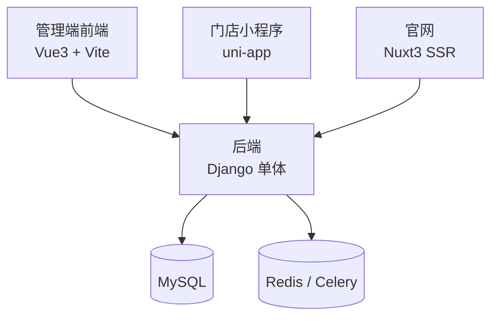

# 架构层导读

> 这一层讲整套系统的"骨架"——技术选型、仓库拆分、部署链路、定时任务。适合技术负责人在开工前通读一遍,再决定自己的第一行代码写什么。

## 读完你会知道

- 一个只有 1 个人的技术团队为什么选单体 Django,而不是微服务
- 整套产品为什么拆成四个仓库,边界是按"使用者"划的,不是按"业务域"划的
- 四端各自的部署链路长什么样,以及我们在部署上交过的学费
- 定时任务两套系统并存是怎么形成的,留下了什么教训
- 「做减法」在架构上具体减掉了什么

## 先说结论:小团队的架构红利来自做减法

如果整个架构层只能带走一句话,就是这句。我们没有服务网格、没有消息队列集群、没有配置中心,甚至连 Django 的 class-based view 都很少用。支撑几十个业务模块的,是三条朴素原则:

- **单体**:一个 Django 工程装下所有业务域。模块之间是函数调用,不是 RPC;查问题是翻代码,不是翻链路追踪。
- **少中间件**:MySQL + Redis + Celery,到此为止。每多一个中间件,就多一套要运维、要理解、要在半夜排障的东西。
- **约定优于配置**:视图统一函数式、响应统一一个 JSON 约定、路由集中在一个文件里。约定越少越硬,新人(和 AI 助手)上手越快。

这不是"我们不会做复杂架构",而是算过账:小团队最贵的资源是注意力,架构上省下的每一分注意力,都能花到业务上。后面四篇会反复回到这个判断。

## 这一层怎么读

本层四篇都是同一个写法:**决策 + 为什么 + 如果重来会怎么选**。我们不只告诉你"我们用了什么",更想讲清楚当时面对的约束、备选项为什么被否掉,以及哪些决定今天看是对的、哪些是将就。你照搬结论之前,先对一对自己的约束和我们像不像。

建议顺序就按下面的编排读:先定技术栈,再看仓库怎么拆,然后是怎么把东西部署出去,最后是最容易被忽视的定时任务。

## 本层四篇

### 1. [技术选型与取舍:为什么单体 Django 够用](tech-stack.md)

讲最底层的选型:为什么是 Django + MySQL + Redis + Celery 这套"老三样",为什么坚持函数式视图和集中式路由,为什么没上微服务、没上 DRF、没上更时髦的框架。核心论点是:选型的第一标准不是先进,而是团队(包括你的 AI 编程助手)能不能在这套栈上跑得又快又稳。文末有"如果重来"清单——有几个决定我们会原样再做一遍,也有几个会改。

### 2. [四端拆分:后端 / 管理端 / 门店小程序 / 官网](four-repos.md)

讲整套产品为什么正好拆成四个仓库:后端是数据与接口的中枢,管理端网页给内部同学用,小程序给店长店员在手机上用,官网对外获客。拆分的依据是"谁在用、在什么设备上用、发布节奏是什么",而不是业务域——这直接决定了跨仓协作的日常形态:一个需求经常是"前端页面 + 后端接口"两个仓一起改。这篇也会讲每个仓的技术栈和它们之间唯一的耦合点(HTTP 接口)。

### 3. [部署链路与部署坑](deployment.md)

四个端的部署方式完全不同:后端是容器内热重启,管理端是构建产物叠加进仓库再刷 CDN 缓存,小程序必须人工提审等平台审核,官网走蓝绿切换。这篇把每条链路画出来,重点讲坑——比如热重启信号发错位置导致改动"几小时后才神秘生效",比如 CDN 缓存让用户一直跑着旧代码。部署的坑有个共同特点:代码没错,但用户看到的就是错的,所以必须把链路本身当作系统的一部分来理解。

### 4. [定时任务:双系统并存的教训](scheduled-jobs.md)

我们的定时任务同时挂在两套系统上:早期的 django-crontab 和后来的 Celery Beat,几十个任务分布在两边。这是典型的"历史包袱没还清"——每次改定时都要检查两套配置,漏一侧就是线上事故;时区语义两边还不一样。这篇讲这个局面是怎么一步步形成的、我们现在的共存纪律,以及如果重来,为什么会从第一天就只留一套。

## 延伸阅读

- [业务模块全景与阅读顺序](../02-modules/README.md) — 骨架看完了,去看长在上面的肉
- [后端坑:时区 / 迁移 / 连接 / 序列化](../03-pitfalls/backend.md) — 架构决策在日常开发里的代价清单
- [M1 骨架:框架 / 响应约定 / 鉴权 / 定时](../05-replication/prompts/00-bootstrap.md) — 想直接动手复刻,从这个 prompt 开始

---

[← 返回总目录](../README.md)
