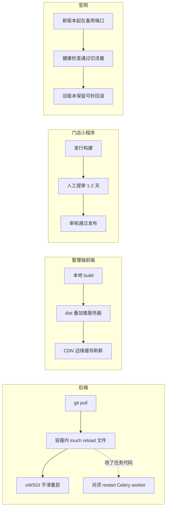

# 部署链路与部署坑

> 这一页讲我们四个端(后端 / 管理端前端 / 门店小程序 / 官网)各自怎么发版,以及那些「看起来发成功了、其实没生效」的坑。谁该读:要接手运维的工程师,以及准备让 AI 帮你写部署脚本的人——把这页喂给 AI,能少走很多弯路。

**读完你会知道:**

- 四个端的部署链路各自长什么样,为什么它们必须不一样
- 后端热重启的头号坑:touch 错了地方,改动几小时不生效
- 为什么改了 Celery 任务代码后「定时任务还在跑旧逻辑」
- 前端发版为什么严禁 `rsync --delete`,CDN 缓存怎么配才不坑自己
- 最不值得踩的运维坑:根盘写满引发全站 500

## 一图看懂四条部署链路

四个端的发布方式完全不同——这不是设计出来的,是各端的技术形态决定的。后端能热重启,小程序必须人工提审,谁也替代不了谁。

## 后端:容器 + uWSGI + 独立 ASGI

后端跑在 Docker 容器里,Web 层用 uWSGI 多进程模式。几个关键参数是被真实流量逼出来的,不是照抄默认值:

- **busyness 模式动态扩容**:进程数随负载自动伸缩,低峰不浪费内存,高峰不排队。配合「常热进程数」下限,避免冷启动拖慢首字节(TTFB)。
- **buffer-size 调大**:飞书等 IM 的 webview 请求会带很大的 header,默认 4KB buffer 直接报错,请求根本进不来。我们调到了 64KB 量级(示例配置,按你的网关实测调)。
- **单请求超时放宽**:有导出、批量计算这类长请求,默认超时太短会被拦腰砍断。我们放宽到了几分钟量级——但这是兜底,不是鼓励写慢接口。
- **RSS 超限自动回收**:单个 worker 进程内存超过阈值(例如 256MB,示例数字,按你的机器定)就自动重启,防止 Python 进程慢性内存泄漏拖垮整机。

WebSocket 不走 uWSGI,由一个**独立的 ASGI 进程**(如 Daphne)承接。两个进程各管各的,Web 热重启不影响长连接,反之亦然。

## 后端热重启:头号坑,值得单独一节

uWSGI 的平滑重启机制是 touch 一个 reload 文件,worker 会逐个换新代码,用户无感知。听起来很简单,但我们在这里反复栽过跟头:

**宿主机上存在一个和容器内路径同名的目录,touch 宿主机上的那个文件完全无效。**

现象极具迷惑性:你 pull 了代码、touch 了文件、脚本没报错,一切看起来都发成功了。但 uWSGI 根本没收到信号——改动只会随着 worker 因内存回收等原因自然轮换而慢慢生效,低峰期可能**几个小时都不生效**。期间用户报「bug 没修」,你对着已经是新版的代码百思不得其解。这个坑我们排查过不止一次,每次都浪费半天。

正确做法是通过 `docker exec` 在**容器内部** touch 那个 reload 文件。而更根本的解法是:

**铁律:部署动作固化成脚本,人不手敲。** 手敲命令的人总有一天会在错误的 shell、错误的机器、错误的路径上敲。脚本写对一次,之后每次都对。

## Celery:web 热重启管不到它

后端有大量异步任务和定时任务跑在 Celery worker 里。这里有第二个「看似发了、实际没生效」的坑:

**web 热重启只重启 web 进程,Celery worker 里的任务代码不会跟着换。**

改了 `tasks.py` 之后只 touch reload,web 接口是新的,定时任务还在跑旧逻辑——直到第二天任务产出错误数据你才发现。所以我们的部署脚本里写死一条判断:本次改动涉及任务代码,就必须重启 Celery worker(和 beat,如果调度也改了)。定时任务本身的坑更多,见[定时任务:双系统并存的教训](scheduled-jobs.md)。

## 管理端前端:dist 叠加 + CDN 边缘缓存

管理端是 Vue 单页应用,发布链路是:本地 build → 把 dist 产物推到服务器的静态目录 → CDN 边缘节点缓存分发。两条红线:

- **严禁 `rsync --delete`。** 服务器上的静态目录被多个项目共用,`--delete` 会把别的项目的产物当作「多余文件」删掉——你发自己的版,把同事的站点发没了。我们统一用「叠加」方式推送:只增改,不删除。旧的带 hash 的 chunk 文件留着无害,反而能救活还开着旧页面的用户。
- **index.html 的边缘缓存必须短,且 /api 路径必须排除在缓存之外。** 带 hash 的 JS/CSS 可以缓存很久(内容变了 hash 就变),但 index.html 是入口,缓存太久用户就一直拿旧入口、加载旧 JS。我们把它的边缘缓存设在 60 秒左右(示例配置);而 `/api` 路径一旦被 CDN 缓存,用户会看到别人的数据或过期数据,属于事故级配置错误。

还有一类不在服务器端的缓存:**浏览器/PWA 的本地旧缓存**。发版后用户报「点了没反应」「导出是空白」,九成不是你代码的问题,而是用户浏览器还在跑旧 JS。第一步永远是让用户强制刷新(Ctrl+Shift+R),确认还复现再排查代码。细节见[管理端前端坑](../03-pitfalls/frontend.md)。

## 小程序:节奏最慢的一端

门店小程序的发布和其他三端有本质区别:**中间隔着平台的人工审核**。

- 必须走「发行」构建,不能拿预览/开发构建当发布——两者的产物和行为有差异,预览版验过不等于发行版没问题。
- 提审到过审通常 1-2 天,**紧急修复也快不了**。线上出了 bug,你最快的修复路径也要按天算。

由此推出一条端上的工程纪律:**小程序端要格外保守**。能放在后端做的逻辑尽量放后端(后端热重启分钟级生效),小程序只做展示和交互;上线前的测试标准也要比其他端更严。更多小程序的构建与发布坑见[小程序坑](../03-pitfalls/miniapp.md)。

## 官网:SSR 蓝绿部署

官网是 SSR 应用(服务端渲染,为了 SEO/GEO),不能像 SPA 那样只推静态文件,进程本身要换。我们用最朴素的蓝绿部署:

1. 新版本在备用端口启动;
2. 健康检查通过后,把反向代理的流量切到新端口;
3. 旧进程保留一段时间——新版本一旦出问题,把流量切回旧端口就是**秒级回滚**。

整套动作固化在一个部署脚本里,一条命令完成。对一个对外形象站来说,「发布失败可秒回滚」比「发布快几秒」重要得多。

## 服务器运维:最不值得踩的坑

**根盘写满会引发全站 500。** 日志、临时文件、上传缓存都在悄悄增长,根盘一满,数据库写不进、session 存不了、日志刷不出,所有服务一起倒,而且报错信息往往和「磁盘」毫无关系,排查方向极易跑偏。

三条对策,都便宜:

- 大体积数据(数据库文件、备份、上传文件)一律放独立数据盘,和系统盘隔离;
- 磁盘使用率告警(例如 80% 就报,示例数字),宁可告警烦一点;
- 日志轮转 + 定期清理临时文件,写进 cron,不靠人记。

这是全书里投入产出比最高的一条运维建议——预防成本几乎为零,踩中一次代价是全站宕机。

## 数据库迁移:多人多环境的编号分叉

Django 迁移文件按编号顺序执行。多人开发 + 本地/生产环境并存时,如果你在本地凭本地库的状态手写迁移,编号很容易和生产库已有的迁移**分叉冲突**——两个人都创建了同一编号的迁移,合并后谁先谁后说不清,严重时要人肉修复迁移状态表。

铁律:手写迁移必须以**生产库的最新迁移编号**为基准创建。细节和修复手法见[后端坑](../03-pitfalls/backend.md)。

## 监控与 TTFB 三板斧

- **错误追踪**:接入错误追踪平台(如 Sentry 类产品),线上异常带堆栈直接推送,不用等用户报。注意把**采样率调低**——全量采样本身会消耗每个请求的性能,监控反过来拖慢被监控者就本末倒置了。
- **TTFB(首字节时间)优化三板斧**,按性价比排序:
  1. **进程常热**——冷启动是 TTFB 长尾的最大来源,保住常热进程数下限,比任何代码优化都立竿见影;
  2. **CDN 缓存**——静态资源和入口页交给边缘节点,回源越少越快;
  3. **慢查询治理**——用监控找出 p95 最慢的接口,逐个加索引、消 N+1、上缓存。

## 踩坑与红线

- **热重启无效**
  症状:代码已 pull、reload 文件已 touch、脚本无报错,但线上跑的还是旧代码,几小时后「自己好了」。
  根因:touch 的是宿主机上的同名路径,uWSGI 在容器内,根本收不到信号;改动只随 worker 自然轮换缓慢生效。
  铁律:reload 必须在容器内执行;部署动作固化成脚本,人不手敲。

- **定时任务跑旧逻辑**
  症状:web 接口已是新版,但异步/定时任务产出的还是旧口径数据。
  根因:web 热重启只管 web 进程,Celery worker 常驻内存里的任务代码不会更换。
  铁律:改动涉及任务代码,部署必须重启 Celery worker,写进部署脚本的判断里。

- **发版把别人的站点删了**
  症状:自己前端发版成功,另一个项目的页面 404。
  根因:静态目录多项目共用,`rsync --delete` 把其他项目的产物当多余文件删除。
  铁律:推 dist 一律叠加式同步,永远不带 `--delete`。

- **用户永远拿到旧页面 / 看到别人的数据**
  症状:发版后部分用户长时间加载旧 JS;或接口返回了不属于该用户的数据。
  根因:index.html 边缘缓存过长;`/api` 路径被 CDN 缓存。
  铁律:入口页缓存以秒计(如 60 秒),`/api` 明确排除出 CDN 缓存规则。

- **「点了没反应」的假 bug**
  症状:发版后用户报功能失灵,开发本地无法复现。
  根因:浏览器/PWA 本地缓存还在跑旧 JS。
  铁律:先让用户强刷(Ctrl+Shift+R),确认仍复现再进代码排查。

- **全站突然 500,日志毫无头绪**
  症状:所有接口同时报错,错误信息五花八门,和最近的改动对不上。
  根因:根盘被日志/临时文件写满。
  铁律:数据放数据盘,磁盘告警前置,日志轮转写进 cron。

- **迁移编号冲突**
  症状:合并代码后 migrate 报冲突,或生产执行顺序与预期不符。
  根因:多人各自基于本地库状态手写迁移,编号分叉。
  铁律:手写迁移以生产库最新编号为基准创建。

## 延伸阅读

- [技术选型与取舍:为什么单体 Django 够用](tech-stack.md) —— 这些部署方式是选型的直接后果
- [四端拆分:后端 / 管理端 / 门店小程序 / 官网](four-repos.md) —— 四条链路对应的四个仓库
- [定时任务:双系统并存的教训](scheduled-jobs.md) —— Celery 之外还有一套 cron,坑更多
- [后端坑:时区 / 迁移 / 连接 / 序列化](../03-pitfalls/backend.md) —— 迁移编号分叉的完整案例
- [管理端前端坑:缓存 / 路由 / 组件](../03-pitfalls/frontend.md) —— 旧缓存排查手法
- [小程序坑:构建 / 发布 / 兼容](../03-pitfalls/miniapp.md) —— 发行构建与提审细节

---

[← 返回本层目录](README.md) · [返回总目录](../README.md)
