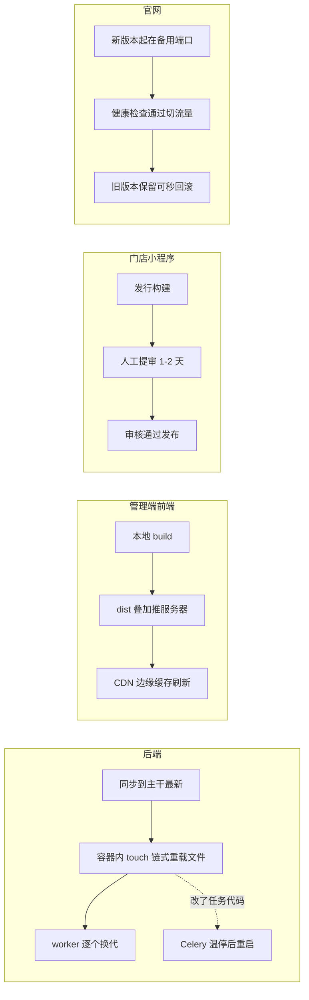
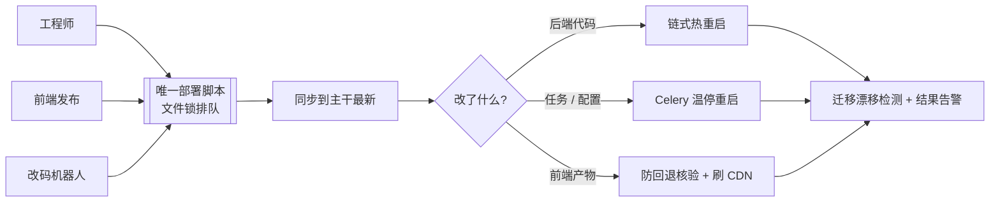

# 部署链路与部署坑

> 这一页讲我们四个端(后端 / 管理端前端 / 门店小程序 / 官网)各自怎么发版,以及那些「看起来发成功了、其实没生效」的坑。谁该读:要接手运维的工程师,以及准备让 AI 帮你写部署脚本的人——把这页喂给 AI,能少走很多弯路。

**读完你会知道:**

- 四个端的部署链路各自长什么样,为什么它们必须不一样
- 后端热重启怎么做到「逐个 worker 换代、部署期零排队」,以及两个 touch 了却没用的坑
- 为什么 Celery 不能直接 `docker restart`,长任务为什么要单独一个慢队列
- ★多方(人 + 机器人 + 前端)同时发布时,怎么用一把锁把它们串起来,前端产物又怎么防「无声回退」
- 依赖为什么只能进镜像,备份为什么一定要做恢复演练

## 一图看懂四条部署链路

四个端的发布方式完全不同——这不是设计出来的,是各端的技术形态决定的。后端能热重启,小程序必须人工提审,谁也替代不了谁。

```mermaid
flowchart LR
    subgraph 后端
        A1[同步到主干最新] --> A2[容器内 touch 链式重载文件] --> A3[worker 逐个换代]
        A2 -.改了任务代码.-> A4[Celery 温停后重启]
    end
    subgraph 管理端前端
        B1[本地 build] --> B2[dist 叠加推服务器] --> B3[CDN 边缘缓存刷新]
    end
    subgraph 门店小程序
        C1[发行构建] --> C2[人工提审 1-2 天] --> C3[审核通过发布]
    end
    subgraph 官网
        D1[新版本起在备用端口] --> D2[健康检查通过切流量] --> D3[旧版本保留可秒回滚]
    end
```

## 后端:容器 + uWSGI + 独立 ASGI

后端跑在 Docker 容器里(两个 Web 容器挂同一份代码目录),Web 层用 uWSGI 多进程模式。几个关键参数是被真实流量逼出来的,不是照抄默认值:

- **busyness 模式动态扩容**:进程数随负载自动伸缩,配合「常热进程数」下限,避免冷启动拖慢首字节(TTFB)。
- **buffer-size 调大**:飞书等 IM 的 webview 请求会带很大的 header,默认 4KB buffer 直接报错。我们调到了 64KB 量级(示例配置,按你的网关实测调)。
- **单请求超时放宽 + RSS 超限自动回收**:导出、批量计算这类长请求不被拦腰砍断;单个 worker 内存超过阈值(示例:几百 MB)就自动重启,防慢性内存泄漏。

WebSocket 不走 uWSGI,由一个**独立的 ASGI 进程**(如 Daphne)承接。两个进程各管各的,Web 热重启不影响长连接。

## 后端热重启:链式换代 + 两个「touch 了没用」的坑

**默认的整台平滑重启也会卡。** uWSGI 的 graceful reload 要等全部 worker 退出、master 重读配置、再 fork,这几秒里监听端口还在但没人接客,新请求排队——每次部署都有一小撮 2~5 秒的慢请求。我们改成了 **lazy-apps + 链式重载**:每个 worker 自己加载应用;touch 链式重载文件后 master 不退出,worker **逐个**优雅退出重生——上一个新 worker 能接客了才动下一个,其余 worker 一直在接客。十几个 worker 约二十秒换完(示例量级),期间没有排队慢请求;两个 Web 容器先后换,前一台换完才动后一台。

代价与细节,都要写进文档:

- **内存接近翻倍**:没了 fork 写时复制,每个 worker 各自一份应用,每容器常驻内存明显上涨,上线前先看机器余量;
- **链式重载不重读配置**:改了 uWSGI 配置必须走整台重载,部署脚本检测到配置文件变化会自动切过去;
- **完成判据看进程,不看日志**:触发前记下旧 worker 的 PID,旧 PID 全部消失且在册 worker 不少于下限才算完成——两台共用一个日志文件,轮转后另一台会继续写旧文件,日志里的「完成」字样不一定出现在你看的那个文件里;超时就告警并回退整台重载。

**坑一:touch 了宿主机上的同名路径。** 宿主机上恰好有一个和容器内路径同名的目录,touch 它完全无效。现象极具迷惑性:脚本没报错、一切看起来都发成功了,改动却只随 worker 自然轮换慢慢生效,低峰期可能几个小时不生效。

**坑二:触发文件没带主机名。** 两个容器共用一份 uWSGI 配置,为了不被同一个文件同时叫醒,配置里用 uWSGI 的魔法变量把**容器主机名**拼进触发文件名,各 watch 各的。于是 touch 不带主机名后缀的文件 = 没人在听,静默无效;容器重建后主机名会变,写死文件名同样失效——**只能在容器内动态取主机名再 touch**。这个坑我们真踩过:手改配置后反复 touch,最后「生效了」其实是搭了别人一次部署的便车。

顺带一条验证纪律:**确认配置对线上请求生效,必须走 HTTP 打真实接口**。用命令行起一个新进程去读配置,读到的必然是新值,证明不了正在接客的 worker 是什么状态。

**铁律:部署动作固化成脚本,人不手敲。** 手敲命令的人总有一天会在错误的 shell、错误的机器、错误的路径上敲。

## ★统一部署入口:一把锁,一条队列

部署的发起方变多之后——工程师在本地发、前端同学发自己的产物、[改码机器人](../04-ai-engineering/bots-architecture.md)自动发——三方同时动手的后果不是排队,是互相覆盖。解法是把所有部署收敛成**服务器上唯一的一个入口脚本**,自带一把锁:

```mermaid
flowchart LR
    A1[工程师] --> Q
    A2[前端发布] --> Q
    A3[改码机器人] --> Q
    Q[["唯一部署脚本<br/>文件锁排队"]] --> S1[同步到主干最新]
    S1 --> S2{改了什么?}
    S2 -->|后端代码| S3[链式热重启]
    S2 -->|"任务 / 配置"| S4[Celery 温停重启]
    S2 -->|前端产物| S5[防回退核验 + 刷 CDN]
    S3 & S4 & S5 --> S6[迁移漂移检测 + 结果告警]
```

- **文件锁排队**,不是拒绝:后到的请求等前一个做完(设上限等待时间),失败会逼发起方手动绕过;
- **同步到主干 HEAD,而不是发布方指定的某个提交**:「后到的部署 = 前一个的超集」,永远不会把别人刚发的后端代码回退掉;
- **按变更内容决定动作**,不要求发起方记规则;**迁移漂移检测**比对迁移文件与数据库执行记录,不一致立刻告警;统一日志 + 状态文件,当前锁被谁占着一看便知。

配套禁令:**禁止在服务器上裸跑 `git pull` / `git reset --hard`**。发布前置闸也在这里:**只检测行首的冲突起始标记**(查全部三种标记会误报到没人理)。推主干同样收敛成一个脚本:fetch → rebase → 失败重试、**永不 force push**,带「热点文件误删守卫」。

## Celery:不能直接 restart,长任务单独排队

**web 热重启只重启 web 进程,Celery worker 里的任务代码不会跟着换**,所以改动涉及任务代码时部署脚本必须重启 Celery。但「重启」本身也有讲究:主容器的 1 号进程是一个 shell,不转发信号,`docker restart` 等于十秒后全员强杀。我们排查出三个后果:预取和定时投递的消息要等一个小时的可见性超时才重投;调度器状态没落盘,重启后把刚发过的定时任务又发一遍(日报真发过两遍);正在跑的长任务被杀就直接丢了。现在的做法:

- **温停**:先摘掉队列消费、停两秒,再给 worker 发温停信号——不领新任务、跑完手上的、把预取消息放回队列;超过上限(示例:一两分钟)才冷停;调度器单独发信号落盘状态;
- **长任务进独立慢队列**:常态跑超过一两分钟的任务一律路由到单独的慢队列容器,部署时只发温停、不等它,它跑完手上的活自己退出,由重启策略用新代码拉起。**新写的长任务要加进路由表**,否则部署撞上就被冷停;
- **有人在等结果的任务进交互队列**,两个副本轮流温停,任何时刻都有消费者;高频周期任务一律走 Beat,不再加 cron。定时任务本身的坑见[定时任务:双系统并存的教训](scheduled-jobs.md)。

## 镜像重建:依赖只能进镜像

镜像里只有运行环境和依赖,代码靠目录挂载。早期为了图快,图像库、PDF 解析、字体都是往**跑着的容器里**直接装的——重启不丢,但容器一旦**重建**(改编排、加服务、迁机)就回到旧镜像。我们新加慢队列容器那天正好踩中:巡检遮罩和回单转图同时报缺模块。

规矩:**禁止往跑着的容器里裸装依赖了事**。加依赖 = 改依赖清单(直接依赖 + 全量钉版)→ 构建 → 离线验证(安装结果与钉版清单逐行一致 + 临时容器跑只读冒烟)→ 指向新镜像 → 逐台替换(每步各自拿部署锁;Web 容器先摘流排空、重建、探活再挂回)。替换前把旧容器提交成回滚快照,新镜像稳定一天前不删任何旧镜像。

## 每晚备份 + 恢复演练

数据库每晚做一次一致性快照的逻辑全量备份,传到**私有、加密**的对象存储桶,按生命周期自动删除(示例:保留 30 天)。每次都校验:压缩包能完整解开且尾部有完成标记、分片校验和一致、**匿名访问必须被拒**;成功和失败都通报到运维群,磁盘余量不够就跳过并告警。备份**绝不进业务公开桶**。

**没演练过的备份等于没有备份。** 恢复一律先进隔离环境:下载并校验 → 起一个断网、无端口的临时数据库容器 → 导入 → 逐表按 id 上界与生产核对行数 → 用完清理。只捞几张表就从临时库导出再导回;整库回滚生产须拍板并先停写。

## 管理端前端:dist 叠加 + CDN 边缘缓存 + 防回退闸

管理端是 Vue 单页应用:本地 build → dist 推到服务器静态目录 → CDN 边缘分发。两条红线:**严禁 `rsync --delete`**(静态目录多项目共用,会把别人的产物删掉;一律只增改不删除,旧 hash chunk 留着还能救活开着旧页面的用户);**入口页边缘缓存必须短**(示例:60 秒)、**`/api` 必须排除在缓存之外**(否则用户会看到别人的数据)。

叠加还带来一个隐蔽问题:hash 文件只增不删,入口页却是**后写覆盖**——谁最后叠包,线上就是谁的源码。拿旧源码快照出的包叠上去,别人刚上线的前端改动会被**无声回退**,部署全程绿灯。我们的闸:叠包提交信息必须带构建所用的前端提交号;部署脚本维护一份前端仓的「只有提交对象」的轻量镜像,检查线上现有的前端提交是否都被本次产物包含,不包含就告警「回退」;产物的提交号在前端仓任何分支都查不到,说明源码没推,同样告警。目前只告警不拦,观察期后可切成拦截。源头也收紧了:改码机器人出包时追不上前端主干,就重新出包或拒绝出包。

**浏览器本地旧缓存**是另一类:用户报「点了没反应」,第一步永远是强制刷新,确认还复现再排查代码。细节见[管理端前端坑](../03-pitfalls/frontend.md)。

## 小程序与官网

**小程序中间隔着平台人工审核**:必须走「发行」构建,提审到过审通常 1-2 天,紧急修复也快不了。所以小程序端要格外保守——能放后端的逻辑尽量放后端,小程序只做展示和交互。更多见[小程序坑](../03-pitfalls/miniapp.md)。

**官网是 SSR 应用**,进程本身要换,用最朴素的蓝绿部署:新版本在备用端口启动 → 健康检查通过后切流量 → 旧进程保留一段时间,出问题**秒级回滚**。对外形象站,「失败可秒回滚」比「发布快几秒」重要得多。

## 服务器运维与监控

**根盘写满会引发全站 500**,而且报错信息往往和「磁盘」毫无关系。三条对策都便宜:大体积数据放独立数据盘;磁盘使用率告警(示例:80%);日志轮转 + 定期清理写进 cron。**手写迁移必须以生产库的最新编号为基准**,细节见[后端坑](../03-pitfalls/backend.md)。错误追踪平台的**采样率要调低**;TTFB 优化按性价比排:进程常热 → CDN 缓存 → 慢查询治理。

## 踩坑与红线

- **热重启无效**
  症状:代码已同步、触发文件已 touch、脚本无报错,线上跑的还是旧代码,几小时后「自己好了」。
  根因:touch 的是宿主机同名路径,或触发文件名没带容器主机名——没人在听。
  铁律:容器内动态取主机名再 touch;部署固化成脚本;验证走 HTTP。

- **部署期一小撮慢请求**
  症状:每次部署那几秒,监控里出现一批 2~5 秒的请求。
  根因:整台平滑重启期间没人接客,新连接排队。
  铁律:lazy-apps + 链式重载逐个换代;改 uWSGI 配置时才整台重载。

- **定时任务跑旧逻辑 / 重复发 / 长任务丢**
  症状:任务产出旧口径数据;日报发两遍;长任务跑一半没了。
  根因:只重启了 web;或者用 `docker restart` 强杀了 Celery。
  铁律:改任务代码必重启 Celery,且一律温停;长任务进慢队列。

- **容器重建后功能挂了**
  症状:一个从没改过的功能突然报缺模块。
  根因:依赖当初是装在跑着的容器里,重建回到了旧镜像。
  铁律:依赖只进镜像,改清单 → 构建 → 离线验证 → 逐台替换。

- **前端改动被无声回退**
  症状:刚上线的前端修复十来分钟后又没了,部署全绿。
  根因:有人拿旧源码快照出包,后写覆盖了入口页。
  铁律:叠包提交带前端提交号,部署时核验「线上已有的前端提交都被包含」。

- **发版把别人的站点删了 / 用户看到别人的数据**
  症状:另一个项目 404;或接口返回了不属于该用户的数据。
  根因:`rsync --delete` 删了共用目录里的产物;`/api` 被 CDN 缓存。
  铁律:推 dist 永远叠加;入口页缓存以秒计,`/api` 明确排除。

- **全站突然 500,日志毫无头绪**
  症状:所有接口同时报错,错误五花八门。
  根因:根盘被日志 / 临时文件写满。
  铁律:数据放数据盘,磁盘告警前置,日志轮转写进 cron。

- **并发部署互相覆盖 / 冲突标记被打包上线**
  症状:刚发的功能过一会儿不见了;或页面整片白屏。
  根因:多个发起方各跑各的脚本;未解决的冲突标记混进产物。
  铁律:**唯一入口 + 文件锁排队 + 同步到主干 HEAD**;行首冲突标记检测命中即中止。

- **有备份但从没恢复过**
  症状:真要恢复时才发现备份残缺或不会恢复。
  根因:只做了备份,没做演练。
  铁律:每次备份自动校验;恢复先进断网临时库核对,再动生产。

## 延伸阅读

- [技术选型与取舍:为什么单体 Django 够用](tech-stack.md) —— 这些部署方式是选型的直接后果
- [四端拆分:后端 / 管理端 / 门店小程序 / 官网](four-repos.md) —— 四条链路对应的四个仓库
- [定时任务:双系统并存的教训](scheduled-jobs.md) —— Celery 之外还有一套 cron,坑更多
- [后端坑:时区 / 迁移 / 连接 / 序列化](../03-pitfalls/backend.md) —— 迁移竞态、外键拆序熔断等部署相关案例
- [管理端前端坑:缓存 / 路由 / 组件](../03-pitfalls/frontend.md) —— 旧缓存排查手法
- [小程序坑:构建 / 发布 / 兼容](../03-pitfalls/miniapp.md) —— 发行构建与提审细节

---

[← 返回本层目录](README.md) · [返回总目录](../README.md)
