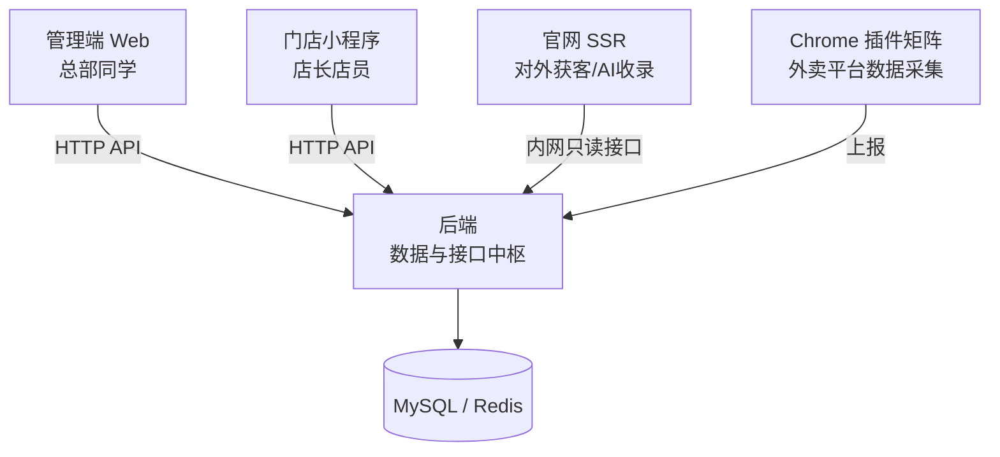

# 四端拆分:后端 / 管理端 / 门店小程序 / 官网

> 这页讲我们整套系统为什么拆成四个代码仓库、拆分的边界画在哪里、以及多仓协作的日常约定。适合正在纠结「单仓还是多仓」的 IT 负责人和工程师,也适合喂给你的 AI 编程助手当作项目结构的顶层认知。

**读完你会知道:**

- 四个仓库各自管什么、谁在用、彼此怎么连
- 拆仓的真正依据不是代码量,而是**发布节奏**
- 跨仓改动(一个需求 = 页面 + 接口)的协作约定怎么定
- 怎么让 AI 在多个仓库之间干活不迷路
- 两个我们踩过的多仓大坑:dist 产物入库、分支长期分叉

## 一、四个仓库 + 一个插件矩阵

我们整套系统由四个独立仓库组成,再加一组 Chrome 插件作为数据采集端:

| 仓库 | 谁在用 | 技术形态 | 角色 |
|---|---|---|---|
| **后端** | 所有端都靠它 | Django + Celery + Redis + MySQL | 数据与接口中枢,所有业务逻辑、模型、定时任务都在这 |
| **管理端 Web** | 总部同学(运营/财务/督导/招商) | Vue3 + Vite,SPA | 内部管理页面:看板、审批、录入、报表 |
| **门店小程序** | 店长、店员 | uni-app + Vue2 | 手机上的日常操作:订货、盘点、开收档、日报 |
| **官网** | 外部访客 + AI 搜索引擎 | Nuxt3 SSR | 对外获客门面,兼顾 AI 搜索收录(GEO) |

另有一个**Chrome 插件矩阵**挂在后端仓里:外卖平台的商家后台没有开放我们需要的全部数据接口,就用浏览器插件在运营同学正常登录的页面里半自动抓取,上报给后端。插件不算独立的「端」,但它是数据进入系统的重要入口之一(细节见 [外卖平台集成](../02-modules/delivery-platforms.md))。

后端是绝对的中枢:三个前端都不直接碰数据库,全部通过后端 API。官网稍特殊——它有自己的内容体系,只通过一小组**只读接口**从后端取展示数据,天然隔离了风险。

## 二、为什么拆:发布节奏才是分界线

很多团队纠结拆仓的依据:按技术栈拆?按团队拆?按代码量拆?我们的答案很朴素——**按发布节奏拆**。四个端的发布方式和周期完全不同:

| 端 | 发布方式 | 周期 |
|---|---|---|
| 后端 | 服务器拉代码 + 热重启 | 随时发,一天可以发很多次 |
| 管理端 | 构建产物推 CDN | 秒级生效,随时发 |
| 门店小程序 | 提交平台**人工审核** | 审核要 1~2 天,过审才能发布 |
| 官网 | SSR 服务蓝绿部署 | 有部署脚本,分钟级,但有切换流程 |

节奏不同的东西放在一个仓里,会互相拖累:

- 后端一个紧急修复,不该被「小程序这周正在提审」这种事牵制;
- 小程序一次发版要圈定内容送审,如果和后端代码混在一个仓、一条分支,「哪些改动进这次审核包」会变成每次都要人肉理清的糊涂账;
- 官网的蓝绿切换有自己的检查清单,和管理端「构建完推 CDN 就完事」是两种心智。

反过来看,**发布节奏相同的东西就不必拆**。我们的后端是一个 Django 单体,几十个业务模块都在里面——它们全都是「热重启随时发」,拆成微服务只会徒增联调和部署成本(为什么单体够用,见 [技术选型与取舍](tech-stack.md))。

一句话:**仓库边界 = 部署边界**。这个标准比「按技术栈」「按团队」都好用,因为它直接对应了拆仓能换来的最大收益——各端独立发布、互不阻塞。

## 三、跨仓改动是常态:约定比工具重要

拆仓不等于解耦业务。实际干活时,**一个需求 = 页面 + 接口**是常态:业务同学提「订货单要能看价格变化记录」,就意味着后端加接口、管理端(或小程序)加页面,两个仓都要动。

我们的协作约定只有两条,但执行得很硬:

1. **接口文档统一写在后端仓**。每个业务模块一份 `XXX_API.md`,放在后端仓根目录。前端照文档对接,不靠口头传达、不靠翻后端代码猜。后端仓是数据与接口的中枢,文档跟着接口的「真身」走,天然是单一事实源。
2. **改完接口必须同步更新文档**,最好在同一次提交里。文档滞后于代码的那一刻起,它就从资产变成了陷阱——前端(以及 AI)会照着过期文档写出「看起来对、跑起来错」的对接代码。

这套约定对 AI 协作尤其重要:AI 接到跨仓需求时,先读后端仓的接口文档就能知道数据长什么样,不用把两个仓的代码都灌进上下文。

## 四、让 AI 在多仓之间不迷路

多仓结构对人是清晰的,对 AI 却天然是个坑:AI 的会话通常锚定在一个仓库目录里,它并不知道「别的仓在哪、主干叫什么、怎么部署」。我们用两份文档解决:

### 每仓一份 CLAUDE.md

每个仓库根目录放一份 CLAUDE.md——AI 的「入职手册」,写清这个仓管什么、代码怎么组织、有哪些约定和红线。铁律是:**AI 跨仓干活前,先读对应仓的 CLAUDE.md**,而不是拿着 A 仓的认知去改 B 仓的代码。这份手册怎么写、写什么,是单独一整页的话题,见 [CLAUDE.md:给 AI 的入职手册](../04-ai-engineering/claude-md-practice.md)。

### 一份多仓地图

光有各仓手册还不够——AI 得先知道「去哪找那个仓」。我们在后端仓维护一份多仓地图文档,核心就是一张对照表:

| 仓库 | 本地路径 | 主干分支 | 部署方式 |
|---|---|---|---|
| 后端 | `~/repos/backend`(示例路径) | main | 服务器拉代码 + 热重启 |
| 管理端 | `~/repos/admin-front`(示例路径) | master | 构建 + 推 CDN |
| 门店小程序 | `~/repos/store-app`(示例路径) | master | 平台提审,人工发布 |
| 官网 | `~/repos/official-site`(示例路径) | main | 蓝绿部署脚本 |

注意「主干分支」这一列不是废话——四个仓的主干有的叫 main 有的叫 master(历史原因),AI 猜错分支名就会推错地方。我们的改码机器人(飞书里 @ 一下就能跨仓改代码的 AI 分身)接到跨仓任务时,全靠这张地图定位仓库、切对分支、走对部署链路(机器人体系见 [机器人体系:改码机器人 + 岗位 AI 助手](../04-ai-engineering/bots-architecture.md))。

如果你也打算让 AI 跨仓干活,这张表是性价比最高的一份文档:十几行,省掉无数次「AI 在错误的目录里 grep 半天」。

## 五、后端集中路由:千行 urls 也比散落各处好找

一个多仓协作的小设计,顺带在这说了:我们的后端把**所有路由集中在一个 urls 文件里**,按业务域前缀划分——`/api/shop/`、`/api/mall/`、`/api/site/`、`/api/ledger/` 等。这个文件已经一千多行。

听起来很反模式?实践下来恰恰相反:

- **找接口只有一个入口**。前端同学(或 AI)拿到一个接口路径,到这一个文件里搜,一定能找到对应视图函数。散落在几十个模块各自的路由文件里,反而每次都要先猜「它注册在哪」。
- **业务域前缀就是目录**。`/api/mall/` 开头的全是订货商城,扫一眼路由文件就能看清一个模块的接口全貌,这比任何接口清单文档都不会过期。
- **对 AI 格外友好**。AI 排查「这个接口报错」类问题,第一步永远是从路由定位视图——单文件集中路由让这一步永远是一次精确搜索。

代价是这个文件会一直长胖、偶尔合并冲突。我们认为完全值得:路由是「查得多、改得少」的东西,优化查的体验优先。

## 踩坑与红线

**坑一:前端 dist 产物入库的叠加部署**

- 症状:管理端构建产物(dist)提交进仓库、叠加部署到服务器,某次部署后页面行为诡异,新旧文件混杂。
- 根因:产物入库 + 叠加(不清理旧文件)的部署模式下,改名或删除的旧产物文件会一直残留在线上,和新产物共存。
- 铁律:叠加部署严禁用带删除的同步(旧文件残留问题要靠约定和流程管住);完整前因后果与替代方案见 [部署链路与部署坑](deployment.md)。

**坑二:分支长期分叉后,窄 cherry-pick 恢复会丢隐性依赖**

- 症状:一条功能分支和主干长期各自演进,想把主干的某几个修复「挑」过来,cherry-pick 之后功能看似正常,实际暗处坏了一片。
- 根因:cherry-pick 只搬你点名的提交,搬不动它们隐性依赖的其他改动(公共组件的配套修改、构建配置、相邻函数的行为变化),而这些依赖在长期分叉的分支上早就对不齐了。
- 铁律:分支长期分叉后要恢复一致,**整体 checkout 到目标状态**(必要时开 worktree 完整对齐),绝不窄 cherry-pick 挑单个提交。

**坑三:改接口不改文档**

- 症状:前端照接口文档对接,联调时字段对不上,来回扯皮半天,最后发现文档是三个月前的。
- 根因:接口文档和代码分离维护,没有「同步更新」的硬约定,文档必然腐烂。
- 铁律:改接口和改文档是同一件事的两半,同一次提交里完成;AI 改接口时,指令里明确要求它顺手更新对应的 `XXX_API.md`。

## 延伸阅读

- [技术选型与取舍:为什么单体 Django 够用](tech-stack.md) —— 仓库拆了,后端为什么反而坚持单体
- [部署链路与部署坑](deployment.md) —— 四个端各自的完整部署链路,dist 叠加部署的全部细节
- [CLAUDE.md:给 AI 的入职手册](../04-ai-engineering/claude-md-practice.md) —— 每仓一份的 AI 手册怎么写
- [机器人体系:改码机器人 + 岗位 AI 助手](../04-ai-engineering/bots-architecture.md) —— 靠多仓地图跨仓干活的 AI 分身
- [外卖平台集成:插件半自动抓取模式](../02-modules/delivery-platforms.md) —— Chrome 插件矩阵在采集什么、怎么采

---

[← 返回本层目录](README.md) · [返回总目录](../README.md)
