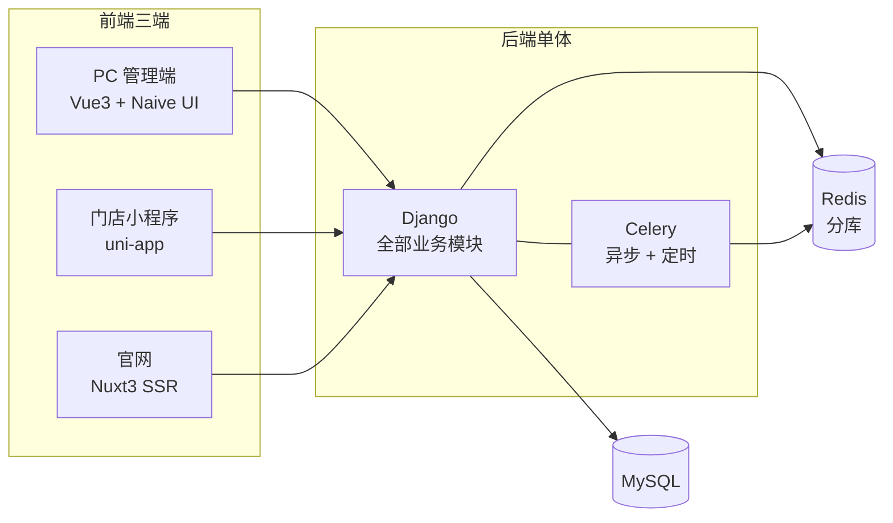

# 技术选型与取舍:为什么单体 Django 够用

> 这一页讲我们整套系统的技术底座怎么选、为什么这么选,以及那些「选完才知道疼」的坑。适合正准备起项目的 IT 负责人和工程师,也适合直接喂给你的 AI 编程助手当选型依据。

**读完你会知道:**

- 一到三人的小团队 + AI,为什么应该选单体架构而不是微服务
- 后端 Django + MySQL + Redis + Celery、前端三端各自的分工与理由
- 视图层、响应格式、数据库、时区这几个「第一天就要定死」的约定
- 我们在响应格式、Redis Session、数字序列化上踩过的真实坑,以及对应的铁律

## 选型总览

先把结论摆出来:

| 层 | 选型 | 一句话理由 |
|---|---|---|
| 后端 | Python + Django 单体 | 一个仓库装下全部业务,AI 上下文完整 |
| 数据库 | MySQL(utf8mb4 + 严格模式) | 成熟、好招人、好排障 |
| 缓存/会话/消息 | Redis(分库使用) | 一个组件干三件事,运维负担最小 |
| 异步/定时 | Celery + Redis broker | Django 生态里最省事的选择 |
| PC 管理端 | Vue3 + Vite + Naive UI | 内部同学用,迭代快优先 |
| 门店小程序 | uni-app | 店长店员在微信里就能用,不装 App |
| 官网 | Nuxt3 SSR | 服务端渲染,为 SEO 和 AI 搜索收录服务 |

前端为什么是三端而不是一端?因为三类用户的使用场景完全不同:内部同学坐在电脑前要的是信息密度和操作效率;店长店员站在店里要的是手机上两三下点完;官网面向的是搜索引擎和 AI 爬虫,必须服务端渲染出完整 HTML。硬揉成一端,三边都别扭。三端如何拆、怎么协作,见[四端拆分](four-repos.md)。

## 为什么是单体:小团队 + AI 的最优解

我们的技术团队常年就是一到三个人的小团队,再加上 AI 编程助手。在这个规模下,单体不是妥协,是最优解:

- **对人:** 微服务的收益(独立部署、独立扩容、团队解耦)全都建立在「有多个团队」的前提上。一个人维护八个服务,得到的不是解耦,是八份部署脚本、八套日志、八个可能互相版本不齐的接口契约。
- **对 AI:** 这是很多人还没意识到的一点——**单体对 AI 极其友好**。一个仓库里,模型定义、视图、任务、路由全在眼前,AI 顺着 import 就能把一条业务链读完整。换成微服务,AI 每跨一次服务边界就丢一次上下文,你得不停地替它搬运信息。
- **对排障:** 出问题时只有一个进程、一份日志、一个数据库。凌晨两点收到告警,这件事的价值怎么强调都不过分。

什么时候该拆?我们的答案:等到**某个模块的发布节奏或负载曲线明显和主体不一样**,再拆那一块,而不是预防性地全拆。到今天为止,我们几十个业务模块仍然在一个 Django 工程里,没有哪一块真正到了必须拆出去的程度。

## 视图层约定:无聊,但要从第一天守住

我们用函数式视图,不用 class-based view。不是 CBV 不好,是函数式对小团队和 AI 都更直白:一个 URL 对应一个函数,从头读到尾就是完整逻辑,没有继承链要跳。

三条核心约定:

1. **统一入参函数,只处理 POST JSON。** 所有视图第一行调同一个入参解析函数,它只解析 POST 的 JSON body(GET 直接返回空字典)。好处是入参处理只有一种写法,AI 生成新接口时不会发明第二种。
2. **统一响应封装。** 所有视图最后一行调同一个响应函数,内部挂一个自定义 JSON encoder,datetime 自动序列化成字符串。没有这个封装,每个接口都会各写一遍时间格式化,格式迟早漂移。
3. **响应结构平铺。** 列表接口一行数据就是一层 key-value,不搞 `data.shop.info.detail` 这种三四层嵌套。嵌套深了前端取值链一长,空值防御写到吐;而且给列表接口加字段时,别忘了后端如果对这个列表做了缓存,**必须同步清缓存**,否则新字段永远是 undefined——这个我们踩过,排查了半天以为前端没发版。

## 响应 code:我们最后悔没在第一天定死的事

我们的响应约定是 `code` 表示业务结果。但早期没有定死类型:有的接口成功返回字符串 `'0'`,有的失败返回整数 `-1`。等意识到的时候,两种写法已经散落在几百个接口里,前端只能用 `== `松散比较兜底,**清不掉了**——每次想统一,都意味着前后端同时改一大片,风险远大于收益,于是永远搁置。

新项目请在写第一个接口之前就定死:code 用什么类型、成功是什么值、失败怎么分段。写进项目的约定文档,让 AI 每次生成接口都照着来。这是一行字的成本,拖过第一周就是永久债务。

## 数据库:MySQL 的三个开关

- **utf8mb4,第一天开。** 餐饮业务里 emoji 无处不在——门店群名、商品备注、顾客评价。utf8 存不下 emoji,等线上报错再改 charset 是大工程。
- **严格模式(STRICT_TRANS_TABLES),第一天开。** 非严格模式下超长字符串静默截断、非法日期存成零值,数据坏了都不报错。宁可开发期多报错,不要生产期静默脏数据。
- **持久连接(CONN_MAX_AGE)。** Django 默认每个请求新建一次数据库连接,这笔开销直接体现在 TTFB 上。我们把 CONN_MAX_AGE 设为几百秒后,接口延迟肉眼可见地下降。这是性价比最高的一行配置。

## 时区:USE_TZ=False 的取舍

Django 默认 `USE_TZ=True`,数据库存 UTC,展示时转本地时区。我们反其道选了 `USE_TZ=False` + 本地时区:数据库里存的就是墙上钟的时间,写 SQL、查数据、对报表所见即所得,业务同学直接看库不用换算。

代价是:**Celery Beat 默认按 UTC 理解时间**,和这个选择正面打架。定时任务写「早上 9 点」结果下午 5 点才跑(或者反过来),我们在这上面结结实实踩过。怎么配、怎么验证,单独写在[定时任务:双系统并存的教训](scheduled-jobs.md)里,改任何定时配置前先读那一页。

这个取舍没有标准答案:单时区经营的连锁品牌,USE_TZ=False 简单直接;但如果你的业务可能跨时区,老老实实用 UTC。

## Redis:一个实例,分库隔离

Redis 在我们系统里身兼三职,靠分库隔离:

| DB | 用途 |
|---|---|
| 0 | Celery broker(任务队列) |
| 1 | Django 缓存 + Session |
| 2 | WebSocket(Channels) |

分库的价值在排查:任务堆积看 db0,缓存异常看 db1,互不干扰,`FLUSHDB` 也不会误伤别的用途。

**Session 存 Redis 而不是数据库**,是为了性能——每个请求都要读 session,走数据库就是每个请求多一次查询。但这带来一个必须提前知道的坑:**重启 Redis,全员掉登录**。所有人同时被踢回登录页,客服消息瞬间爆炸。要么给 Redis 配持久化,要么把重启安排在低峰期并提前公告。我们是被动学会这一课的。

## 数字序列化:钱的字段没有「差不多」

后端出参里的浮点数,**必须 round 到固定位数再返回**。原因藏得很深:后端算完的浮点数带着一长串小数位(比如 `12.340000000000002`),前端如果用了 json-bigint 一类的解析库,会把这种长数字当大数处理转成**字符串**,页面上一做算术直接崩——而且是「有的数据崩、有的不崩」的飘忽 bug,极难定位。

铁律:**钱一律用分(整数),或后端 round 成固定两位小数**。这条写进接口约定,让 AI 生成每个带金额的接口时自动遵守。

## 权限:布尔字段表,不是 RBAC

我们没有上角色-权限-资源的重型 RBAC,而是一张轻量权限表:**一个功能一个布尔字段**——「能不能看选址」「能不能审批」「能不能进财务」,一人一行,一目了然。

- 加一个新功能模块 = 加一个布尔字段,一次迁移搞定
- 排查「他为什么看不到这个菜单」= 查一行记录,十秒出答案
- 没有角色继承、权限组合的心智负担,AI 改权限逻辑也不容易出错

这个设计从小团队一路用到更大规模的组织,跨越量级依然够用。什么时候不够?当你需要「给某类人批量开一组权限」高频发生时,再演进成角色层也不迟——从布尔表演进到 RBAC 很容易,反方向几乎不可能。核心域建模详见[核心域:门店 / 员工 / 角色权限](../02-modules/core-domain.md)。

## 踩坑与红线

这五条正文里都讲过缘由了,这里只留一行速查;完整的「症状 → 根因 → 铁律」三行式在[后端坑](../03-pitfalls/backend.md)里,一处维护,别处只指过去:

- **code 类型混存**:成功判断写两种才能过 → 第一个接口之前就定死 code 的类型和取值,写进约定文档。
- **重启 Redis 全员掉登录**:Session 在缓存库没持久化 → 配持久化,或选低峰期重启并提前公告。
- **列表加字段前端拿不到**:接口有缓存没清 → 清缓存是发版动作的一部分,不是可选项。
- **长浮点崩页面**:json-bigint 把长小数转成字符串 → 出参浮点必 round,钱用分或固定两位。
- **定时任务错点一个时区**:USE_TZ=False 与 Celery Beat 的 UTC 假设打架 → 改定时前先读[定时任务篇](scheduled-jobs.md),配完验证实际触发时间。

## 延伸阅读

- [四端拆分:后端 / 管理端 / 门店小程序 / 官网](four-repos.md) — 三个前端仓各自怎么组织
- [部署链路与部署坑](deployment.md) — 这套单体怎么上线、怎么热重启
- [定时任务:双系统并存的教训](scheduled-jobs.md) — 时区打架的完整展开
- [后端坑:时区 / 迁移 / 连接 / 序列化](../03-pitfalls/backend.md) — 本页 5 条坑的完整三行式都在这,还有更多
- [M1 骨架:框架 / 响应约定 / 鉴权 / 定时](../05-replication/prompts/00-bootstrap.md) — 想复刻?从这个 prompt 开始

---

[← 返回本层目录](README.md) · [返回总目录](../README.md)
