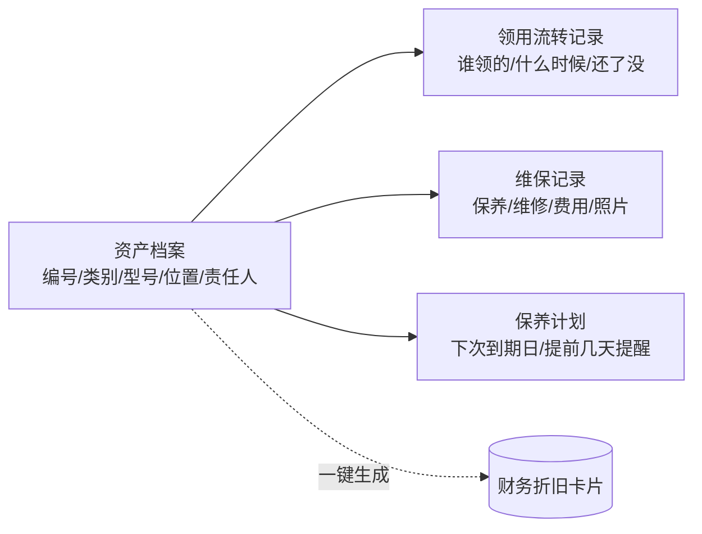

# 资产台账:实物、领用与保养提醒

> 这页讲手机、电脑、工厂设备这类固定资产怎么在业务系统里管起来:台账、领用流转、维保记录、到期提醒,以及它和财务折旧卡片的边界。适合设备越买越多、却没人说得清「在谁手上、什么时候该保养」的老板和行政/工厂负责人读。

**读完你会知道:**

- 实物台账和财务折旧卡片为什么要拆成两套、怎么关联
- 四张表就能撑起一个够用的资产模块
- 扫码免登:怎么让工人在设备旁边用手机三秒完成报修
- 保养提醒的频率设计——临期限频、逾期每天催
- 为什么维修费**故意不**自动生成凭证
- 一个反直觉的观察:上线后台账长期是空的,这不是 bug

## 边界:实物一套,财务一套

同一台设备,有两个完全不同的视角:

| | 实物台账 | 财务卡片 |
|---|---|---|
| 关心什么 | 在哪、在谁手上、什么时候保养、坏没坏 | 原值、折旧年限、月折旧、净值 |
| 谁维护 | 行政、工厂、领用人自己 | 财务 |
| 变更频率 | 高(领用、调拨、维修) | 低(建卡后按月计提) |
| 放在哪 | 业务系统 | [内账引擎](finance-ledger.md) |

我们的拍板是**两套并存、单向关联**:实物档案上存一个「财务卡片 ID」,一键从实物档案生成财务卡片(按类别自动带出折旧年限),此后**互不混写**。

为什么不合成一张表?因为两边的生命周期不同步:一台设备在实物侧可能经历三次领用、两次维修,财务侧只关心它建卡那天的原值和年限;反过来,财务侧折旧提完了,实物侧这台机器还在车间里转。硬合成一张表,结果就是两边的字段互相污染,谁都不敢改。

同理,**不设独立权限位、登录即可用**——资产台账的价值在于人人都愿意随手更新,加权限只会让它变成一张没人维护的死表。财务卡片那一侧才需要资金权限。

## 四张表

几个建模细节值得抄:

- **人员字段存「ID + 姓名快照」,不用裸外键**。设备可能领给已离职的人,外键会把删除/停用逻辑变复杂;存快照后,历史记录永远读得出当时是谁领的。
- **资产编号是唯一标识,别指望序列号**。我们工厂里同型号的三台机组,铭牌上印着完全相同的出厂码——序列号在现实里不唯一。自己发号(类别前缀 + 年月 + 序号),贴上码就是这台设备的身份。
- **铭牌照片单独一个字段**,不要混进普通照片列表。铭牌是查型号、查保修、报维修时最常看的一张图,值得给它一个固定位置。覆盖时要求二次确认,被换下的旧图自动并入历史照片,不丢。

## 扫码免登:让现场的人愿意用

设备管理的死穴是**录入发生在设备旁边,而人不会为此打开电脑登录系统**。所以我们给每台设备生成一个二维码贴在机身上,扫码打开的是一个**免登录的手机页**:

- 页面地址里带一个**签名令牌**(设备 ID + 有效期签名),服务端验签即可确认扫的是哪台设备,不需要用户身份;
- 页面上能干三件事:看这台设备的档案和维保历史、登记一次保养/维修、**一键报修**;
- 报修后设备状态自动置「维修中」,并给责任人发 IM 通知(没有责任人就通知建档人)。

免登不等于不设防:令牌带有效期、只对这一台设备有效、页面上不暴露任何跨设备的查询能力。这是我们在几个「现场扫码」场景(工位报工、资产报修)通用的模式——**用一次性签名令牌换取零登录成本**。

## 保养提醒:频率比内容重要

保养提醒最容易做成两个极端:要么提醒太少漏掉,要么每天轰炸到被屏蔽。我们的频率设计:

- **临期**(距到期日 N 天内):限频提醒,不是每天发;
- **逾期**:每天催,直到有人登记完成;
- **保修到期**:在剩余 30/7/1 天各提醒一次——保修快到期时的一次检修,往往能省下一次自费维修。

提醒走 IM 单聊发给责任人,而不是发群——群里的提醒是所有人的责任,也就是没有人的责任。

## 为什么维修费不自动生成凭证

模块里能拿到维修费金额,顺手生成一张凭证看起来很自然。我们**故意没做**:因为维修费的报销单已经走了[费用审批](expense-payroll.md)链路并入账,这里再自动推一次就是重复过账。

这条推广出去是一个通用判断:**同一笔钱只能有一个入账入口**。业务模块记录金额是为了统计和分析(这台设备今年修了几次、花了多少),不代表它有资格记账。做集成时先问:「这笔钱的入账责任在谁?」——答案只能有一个。

## 一个反直觉的观察:台账空着不是 bug

模块上线之后相当长一段时间,台账里是零条记录。后来才慢慢有了第一批设备档案和保养计划。

这不是失败,是**顺序的必然**:资产管理的成本在于「盘一遍、贴码、录入」,而这件事只有在有明确触发点(比如新工厂投产、买了一批新设备)时才会真正被做。工具先备好,业务用起来时才不至于又拿 Excel 顶上。

对复刻者的提醒:别拿「上线后有没有数据」当唯一验收标准,但**一定要在真的开始录入时回头看一次**——第一批真实数据总会暴露建模问题(我们就是在那时才发现同型号设备的出厂码重复)。

## 踩坑与红线

**坑一:免登页遇到非 JSON 响应直接白屏**

- 症状:扫码页在接口还没部署时整页崩溃,连错误提示都没有。
- 根因:未部署的接口被前端路由兜底成了 HTML,而请求层默认按 JSON 解析,解析异常直接把 Promise 打挂。
- 铁律:**免登页的每个请求都要有兜底**——现场的人没有刷新重试的耐心,更没有看控制台的能力。

**坑二:把实物档案和财务卡片做成一张表**

- 症状:财务改折旧年限,业务侧的领用记录跟着被锁;业务侧调拨位置,财务报表出现波动。
- 根因:两个生命周期不同的对象共用了一行数据。
- 铁律:**双轨 + 单向关联**,各自演进,靠一个 ID 对上。

**红线汇总**

- 实物台账不设权限门槛,财务卡片那一侧才要资金权限;
- 资产编号自己发,不依赖厂商序列号;
- 现场页一律免登 + 签名令牌 + 单设备作用域;
- 提醒发给责任人单聊,不发群;
- 维修费不自动入账,入账入口只留报销链路一个。

## 延伸阅读

- [费用审批与工资:把审批流做进自己的系统](expense-payroll.md) — 维修费实际的入账路径
- [自建内账引擎:事件源自动凭证(模式篇)](finance-ledger.md) — 财务卡片和折旧在这一侧
- [冷链温控与工厂 IoT:让设备自己说话](iot-coldchain.md) — 台账管「这台设备是什么」,IoT 管「它现在怎么样」
- 复刻 prompt:[M7 费用审批与工资](../05-replication/prompts/14-expense-payroll.md)(资产台账作为其中一节)

---

[← 返回本层目录](README.md) · [返回总目录](../README.md)
