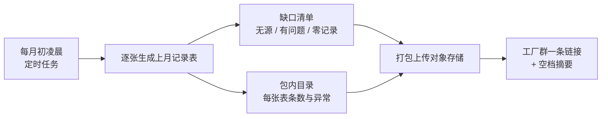

# 认证记录自动生成:把系统里已有的数,排成审核员要的表

> 这页讲我们怎么把系统里本来就有的数据(来料验收、关键控制点实测、冷库温度、追溯、设备保养、AI 卫生巡查……)按食品安全体系认证的条款排成带表头和签字栏的记录表,一键出 Word/Excel,每月自动打包归档——并且明明白白告诉你**哪几张表根本出不来**。适合准备做食品安全认证的工厂负责人、品控和工程师读。

**读完你会知道:**

- 「表单 ← 数据源 ← 缺口」矩阵怎么建,为什么它本身就是一份整改清单
- 为什么我们出的是「零依赖」的 Word/Excel,而不是往服务器上装一堆文档库
- 缺口怎么算,为什么「零记录」不等于「合规」
- 每月归档包里有什么,单张表出错为什么不能拖垮整包
- 三条红线:不替代现场签字、缺就写缺、演练底稿不是演练记录

## 问题:数据都在,表要人抄

食品安全体系认证(例如 FSSC 22000 及其前提方案、HACCP)审核时要看大量记录表:来料验收、关键控制点监控、温度、追溯演练、设备保养、人员卫生……盘一遍就会发现:**相当一部分表的数据系统里早就有**,只是散在各个模块;另一部分记录的是纯现场动作,**业务系统天然没有数据源**,只能靠纸质表或专门建录入入口。

人工把系统数据抄到纸质表上,既费人,又引入抄错。于是做了一个**纯读**的模块:不建业务表、不改任何数据,只负责把已有数据按认证条款排成表。

## 表单 ← 数据源 ← 缺口 矩阵

模块的核心是一份**表单目录**,每张表一行:对应的认证条款、数据从哪个模块来、能不能出、能出但哪些列要手填、出不来的原因。示例:大约一半能自动出。

下表用通用的记录类别说明矩阵怎么分类:

| 类别 | 典型类别 | 处理 |
|---|---|---|
| 能出,字段齐 | 进货验收类、温度监控类、召回类 | 直接出 |
| 能出,有列要手填 | 业务记录有了、但缺签核列的表,比如只记了监控人、没记复核人;或只记了告警、没记处置 | 出表并标出空列 |
| 能出,口径要说明 | 来自摄像头 AI 巡检的人员卫生巡查(只能定位到机位,见[工厂摄像头 AI 巡检](factory-ai-inspection.md))、追溯演练(只是底稿) | 出表 + 页内说明 |
| 出不来 | 业务系统天然不产生数据的纯现场动作,比如现场清洁类、虫害防治类、计量校准类、过敏原管理类 | 不出表,给出原因 |

在自己的系统里填满这张矩阵,它就是一份**整改清单**:「出不来」那一栏告诉你认证前必须补什么模型、或者先走纸质流程;「有列要手填」那一栏告诉你补上哪几个字段就能整张自动化。

## 零依赖出 Word/Excel

生产环境里没有任何 Office 文档库,而往运行中的容器里临时装依赖,容器一重建就丢(依赖必须进镜像,见[部署链路](../01-architecture/deployment.md))。所以我们选了**零依赖**的出法:

- **正式表单**:内容是带样式的网页表格,配上 Word 的文件类型,Word 直接打开、可编辑,另存即得真 Word 文件;
- **电子表格**:同理配 Excel 的文件类型;
- 另有纯数据 CSV(内审做统计)和网页预览(浏览器打印成 PDF)。

升级路提前埋好:代码对原生文档库做了软探测,哪天镜像里装上了就自动切到原生格式,接口和调用方都不用改。**在那之前绝不假装有**。

每张正式表都有表头(单位、条款、期间)、数据区和页脚。页脚印着「本表由系统生成,打印后须手签方为有效记录」,并留四格空白:记录人 / 复核人 / 审核人 / 日期。数值**照抄不圆整**,合格与否取录入端的结论,系统不重新判。单表有行数上限(示例:一万行),超过就提示按仓、按点位、按产线收窄——几万行的表本来也不该交给审核员。

## 缺口怎么算:零记录不等于合规

| 类 | 判据 |
|---|---|
| 无数据源 | 静态清单,目录里标着 |
| 记录空档 | 逐日扫描该有记录的日子:温度类每个日历日都该有;关键控制点、生产过程类**只看有生产活动的日子** |
| 字段缺失 | 表能出,但有列要手填 |
| 本期零记录 | 有数据源,但这个期间一条都没有 |

另有几条专项空档,比逐日扫描更有针对性:有关键控制点工序却一条实测都没有的工单;已完工却没有出厂检验的工单;启用中却整段期间零读数的温控点(探头掉线或没接入);冷冻冷藏来料没填到货温度的条数;AI 判了不良或违规、还没人工复核的条数;逾期未执行的保养计划;缺证或过期的健康证。

**「零记录」≠「合规」**:停产期间没记录是正常的,有生产活动却零记录才是缺陷。「只看有生产活动的日子」这条判据就是为此而设——既不拿停产日冤枉人,也不因为没数据就当一切正常。

## 每月自动归档

- **月初跑上月,而不是月末跑当月**:月末跑会漏掉最后一天的记录;
- **放在凌晨低峰**:归档要扫一整月的温度流水,白天跑会和业务抢数据库;
- **单张表出错绝不拖垮整包**:异常写进包内目录的「生成异常」列,其余照出;
- **上传失败就如实说**:落本地兜底目录,群消息里写明「上传失败,文件在服务器上」,不假装成功;
- **手工触发和定时任务调同一个函数**,口径只有一份;但手工触发**不发群**,手动生成不该惊动工厂群;
- **环境守卫放第一行**:这个任务既写存储又发消息,非生产环境直接返回。

## 三条红线

1. **自动生成不替代现场签字**。页脚四格签字栏打印后手签才有效;拿系统截图当记录,审核员不认。
2. **缺就写「缺」,绝不拿空表冒充**。请求一张没有数据源的表,返回的是「为什么出不来」的原话,而不是一张空表。**审核时拿出一张全空的表,比没有这张表更糟**。
3. **追溯演练表是底稿,不是演练记录**。有系统不等于做过演练,审核员要看的是有人实地走一遍后写的演练报告。表里还要老实交代:门店去向有多少是按「先到期先出」规则**推定**的,而不是实测的。

一条容易忽略的:归档包里有员工姓名、证件到期日等个人信息。含个人信息的归档只放私有存储,走登录下载,链接不外发。

## 缺口矩阵当整改清单:按性价比排序的通用思路

矩阵填出来之后,补的顺序按「成本低、堵的口子大」排。下面是通用思路,不是某家工厂的待办:

| 顺序 | 先补哪类 | 为什么 |
|---|---|---|
| 1 | 已有记录上缺的签核与处置字段(复核人、复核时间、纠偏措施、处置结论) | 不用新建模块,照系统里已有的复核字段范式加列即可;「有记录、没人审」又是审核里最常见的不符合项 |
| 2 | 「只告警、不记处置」的事件,补一张处置记录(处置人、措施、关闭状态) | 告警链路已经有了,差的只是闭环留痕 |
| 3 | 高频的纯现场动作(每日、每班都要记的那类) | 要新建模型和录入入口,成本中等,但覆盖的条款多、天天被看 |
| 4 | 低频台账(年检、送检、定期评估一类) | 频次低,先用纸质也能过,系统化的收益排在后面 |
| 5 | 跨流程的关联断点(比如返工前后的批次关联) | 牵涉生产流程改造,最贵,放最后 |

经验是**先补字段,再建模型**:很多「有列要手填」甚至「出不来」,差的只是现有记录上的两三个字段,成本远低于新建一个模块。

## 人机边界

| 环节 | 系统 | 人 |
|---|---|---|
| 取数排表 | 按目录生成,标出空列与空档 | — |
| 判定 | 照抄录入端结论,不重新判 | 现场判定、填纠偏 |
| 签字 | 留四格空白 | 打印后手签 |
| 演练 | 出底稿 | 实地走一遍并写报告 |
| 补缺口 | 给出清单与优先级 | 决定补模型还是先走纸质 |

## 踩坑与红线

- **审核前一晚才发现某张表一条记录都没有**
  根因:只在出表时看数据,没有持续的缺口体检。
  铁律:月度归档自带缺口清单,零记录与空档每月主动报,不等审核员来问。
- **停产那几天被缺口体检报成大面积空档**
  根因:关键控制点类记录按每个日历日扫描。
  铁律:生产类记录只看有生产活动的日子;温度类才逐日全扫。
- **想出原生格式,把文档库装进运行中的容器,重建后全丢**
  根因:依赖没进镜像。
  铁律:依赖进镜像;没进之前用零依赖格式,软探测留好升级路。
- **一张表的数据异常,让整个月度归档失败**
  根因:逐表生成没有隔离异常。
  铁律:单表异常记进目录,其余照出。

**红线汇总**

- 自动生成不替代签字;缺就写缺;演练底稿不是演练记录;
- 纯读,不写任何业务数据;数值照抄不圆整,不重新判定;
- 含个人信息的归档链接不外发。

## 延伸阅读

- [生产与成本:研发档案 / 工单 / 批次追溯(结构篇)](production-costing.md) — 关键控制点、来料验收、批次追溯这些数据源
- [冷链温控与工厂 IoT:让设备自己说话](iot-coldchain.md) — 温度记录与到货温度数值化
- [工厂摄像头 AI 巡检](factory-ai-inspection.md) — 人员卫生巡查表的来源
- [质检与计量](quality-control.md) — 出厂检验里的净含量复核与视觉质检复核
- [资产台账:实物、领用与保养提醒](asset-management.md) — 设备保养记录的来源
- 复刻 prompt:[M8 工厂 AI 巡检、机组自动化与认证记录](../05-replication/prompts/18-factory-ai-equipment.md)

---

[← 返回本层目录](README.md) · [返回总目录](../README.md)
