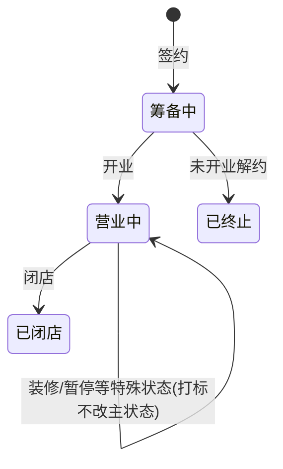

# 核心域:门店 / 员工 / 角色权限

> 这一页讲整个系统的地基:门店、总部用户、门店员工三张核心表怎么建,权限怎么做得又轻又不失控,以及我们在「在职口径」上踩过的那个史诗级坑。所有业务模块都挂在这三张表上,建议在读任何其他模块页之前先读完它。

**读完你会知道:**

- 为什么总部员工和门店店员必须从第一天就分成两套账号体系建模
- 布尔/状态字段的语义方向不统一,会怎样在之后的每一个统计里反复咬你
- 一人多角色,逗号串和关联表怎么选,轻量方案的唯一安全用法是什么
- 不上重型 RBAC 的情况下,权限怎么用「布尔权限表 + 统一 check 函数」管住
- 门店生命周期状态机,以及存活率/闭店率为什么必须用队列法先写口径文档

## 三张核心表:一切业务的地基

我们整个系统的核心域只有三张表:

| 表 | 是谁 | 干什么 |
|---|---|---|
| 门店(Shop) | 一家加盟/直营门店 | 几乎所有业务数据的外键归属:营业额、订货单、巡检记录、库存……全部挂 `shop_id` |
| 总部用户(User) | 总部员工:运营、督导、市场、财务 | 登录管理端网页,按权限操作后台功能 |
| 门店员工(ShopStaff) | 店长、店员 | 登录门店小程序,做开收档、订货、盘点这类店内动作 |

后面每一个业务模块——订货、库存、积分、巡检——本质上都是在这三张表之间连线。核心域建歪了,上层每个模块都要陪着歪。

## 总部用户与门店店员:两类人,别合成一张表

这是核心域最重要的一个建模决策:**总部员工和门店店员是两类人,第一天就分开建模**,不要图省事塞进同一张「用户表」再用一个 `type` 字段区分。

三个维度上它们完全不同:

- **账号体系不同**。总部用户走公司账号,入离职由行政流程管理;门店店员由店长在店内维护,人员流动快得多,一家店一年换几轮店员是常态。
- **登录端不同**。总部用户登录管理端网页(PC 为主);门店店员只用门店小程序,从来不碰管理后台。
- **权限模型不同**。总部用户按功能模块授权(谁能看选址、谁能审批打款);门店店员的权限边界天然就是「本店」,基本只区分店长/店员两级。

合表的诱惑在于「都是人,复用登录逻辑多省事」。但两类人的生命周期、字段、鉴权路径没有一处真正重合,合在一起只会让每个查询都背上一个 `WHERE type=...`,而且总有人忘写。我们分开建,后来所有需要区分「谁在操作」的场景都因此变得简单。

分表的代价是鉴权变成双体系,这确实埋过雷,见下文「鉴权双体系」一节。

## 史诗级坑:两张表的「在职」方向相反

先把坑亮出来,因为它影响你读本页之后的所有统计类模块。

我们的两张人员表,「在职」这个语义的字段方向是**相反**的:

- 门店员工表:`staff_status == 1` 表示在职
- 总部用户表:`work_state == 0` 表示在职

也就是说,一张表里「1」是好状态,另一张表里「0」才是好状态。这不是设计,是两个人在不同时期各写各的、没有约定造成的历史事故。

后果是什么?此后**每一个**涉及人员的统计——在职人数、人效、日报覆盖率、头像展示——写查询的人都要先想一遍「这张表到底哪个值是在职」,想错一次就是一个反向的报表。它没有让系统崩溃,但它让每一行相关代码都变得需要小心翼翼,而且这个税永远交不完:字段一旦上了生产、被几十处引用,再想统一方向,迁移成本远大于当初约定一下的成本。

**铁律:布尔/状态字段的语义方向,全库统一,并写进口径文档。** 比如约定「表示正向/存续状态的一律用 1(或 True)」,新表新字段一律遵守;历史不一致的字段,在口径文档里显式列出来,让每个新人(包括你的 AI 助手)第一天就知道这里有雷。

## 多角色:逗号串起步,但筛选必须收口

一个总部员工常常身兼多角色:既是运营又管市场,既做督导又看选址。建模有两条路:

- **逗号串(轻量)**:用户表加一个 `roles` 字段,存 `"运营,市场"` 这样的逗号分隔串。加角色就是改一个字符串,不用建表不用迁移。
- **关联表(规范)**:`user_role` 中间表,一人一角色一行。查询规范、可加外键约束、可挂角色级别的扩展字段。

教科书会告诉你必须用关联表。我们的实际经验是:**小团队从逗号串起步完全可以**,角色总数十来个、按角色筛人的场景就那么几处,关联表带来的规范性在这个规模下换不回它的建模和迁移成本。

但轻量方案有一个不可妥协的前提:**按角色筛选的逻辑必须封装成一个函数**,全库只有这一个入口。绝对不要让 `roles LIKE '%运营%'` 这种写法散落在几十个视图里——一旦散落,你会遇到:

- 「运营」匹配上「运营助理」这类子串误伤;
- 将来想升级成关联表时,要全库 grep 出每一处 LIKE 挨个改,漏一处就是一个隐蔽 bug。

收口成一个函数后,轻量方案的所有缺点都被关在一扇门里;哪天规模到了,把这一个函数的实现换成关联表查询,调用方一行不用动。

## 权限:布尔权限表 + 统一 check 函数

我们没有上 RBAC(角色-权限-资源三层模型),而是用一个非常朴素的方案:**按功能模块的布尔权限表**。

- 一张权限表,一行对应一个总部用户,列就是一个个布尔字段:`site_permission`(能用选址工具)、`site_admin_permission`(能审批选址)……新功能模块上线,加一列。
- 同一类接口共用**一个统一的 check 函数**收口。比如所有选址接口进来第一件事都调用同一个 `check_site_permission(request, admin=False)`:校验登录态 + 校验对应布尔位;审批类接口传 `admin=True` 改查管理位。

为什么不上 RBAC?因为我们的权限需求本质上是「这个人能不能用这个模块」,粒度到模块级就够了,没有「资源级授权」「权限继承」这类需求。RBAC 的表结构和管理界面本身就是一个不小的模块,小团队维护它的成本会超过它解决的问题。

这个方案能守住的前提,和多角色一样是**收口**:权限判断只出现在每个模块唯一的 check 函数里,视图代码永远只写 `check_xxx_permission(request)`,绝不散写 `if user.site_permission and ...`。散写一处,将来改权限逻辑就漏一处。

## 鉴权双体系:店端接口别套总部登录校验

两类人分表带来的直接后果:**鉴权是两套体系**。

- 总部用户走管理端的登录校验(比如一个 `require_login` 装饰器,从 session 里取当前 User);
- 门店店员**根本不在总部用户表里**,店端有自己的登录态和自己的鉴权装饰器。

这里我们踩过一个全线事故级别的坑:给门店小程序的接口顺手套上了总部的登录装饰器——因为「加个登录校验」看起来是天经地义的安全加固。结果所有门店用户请求这个接口一律「未登录」,因为校验逻辑去总部用户表里找人,永远找不到。功能瞬间全线不可用,而且代码 review 时非常难看出问题:那行装饰器怎么看都像是对的。

由此沉淀两条纪律:

1. **店端接口必须用店端专用的鉴权装饰器**(或一个同时接受两类身份的兼容版本),新写接口先问一句:这个接口是谁在调?
2. **改鉴权必须双向验证**:不能只测「匿名请求被拦住了」就收工,还必须测「正常登录的用户依然能通」。鉴权改动的两种失败模式——该拦的没拦、不该拦的拦了——后者往往更隐蔽,因为测试者自己常常拿的是权限最高的账号。

## 门店生命周期与统计口径

门店不是建一行数据就完事,它有生命周期。我们用一个简单的状态机:

状态机本身不复杂,复杂的是**基于状态的统计口径**——存活率、闭店率是加盟品牌最敏感的数字,口径不清就是灾难。我们的做法:

- **队列法(cohort)**:按签约月份把门店分组,同一队列内追踪「签约后第 N 个月还存活的比例」。这样才能回答「去年签约的店活得怎么样」,而不是把新店老店混在一个池子里算出一个谁也解释不了的数。举例(示例数字,非真实数据):2025 年 3 月签约队列 20 家店,12 个月后仍营业 17 家,则该队列 12 个月存活率 85%。
- **剔除特殊状态门店**:测试店、转让中、特殊合作形态的门店,统一从分子分母里剔除,剔除规则白纸黑字写进口径文档。
- **口径先写文档,再写代码**。统计类需求最贵的坑从来不是代码 bug,而是两个人对「闭店率」的理解差了一个剔除条件,各自的报表打架,追查半天发现都「没写错」。我们的流程是:先在口径文档里把定义、分组、剔除规则写清楚并确认,再动手写查询。

## 踩坑与红线

**坑一:「在职」口径方向相反**
- 症状:涉及人员的统计时对时错,同一个「在职人数」不同人写的查询结果不一样。
- 根因:两张人员表的在职字段一张 `==1` 为在职、一张 `==0` 为在职,历史上没约定。
- 铁律:布尔/状态字段全库语义方向统一;历史不一致处显式写进口径文档,新代码一律走封装好的判断函数。

**坑二:店端接口全线「未登录」**
- 症状:门店小程序某功能上线后所有用户报未登录,总部账号测试却一切正常。
- 根因:店员不在总部用户表,店端接口被误套了总部登录校验,校验永远找不到人。
- 铁律:店端接口用店端专用鉴权装饰器;改鉴权必须双向验证——匿名被拦 + 已登录仍通。

**坑三:角色筛选 LIKE 散落全库**
- 症状:按角色筛人的结果偶发多人/漏人,升级角色模型时无从下手。
- 根因:`roles LIKE '%xx%'` 直接写在各个视图里,子串误匹配,且没有统一入口可改。
- 铁律:逗号串方案可以用,但筛选逻辑必须收口成唯一函数;LIKE 只允许出现在这一个函数里。

**坑四:闭店率各说各话**
- 症状:两份报表的闭店率对不上,双方代码都「没错」。
- 根因:分组方式、剔除规则没有事先约定,各自按理解实现。
- 铁律:统计口径先写文档、经确认再写代码;队列法分组 + 剔除规则是口径文档的必备章节。

## 延伸阅读

- 复刻这一模块:[M2 核心域:门店 / 员工 / 权限(复刻 prompt)](../05-replication/prompts/01-core-domain.md)
- 鉴权与响应约定的骨架从哪来:[M1 骨架:框架 / 响应约定 / 鉴权 / 定时](../05-replication/prompts/00-bootstrap.md)
- 口径类坑的完整清单:[数据口径:最贵的一类坑](../03-pitfalls/data-caliber.md)
- 建立在核心域之上的第一个大模块:[订货商城:价格快照与订单一致性](ordering-mall.md)

---

[← 返回本层目录](README.md) · [返回总目录](../README.md)
