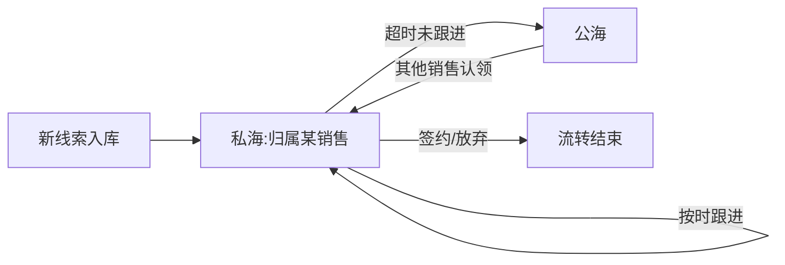

# CRM 招商:线索管道与公海

> 这页讲加盟招商的线索管理系统:线索从哪来、怎么按阶段推进、公海机制怎么防止销售囤线索,以及看板怎么帮管理者看清转化。适合要做招商/销售管理的老板、IT 负责人,以及准备复刻这套系统的工程师。

**读完你会知道:**

- 招商线索的完整生命周期:从进线到签约(或放弃)的阶段化管道怎么设计
- 公海机制为什么是招商 CRM 的灵魂——不做公海,线索一定会被囤死
- 线索列表为什么必须服务端分页,前端全量分页会在什么时候崩给你看
- 官网表单怎么直接落进 CRM,以及读写接口为什么要分离
- 管理者该看哪四个看板指标,而不是只盯"签了几家"

## 业务背景:招商线索是最贵的流量

连锁品牌做加盟招商,一条有效线索的获客成本可能高达几百到上千元(示例数字,非真实数据)。线索来了没人跟、跟了没记录、记录了没复盘——每一环漏掉都是真金白银。所以招商 CRM 要解决三件事:

1. **线索不丢**:所有渠道的线索进同一张表,谁跟进、跟到哪一步,一目了然。
2. **线索不囤**:销售手里压着一堆"我在跟"的线索却不动,别人也碰不了——公海机制专治这个。
3. **过程可复盘**:每一步跟进有时间线记录,管理者能看到转化卡在哪个阶段。

### 线索来源

我们的线索来源有四类,入库时打上来源标记(source 字段),后面看板按来源分析质量:

- **官网表单**:官网"加盟咨询"表单提交,自动落库(下文详述打通方式)
- **电话进线**:客服/招商同学接到咨询电话后手工录入
- **转介绍**:老加盟商、员工、合作方介绍,手工录入并记录介绍人
- **展会**:招商展会现场收集的名片和登记表,会后批量录入

来源标记一旦录入不再修改——它是后面"来源质量"分析的基础,改了口径就全乱了。

## 线索管道:阶段化推进

线索不是"跟进中/已成交"两个状态就够的。我们把管道切成 8 段(示例划分,各家可按自己的招商流程调整):

```
新线索 → 已联系 → 有意向 → 约见 → 考察 → 谈判 → 签约
                                              ↘ 放弃(任意阶段可进入)
```

设计要点:

- **阶段只能显式流转**:销售在跟进时手动推进阶段,系统记录每次流转的时间点。不做"自动推进"——阶段变更本身就是有价值的行为数据。
- **每段有停留时长统计**:系统记录线索进入每个阶段的时间,可以算出"这条线索在'有意向'停了 14 天"(示例数字,非真实数据)。停留过长的线索在列表里高亮提示,管理者一眼看到哪些线索卡住了。
- **"放弃"要写原因**:放弃不是删除,线索保留在库里,放弃原因(预算不足/区域不合/失联……)结构化存储,供来源质量分析用。
- **阶段流转历史单独存表**:不要只在线索主表上存"当前阶段",要有一张流转记录表(线索 id、从哪段、到哪段、操作人、时间)。漏斗分析和停留时长全靠它。

## 公海机制:防囤线索的核心设计

这是招商 CRM 里最值得抄的一个机制。

**问题**:销售天然倾向囤线索——"这条我在跟"说出口很容易,但手里线索一多,单条跟进质量必然下降;同时其他销售看着线索池干瞪眼。没有制度约束,好线索会烂在少数人手里。

**解法**:公海(公共线索池)+ 超时回收 + 认领保护期。



规则拆开讲:

- **超时回公海**:线索归属某个销售后,若超过 N 天没有任何跟进记录(N 是可配置的阈值,示例:7 天),系统自动把线索归属清空,扔回公海。"跟进记录"以真实写入的跟进时间线为准——打个电话不记录,系统视同没跟。
- **公海可认领**:公海里的线索所有销售可见,谁认领归谁。认领是抢占式的,先到先得,认领动作本身也进流转记录。
- **认领后保护期重新计时**:认领那一刻起,超时计时器归零重算。这意味着你认领了就得真跟,不然 N 天后又会被回收——认领不是占坑,是承诺。
- **回收自动化跑定时任务**:回公海的判断不依赖人工,由定时任务每天扫描执行。规则写进代码,才没有"跟老板关系好就不回收"的空间。

这套机制上线后的直接效果是:销售的行为从"抢线索"变成"抢跟进"——因为不跟进就会失去,跟进记录的完整度也顺带上来了(要保住线索就得写记录)。

## 工程要点

### 线索列表:服务端分页 + 筛选,没有商量余地

早期线索少,前端一次拉全量、本地分页筛选,又快又省事。但招商跑起来之后线索是持续累积的——几千条之后,全量接口响应越来越慢,前端渲染开始卡,最后列表页直接不可用。

我们的做法(也是踩过坑之后的重构):

- 列表接口**服务端分页**:前端传 `page` / `page_size`,后端返回当前页数据 + 总条数。
- **筛选条件全部下推到服务端**:按阶段、来源、归属销售、创建时间范围、是否公海等条件,都作为查询参数由后端过滤,而不是前端拉回来自己筛。
- 排序同理,由后端做,并给排序字段建索引。

一句话:**列表页的数据量由后端控制,前端永远只处理一页**。这条坑是性能问题,不在[数据口径:最贵的一类坑](../03-pitfalls/data-caliber.md)的讨论范围,所以在这里单独强调——CRM 是最容易犯这个错的模块:上线时数据少,怎么写都不卡,坑埋在半年后。

### 跟进记录:时间线模型

每条线索下面挂一串跟进记录,按时间倒序展示成时间线:

- 每条记录包含:跟进方式(电话/微信/见面……)、跟进内容摘要、下次跟进计划时间、操作人、时间戳。
- 跟进记录**只增不改不删**——它是公海回收的计时依据,也是复盘的原始凭证,允许改删等于允许伪造。
- 阶段流转事件也混排进时间线展示("2026-01-05 由已联系推进到有意向"),销售翻一条线索,完整历史一屏看完。

### 数据模型骨架

抽象出来就三张核心表:

| 表 | 职责 |
|---|---|
| 线索主表 | 客户信息、来源、当前阶段、当前归属销售(为空即在公海)、关键时间点 |
| 跟进记录表 | 线索 id、跟进内容、方式、操作人、时间;只增 |
| 阶段流转表 | 线索 id、from 阶段、to 阶段、操作人、时间;漏斗与停留时长的数据源 |

## 看板:管理者看什么

招商负责人不该只盯"这个月签了几家",管道健康度要看四个维度:

- **漏斗转化率**:各阶段之间的转化比例(新线索→已联系是多少,约见→考察是多少)。哪一段掉得最狠,就该在哪一段下功夫——是话术问题、还是资料包问题、还是考察接待问题。
- **来源质量**:分来源统计"进入意向及以后阶段的比例"和最终签约率。假设看板显示展会线索签约率是官网表单的三倍(示例数字,非真实数据),下一季度的预算怎么摆就有依据了。
- **人均跟进量**:每个销售每天/每周的跟进记录条数。这是过程指标,和结果指标(签约数)对照着看:跟进量高但签约低,可能是线索分配或能力问题;跟进量低,先别谈别的。
- **转化周期**:从进线到签约的平均/中位时长,以及各阶段停留时长分布。周期数据决定你对"这条线索还有没有戏"的判断标准,也是设置公海回收阈值 N 的依据。

看板数据全部来自阶段流转表和跟进记录表的聚合——这就是前面坚持"流转历史单独存表、跟进只增不删"的回报。

## 与官网打通:表单直落 CRM

官网是独立部署的仓库(见[四端拆分](../01-architecture/four-repos.md)),它的"加盟咨询"表单不落自己的库,而是直接写进后端的 CRM 线索表。设计上有两个讲究:

- **读写接口分离**:官网调用的是一个专用的、只做"写入线索"这一件事的内网接口;官网需要展示的数据(如门店数等对外口径)走另一组只读接口。写入口不复用管理端的 CRM 接口——鉴权体系不同、字段校验口径不同,混在一起早晚出事。
- **新线索自动推送 IM 群提醒**:线索落库的同时,触发一条消息推到招商团队的 IM 群(我们用飞书,换微信/钉钉同理),带上客户姓名、来源、意向区域摘要。官网来的线索时效性最强——客户刚填完表单的几分钟内是接通率最高的窗口,推送让销售第一时间抢认领,而不是第二天早上才翻后台。

## 踩坑与红线

- **列表页越用越卡,最后打不开**
  根因:上线初期图省事做了前端全量分页,数据量增长后接口和渲染双双崩溃。
  铁律:任何会持续累积的业务列表,第一天就做服务端分页 + 服务端筛选,不存在"先全量后面再改"——后面改的成本是前者的十倍。

- **公海回收形同虚设,线索照样囤**
  根因:回收只看"有没有更新线索",销售随手改个备注就算"跟进过",计时器被廉价重置。
  铁律:回收计时只认真实的跟进记录写入,且跟进记录只增不改不删;回收由定时任务自动执行,不留人工豁免的口子。

- **来源质量分析算不出来**
  根因:早期录入不强制来源字段,或者允许事后修改,历史数据来源标记残缺混乱。
  铁律:来源在线索创建时必填、创建后只读;宁可多一个"其他"选项,不留空。

- **漏斗报表和实际感受对不上**
  根因:只在主表存"当前阶段",没有流转历史表,漏斗只能拿存量快照凑,算不了转化率和停留时长。
  铁律:阶段流转必须事件化存储(from/to/操作人/时间),报表只从流转表算,不从主表快照猜。

## 延伸阅读

- [选址工具:评估 SOP 与地图打点](site-selection.md) — 线索签约之后紧接着就是选址,两个模块在业务上前后衔接
- [四端拆分:后端 / 管理端 / 门店小程序 / 官网](../01-architecture/four-repos.md) — 官网与后端的仓库边界和接口约定
- [数据口径:最贵的一类坑](../03-pitfalls/data-caliber.md) — 来源标记、阶段口径这类"改一次全乱"的问题的通论
- 复刻本模块:[M4 选址工具 + CRM 招商 prompt](../05-replication/prompts/11-site-crm.md)

---

[← 返回本层目录](README.md) · [返回总目录](../README.md)
