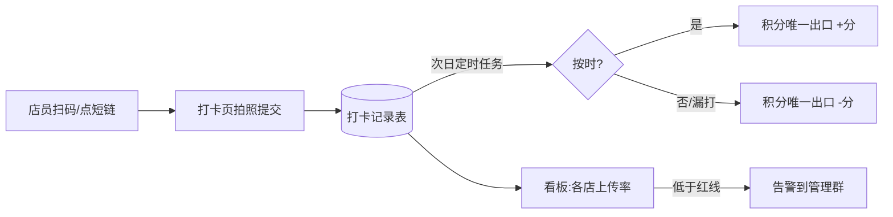

# 门店日常运营:开收档与工作日报

> 这页讲两个「小而高频」的模块:门店每日开档/收档打卡,和总部同学的工作日报。适合想把「日常管理动作」数字化的老板和 IT 负责人读——这两个模块代码量不大,但对执行率的理解,值一个大模块的钱。

**读完你会知道:**

- 为什么门店管理数字化的正确单位是「动作」,而不是「系统」
- 开收档打卡怎么和积分联动,让制度自己跑起来,不靠人天天催
- 入口设计的铁律:操作门槛每高一步,执行率掉一截
- 企业 IM 没有已读 API 时,「已读回执」怎么自建
- 一个真实踩过的工程坑:模块重名遮蔽

## 设计思想:把「店长每天该做的事」变成动作

很多门店管理系统的失败方式是一样的:功能做了一大堆,店长不用。根因往往不是功能不好,而是系统站在总部视角设计——总部想看什么就做什么报表,却没回答店长的问题:「我今天到底要干几件事?」

我们的思路反过来:**门店管理数字化 = 把「店长每天该做的事」逐条列出来,每一条都变成可打卡、可统计、可积分的动作。**

- **可打卡**:动作有明确的完成凭证(一张照片、一条记录),做没做一目了然,不靠口头汇报。
- **可统计**:每个动作落库带门店、人、时间,总部看板能算出每店每人的执行率,趋势和异常都看得见。
- **可积分**:执行结果直接挂钩积分(积分再挂钩礼品兑换等激励),按时做加分、没做扣分,制度自己闭环,不需要运营同学天天在群里追着喊。

开收档就是这个思想最典型的落地:动作最小(拍照打卡)、频率最高(每天两次)、反馈最快(次日结算积分)。把这一个动作跑通,后面的巡检整改、营业额录入,都是同一套模式的复用。

## 开收档:每天两次拍照打卡

### 动作定义

- **开档**:门店每日开始营业前,店长/店员拍照打卡,证明门店按时开档、状态就绪(比如门头亮灯、设备开机——具体拍什么由运营制定标准)。
- **收档**:每日营业结束后,同样拍照打卡,证明收档动作(清洁、关火断电等)已完成。

后端就是一张打卡记录表:门店、打卡人、类型(开档/收档)、照片、打卡时间。**照片是凭证,时间是判据**——设计上刻意保持简单,不做复杂的表单,因为每多填一个字段,执行率就掉一截(下文详述)。

### 与积分联动:次日结算

打卡不和激励挂钩,就是给总部交作业,店长没动力;挂了积分,它才变成店长自己的事。规则骨架:

- 在规定时间窗口内完成打卡 → 加分(例如 +20 分,示例数字,非真实数据);
- 超时或漏打 → 扣分(例如 -50 分,示例数字,非真实数据),扣分明显重于加分,因为要防的是「不做」而不是奖励「做了」;
- **结算放在次日**,由定时任务统一跑前一天的打卡记录,而不是打卡瞬间实时加减分。

为什么次日结算而不是实时?三个原因:

1. **收档时间跨零点**。烧烤门店收档常在半夜,「当天」的边界必须等这一天真正结束才判得准;
2. **留出补救与申诉窗口**。照片传失败、网络抖动这类情况,当天有机会补,结算前运营也来得及豁免;
3. **积分变动要走唯一出口**。我们的积分体系所有加减分收敛到一个服务函数入口(见[积分体系:唯一出口原则](points.md)),定时任务批量调用这个出口,比在打卡接口里散落加减分逻辑干净得多,也方便追溯每一笔分是哪条规则给的。

### 看板与红线告警

单店看打卡是运营督导的事,总部要看的是**面**:一张看板按门店列出近 N 天的开收档上传率,并设一条红线(例如 90%,示例数字,非真实数据)——低于红线的门店高亮,并触发告警推送到管理群。

这里的经验是:**看板的价值不在「看」,在「排序」**。把上传率从低到高排,管理层每天只需要看最差的几家,注意力自然花在刀刃上。全绿的日子看板没人打开,恰恰说明制度在自己运转。

## 入口要足够轻:短链直达

这是本页最想强调的一条产品经验:**操作门槛每高一步,执行率掉一截。**

店员的使用场景是:凌晨收档,人很累,手机在兜里。如果打卡的路径是「找到 App → 登录 → 找到打卡入口 → 选择自己的门店 → 拍照」,五步,那这个功能的真实执行率不会好看——每一步都会流失一部分人,而且流失的恰恰是你最想管住的那部分门店。

我们的做法:

- **永久短链 + 二维码**:每家门店生成一条永久有效的短链(可打印成二维码贴在店里),链接里带门店参数;
- **点开即达打卡页**:不需要选门店(参数里带了),不需要在菜单里找入口,落地页就是「拍照 → 提交」;
- **登录态尽量免打扰**:能免登或静默续期就绝不让店员在深夜对着登录框输密码。

一句话:把路径压缩到「扫码 → 拍照 → 提交」三步以内。这个原则不只适用于开收档——任何要门店高频执行的动作(营业额录入、整改反馈),入口设计都按这个标准审一遍。

## 工作日报:一人一天一篇 + 自建已读回执

日报模块管的是总部/职能同学,和开收档共享同一个设计思想:把「写日报」「读日报」都变成可统计的动作。

### 规则骨架

- **一人一天一篇**:数据库层面按(人,日期)约束唯一,写过了就是编辑,不存在一天刷多篇凑数;
- **谁该写**:按名单圈定应写人群,看板按天列出谁写了、谁没写——「没写」不需要任何人去查,自己浮在看板上;
- **谁读了**:管理层关心的不只是下属写没写,还有相关同事、上级读没读。

### 已读回执:IM 不给,就自己建

日报通常通过企业 IM(飞书/钉钉/企业微信这类)推送提醒。我们最初想直接用 IM 的消息已读状态,查证后发现**用的 IM 并没有开放消息已读查询的 API**——这条路走不通。

解决方式很朴素:**自建一张已读记录表**。用户在我们自己的日报页面打开某篇日报时,后端记一条(日报 ID,读者,时间);看板据此展示每篇日报的已读人列表。IM 只负责把人引到页面来,已读事实由自己的页面采集。

这个模式值得推广:**依赖第三方平台的能力之前,先确认 API 真的存在;拿不到的数据,想想能不能在自己可控的环节采集到等价事实。**已读回执如此,后面外卖平台数据抓取(见[外卖平台集成](delivery-platforms.md))也是同一个道理。

### 管理层看板

日报看板两个视角:

- **写的视角**:按天/按人统计提交情况,漏写一目了然;
- **读的视角**:每篇日报的已读名单,以及管理者自己的「未读列表」——把「读下属日报」也变成管理者的一个可打卡动作。

## 踩坑与红线

**模块重名遮蔽(真实踩过)**

- 症状:日报相关接口行为诡异,改了代码不生效,像是「另一份代码」在运行。
- 根因:日报视图文件最初的命名与仓库里既有模块重名,Python 导入时被同名模块遮蔽(shadowing),实际加载的不是你以为的那个文件。排查细节见[后端坑](../03-pitfalls/backend.md)。
- 铁律:**模块命名全仓唯一**。新建视图/服务文件前先全仓搜一遍名字;宁可名字长一点(如 `work_report_view`),也不用容易撞车的通用词。

**积分加减分散落各处**

- 症状:分数对不上账,查不清某笔分是哪个功能加的。
- 根因:每个业务模块自己写加减分逻辑,没有统一入口和流水记录。
- 铁律:积分变动只走唯一出口函数,带上来源规则标识;开收档结算任务也不例外。详见[积分体系](points.md)。

**入口做重了没人用**

- 症状:功能上线,执行率始终上不来,运营天天在群里催。
- 根因:打卡路径太长(登录、找入口、选门店、填表单),深夜疲惫状态下的店员不会配合五步操作。
- 铁律:高频动作入口按「扫码 → 拍照 → 提交」三步标准审;每加一个必填项,先回答「这个字段值不值得掉一截执行率」。

## 延伸阅读

- [积分体系:唯一出口原则](points.md) — 开收档积分结算的底层依赖
- [巡检与经营分](inspection.md) — 同一设计思想的进阶版:把多个管理动作合成一个分数
- [营业额:录入、抓取与达标锁](turnover.md) — 另一个「高频门店动作 + 达标约束」的模块
- [后端坑:时区 / 迁移 / 连接 / 序列化](../03-pitfalls/backend.md) — 模块重名遮蔽的完整排查过程
- 复刻 prompt:[M4 积分 + 开收档 + 日报](../05-replication/prompts/04-points-daily-ops.md)

---

[← 返回本层目录](README.md) · [返回总目录](../README.md)
