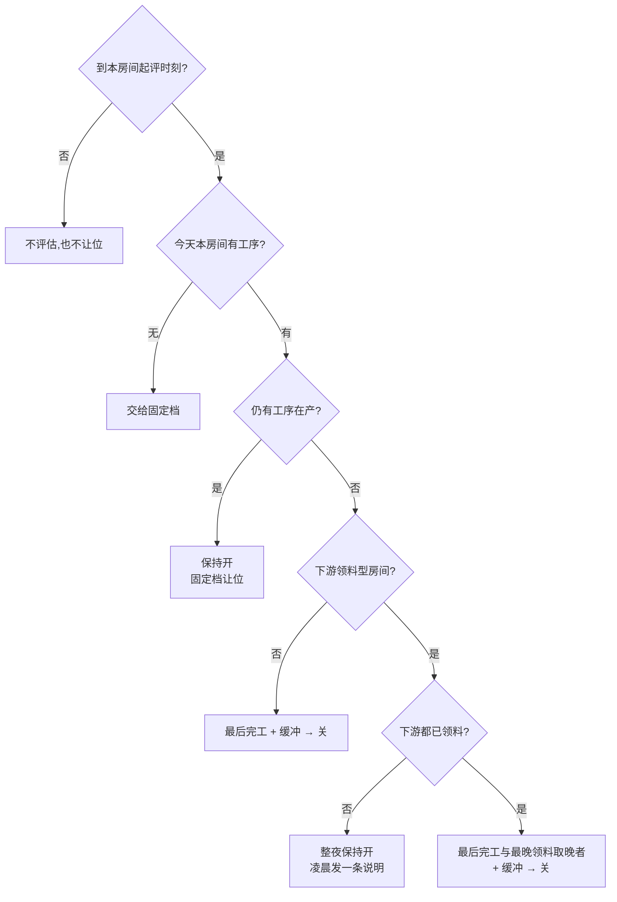

# 机组联网与收工自动关机:让冷机按生产节奏下班

> 这页讲工厂制冷机组联网之后我们又往前走的几步:统一状态出口、开关机变更流水、故障告警分级推送,以及最需要谨慎的一步——**系统在收工后自己去关机**。温度采集、告警门禁和远程控制的分级在[冷链温控与工厂 IoT](iot-coldchain.md)已经讲过,本页不重复。适合厂长、设备负责人和要实现它的工程师读。

**读完你会知道:**

- 两类接入方式不同的机组,为什么必须收口成一个状态出口
- 「几点谁开的机」为什么只能靠变更流水,不能靠快照
- 故障告警怎么分级推送,以及为什么我们**不承诺「机组一挂必推送」**
- 收工自动关机的两档节奏、冻库守卫、红线房间,和「次日恢复」这个成对动作
- 工单驱动关机:让最后一道工序告诉机组何时下班,参数怎么用回放来定

## 两类机组,一个出口

工厂的机组按接入方式分两类:**云平台采集的一类**(机组自带联网模块,数据在设备厂商云上,我们每分钟拉一次);**厂内总线直连的另一类**——[冷链页](iot-coldchain.md)说过通用网关卡在拿不到寄存器表,后来其中一类机组拿到了点表,由厂内边缘盒子走工业总线直读,每分钟一轮。

两类数据的字段、频率、可信度都不一样。早期各页面和机器人各拼各的,同一个问题得到两个答案。于是收口成**一个状态出口**:一个函数返回全厂每台机组一行——开关、设定温度、库温、风机/压缩机、故障、近期告警、最近一次开关机变更、数据新鲜度;同一个出口还能吐一段中文摘要给机器人直接念。**任何人问「机组怎么样」,只许走这一个出口**。收口时顺手清掉三个坑:

- **死通道的空表**。曾接过一个从没跑通的第三方通道,它的表永远为空。机器人拿「这张表没数据」回答「直连那一类有没有数据」,答成了「一条都没有」。废弃的数据源要从出口摘掉,并在文档里写明「这张表为空不代表任何事」。
- **状态快照频率太低**。云平台那一类温度每分钟采,开关机/设定/风机却只有每天一次快照,机器人把在转的机组答成「关机」。改成**采温度时顺带刷新状态项**,不多打一次云。
- **直连那一类「关没关」读不出**。点表里的「运行状态」在我们现场恒为 0(受启停控制方式影响),真正可用的是状态位、输出功率和转速;而点表里根本没有「已关机」这个状态,关机和到温停机读出来一样。对外口径因此是:**「关」只代表此刻没在转,标为不确定**,绝不说成「总开关已关」。边缘盒子改读法时,后端先兼容新旧两种数据再更新盒子,顺序反了就会报错。

## 开关机变更流水

「昨晚车间那台机组是几点被谁打开的?」——快照永远答不了,因为它只覆盖、不留痕。我们出过一次车间机组通宵空转,第二天谁也查不出时间线。

做法:**每分钟采集时和上一次的值比,变了就记一条事件**(开关、设定温度、故障、风机、压缩机、其他),零额外云调用。风机、压缩机只记「停 ↔ 转」的跨越,不记转速波动,否则流水被噪声淹没。状态出口每行带上「最近一次开关机变更」,摘要里直接念出来。

## 故障告警:分级推送,不承诺「一挂必推」

云平台那一类有告警接口,我们定时拉回落库。接的时候发现三件事:平台只保留近期一小段告警,**我们自己的表是唯一长期留存**;接口不认设备过滤参数,返回全量要自己筛;告警里的设备名只有型号、分不出位置,要自己按设备编号映射房间。首轮回填的历史告警一律不推。推送分级(数字为示例):

| 场景 | 规则 | 限频 |
|---|---|---|
| 冻库类房间 | 新告警即推 | 每台每日示例 5 条 |
| 车间等非冻库 | 同名告警在示例 12 小时内反复 4 次以上,推一条汇总 | 每台每日示例 2 条 |
| 最高严重级 | 持续超过示例 15 分钟仍未结束 | — |

最需要诚实的一条:核对接入以来的全部告警,**每一条都已带结束时间,且发生时间等于结束时间**——平台很可能只登记「已结束的告警」,「持续中」那条规则大概率永远不会触发。所以我们**绝不对任何人说「机组挂了一定会推送」**:告警推送只是加分项,失冷的真兜底是按温度曲线判断的看门狗。直连那一类根本没有告警通道,**告警为空 ≠ 没有故障**。

温度侧四层兜底各司其职,别搞混:

| 层 | 判据 | 会不会动手 |
|---|---|---|
| 真超标告警 | 已越限,且过[告警门禁](iot-coldchain.md) | 只通知 |
| 采集掉线 | 一段时间没有新读数 | 只通知 |
| 失冷自愈 | **已**超线且仍在升 | **会**下发恢复,所以判据刻意迟钝 |
| 趋势提前报 | 还没超标,按近一段曲线的回归斜率预测即将触限,排除化霜 | 只发消息、不进语音播报;**阈值持续校准中** |

## 收工巡检与自动关机

「下班忘关」是实打实的电费,关错一台冻库却是一库货。设计是**两档节奏 + 三道守卫 + 一对成对动作**。

**两档节奏**(时间为示例):**22:00 一档**处理人走库空型的车间;**01:00 一档**处理实时打包型的打包间和速冻——速冻出来的货直接进打包,打完才下班,放在第一档去关等于打断在产。每轮只处理本档名单,提醒也只说本档的机组。

**三道守卫:**

1. **红线房间**:成品库、原料库永不自动关,写死在代码里,配置里写了也拒绝;解冻间、发货区等按房间用途排除——**按用途分,不按品牌分**;
2. **冻库守卫**:速冻的压缩机在转就不下发(在转 = 还在打包或拉温),只有「开着且压缩机没转」才关。车间**刻意不加**这道守卫:夜里温控回差让它自己转起来,恰恰是要关的情形;
3. **免检指令**:加班时在群里说一句「今晚不关」即可免检、可撤销;按班次日算(凌晨仍算前一天),白天说一次,当晚两档都免。

**执行与汇报**:下发走和人工远程控制同一条通道,审计里操作人记为系统;**每台每晚只下发一次**;等几分钟复核,推一条合并消息,分五种状态:已关闭 / 仍在运行未关 / 关不掉请现场处理 / 仍开着但不在名单 / 数据过期。两个总闸分开:推不推消息、关不关机,后者一关就退回纯提醒。

**★成对的恢复动作**。关机时把这台机组的「期望状态」置为关,防止失冷看门狗夜里把它开回来——这是对的。但看门狗见「期望 = 关」就永久跳过,**没人改回来的话,被关过一次的机组从此失去停电自愈**,而且静默失效。所以每天早上把夜里由我们改过的期望状态恢复原值;没有记录的、夜里被人手动改过的一律不动。**任何改了守护状态的自动化,都必须有成对的恢复动作**。

## 工单驱动关机

固定钟点有两个毛病:收得早的那天白开几小时,干得晚的那天又打断生产。对部分房间,我们把判据从「钟点」换成「工序」:

- **只看本房间的工位,不看整张工单**。直觉是「整张工单做完才算收工」,回放却发现会把功能做反:包装、检验、入库这些下游工序常隔天补报,整单永远「没做完」,机组就永远关不掉。
- **下游领料型房间要等领料**。腌制滚揉间完工只代表「腌好了」,料还摊在屋里等穿串来领。条件是:当天在这里有工序的工单,下游工序**都已开工**(工序间是虚拟在制品,开工就等于把料领走,而开工自带缺料闸);有一张没领走就**整夜保持开**。「这间一夜没关」先查是不是下游没领料——那是设计行为,不是故障。
- **别拿「领料勾选」当信号**。挂在下游工序上的物料多是辅料,文员常隔天批量补勾。拿它当信号,等于让文员的鼠标决定机组关不关。
- **起评时刻与缓冲按房间分开**(示例:穿串车间 18:30 起评 + 45 分钟,滚揉间 16:30 起评 + 100 分钟)。参数拿近几周的班次逐日回放来定:每组候选参数下数「早关了多少台·小时」和「关了又来活的误关次数」,取误关不增加的最激进一档。
- **改起评时刻,必须同步挪定时任务的运行时段**,否则那会儿任务根本不跑。还没到起评时刻的房间**不参与让位**——没评估过就让位,等于没人接管,整夜不关。
- **次日凌晨兜底不能去掉**。开了工没报完工的挂单是常态,不兜底就漏成「整夜不关」,我们正是吃过这个亏才加的它。下游领料型房间例外。
- **固定档让位要留痕**:工单说还在干活的那几台,固定档那一轮不关、也不记「已尝试」,合并消息里单列「在产顺延」。

**改参数之前先跑回放**:用历史工单和机组流水逐日模拟「这套参数会在几点关、有没有误关」,看完对比再上线。

## 读数保留期与小时聚合

分钟级读数一年就是一张巨表,而多数查询只看最近几天。规则(示例:保留 60 天):每天凌晨先把即将过期的分钟读数**按小时聚合**(最小 / 最大 / 平均 / 条数)写进小时表,再分小批删除、批间停顿不锁表;**每个序列最新一条永远保留**,否则状态出口会把好好的机组报成「无数据」;任何新加的回看窗口不得超过保留期,更早的曲线去查小时表。

## 人机边界

| 动作 | 系统 | 人 |
|---|---|---|
| 采集、流水、告警入库 | 全自动 | — |
| 收工关机 | 按名单与守卫下发、复核、汇报 | 定名单与红线房间;「关不掉」时去现场 |
| 免检 | 执行指令 | 在群里说「今晚不关」 |
| 新房间能否夜里关 | 先排除并静音 | 业务确认后再纳入 |
| 参数调整 | 跑回放给出对比 | 拍板 |

## 踩坑与红线

- **被关过一次的机组,停电后不再自愈**
  根因:关机置了「期望 = 关」,看门狗见此永久跳过,没人恢复。
  铁律:改守护状态的自动化必须成对出现;恢复只动自己改过的。
- **机器人说直连机组「一条数据都没有」**
  根因:拿一个从未跑通的旧通道的空表做了判断。
  铁律:状态只走唯一出口;废弃数据源从出口摘除并写明「为空不代表任何事」。
- **工单驱动上线前的回放里,某房间几乎天天判不出收工**
  根因:按整张工单判,下游工序常隔天补报。
  铁律:只看本房间工位;改判定范围前必须先跑回放。
- **改了起评时刻,当晚毫无动静**
  根因:定时任务的运行时段没跟着挪。
  铁律:起评时刻与定时时段一起改;没评估的房间不让位。

**红线汇总**

- 成品库、原料库永不自动关,硬编码,配置不能覆盖;冻库压缩机在转不关;每台每晚只下发一次;
- 不承诺「机组一挂必推送」,失冷兜底靠温度曲线;
- 「关」对直连那一类只代表此刻没在转;
- 回看窗口不超过读数保留期。

## 延伸阅读

- [冷链温控与工厂 IoT:让设备自己说话](iot-coldchain.md) — 温度采集、告警门禁、远程控制四层级与停电复盘
- [生产与成本:研发档案 / 工单 / 批次追溯(结构篇)](production-costing.md) — 工单驱动关机读的是这里的逐道工序报工
- [质检与计量](quality-control.md) — 同一车间里的秤、相机与工艺闭环
- [工厂摄像头 AI 巡检](factory-ai-inspection.md) — 工厂里的另一张感知网
- 复刻 prompt:[M8 工厂 AI 巡检、机组自动化与认证记录](../05-replication/prompts/18-factory-ai-equipment.md)

---

[← 返回本层目录](README.md) · [返回总目录](../README.md)
