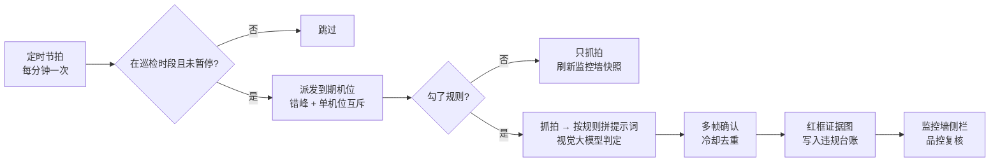
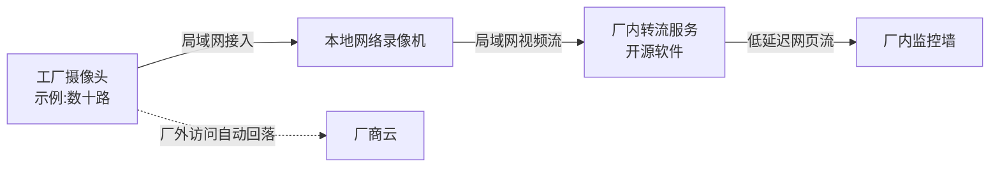

# 工厂摄像头 AI 巡检:规则按机位配,证据能回溯,人来拍板

> 这页讲中央工厂的摄像头怎么从「录了没人看」变成「每隔几分钟有 AI 看一眼、看到问题留证据、人来复核处理」,以及监控墙、本地录像与转流这些配套怎么做。适合有自建工厂、要过食品安全体系审核的老板、品控和厂长读;门店侧的视觉巡检见[业务型 AI](../04-ai-engineering/business-ai.md)。

**读完你会知道:**

- 工厂巡检为什么要和门店穿戴巡检分成两条线,边界划在哪
- 一次判定的完整链路:抓拍 → 按机位规则判 → 多帧确认 → 冷却去重 → 红框证据
- 违规台账怎么做成误判闭环,以及「按批次调出逐工序影像」怎么实现
- 监控墙的免登令牌比通用大屏多了哪几条规矩,为什么不能用「只读账号」替代
- 为什么直播走厂内录像机 + 转流,而不是全部走摄像头厂商的云

## 和门店穿戴巡检的边界

门店那条视觉巡检线跑得早,我们一开始想直接把工厂摄像头挂上去复用。评估之后决定**单独起一条线**,因为两边几乎每个维度都不一样:

| 维度 | 门店穿戴巡检 | 工厂 AI 巡检 |
|---|---|---|
| 规则 | 全网统一几条,写在代码里 | 规则库可增改,**每台摄像头勾自己的规则** |
| 节奏 | 长间隔大轮询,覆盖面优先 | 每台机位独立间隔,关键工位短间隔 |
| 出口 | 门店群提醒 → 督导复核 → 进经营分 | 违规台账 + 监控墙实时侧栏 → 品控复核 |
| 场景 | 机位分散、场景千差万别 | 机位固定、场景稳定 |
| 下游 | 整改任务 | 批次影像回溯、认证记录 |

复用的只有底层能力:抓拍、视觉大模型判图、证据存储。**规则、节奏、出口三样分开**——硬塞进同一套配置,改工厂一条规则就要担心误伤所有门店。

## 一次判定的链路

- **规则库 + 每机位勾选**。预置几条常见规则(工帽、工服、口罩、手套、抽烟、玩手机),每条是一段写给模型看的判定说明 + 严重级。每台摄像头勾自己适用的规则,还可追加一段只对本机位生效的补充说明。**没勾规则的机位只抓拍、不调模型**——仓库、外围这类点位刷新监控墙画面就够了,省下的是实打实的调用费。
- **间隔按机位配,有下限**。关键工位短、外围长(示例:最短 90 秒,默认 5 分钟)。定时节拍只负责判断「谁到点了」;派发时错峰,避免几十路抓拍同时撞上第三方云的限流。
- **单机位互斥**。上一轮判定还没回来,这台机位就不再派发——模型偶尔慢,不互斥就会叠出重复判定。
- **多帧确认**。一帧命中不算数,连拍几帧、多数命中才落账(示例:4 帧中 3 帧)。挡一下、转个身造成的误报,大半在这一步被滤掉。
- **冷却去重**。同一机位、同一违规项在冷却窗口内(示例:20 分钟)只记一条,否则一个没戴帽子的人能在台账里刷出几十条。
- **证据要能指到人**。模型除了结论,还返回位置框和「谁在哪」的文字描述(画面位置、衣着特征),证据图上画红框,复核的人一眼看到是哪一个。
- **巡检时段与暂停**。时段页面可配、支持跨零点;休息日一键暂停,不用改定时任务。
- **测试判定按钮**。管理页上对某台机位「立即抓拍 + 判定」,同步返回结果,**不落库、不进冷却**,专门用来调规则文字。规则写得好不好,拿真实画面试三次比开会讨论管用。

## 违规台账与误判闭环

AI 判定一定有误报,台账的价值在于**让误报越来越少的那条闭环**:

1. **人工复核**:品控在审核页对每条记录标「属实 / 误判」;
2. **误判原因结构化**:误判时必选原因(人物识别错、物品识别错、模糊遮挡、光线夜视、规则边界歧义、重复告警、其他);
3. **按原因开药方**:识别错 → 给该规则补一段「已知误判,以下情况不要判违规」,下一次抓拍就拼进提示词;模糊、光线 → 调机位或抓拍时段;规则歧义 → 改规则文字;重复告警 → 调冷却;
4. **看准确率**:按违规项、按机位、按周统计「属实 ÷(属实 + 误判)」,**待复核的不进分母**,否则没人复核的那几周准确率会虚高。

排除说明只许**收窄误报**,不许放宽判定标准——与门店视觉巡检是同一条红线(见[业务型 AI](../04-ai-engineering/business-ai.md))。

还有一条要老实写下来:**违规只能定位到机位和区域,归不到具体员工**。画面里的人没有身份,台账里的「谁」只是位置和衣着描述。所以它适合发现问题、做区域排名、给培训找素材,不适合直接对个人扣钱。

## 批次影像回溯

每次抓拍成功,画面都存档(可按机位关闭),保留期可配(示例:120 天),每天清理过期记录。**数据库记录和对象存储里的图要一起过期**——只删记录不删图,存储费悄悄涨;只让图过期不删记录,回溯时满屏裂图。

存档的用处在追溯。摄像头在管理页上绑定工位(支持手填自定义工位码,新车间新工位不用改代码)。输入一个批次号或工单号,系统给出**逐工序时间轴**:每道工序在哪个工位、谁做的、起止时间(前后各留一点余量),下面挂着该工位机位在这段时间的存档画面和同一窗口内的违规。

两种降级必须显式:

- 工单没走逐道工序报工 → 退化为「全程时间窗 × 全部存档机位」,并标明是降级结果;
- 某道工序的工位没绑机位 → 返回「无覆盖」,**不返回空列表**。空列表会被读成「这段没问题」,而真相是「这段没人看」。

## 监控墙

监控墙挂在厂长办公室和车间,两种视图:**直播墙**(多路实时画面)和**图片墙**(每个机位最近一次抓拍 + 一句判定摘要,直播拉不起来时也靠它兜底);右侧是**实时违规侧栏**,按「上次拉到的最大编号」增量轮询,新违规滚动出现。

挂墙屏的通用规矩(免登令牌、页面白名单、「挂墙可见 = 对外可见」)在[看板与车间大屏](dashboards.md)讲过。监控墙在那之上多了四条:

- **一类屏一套令牌**。监控墙和生产大屏各用一套,签名用各自独立的密钥和密钥编号,互不相认,一边泄露不牵连另一边;改密钥编号 = 这一套已发出的链接全部即时作废。现在是「按屏的用途分套」,屏多起来之后的下一步是一机一令,换机或外流只作废那一台。
- **令牌只解锁一两个只读接口**。处理违规、改规则、改机位配置,一律仍要登录。
- **先判登录再判令牌**。管理员在自己电脑上点开过一次免登链接,令牌会被记在浏览器里;若先判令牌,他就把自己锁进了墙面模式,看不到全量、出不了新链接。
- **敏感字段只在服务端裁剪**。前端隐藏挡不住开发者工具,往挂墙屏加任何敏感字段,都要在接口层就删掉,而不是交给页面去藏。

**为什么不建一个「只读账号」挂上去?** 因为大屏本身是全局只读聚合,根本用不到身份——用不到,就不给。令牌换来的只是「看这一两块屏」的能力,别的什么都做不了。

最容易漏的一步:**装机后那台机器上不留任何登录态**(退出登录、清浏览器存储)。接口改造只是让登录不再必要,不会把已有的登录态踢掉。

## 本地录像机 + 厂内转流

起初监控墙的直播全走摄像头厂商的云。这类摄像头的云平台通常有几条限制:单台设备的并发直播路数有上限,超过就拒流;云端起流有延迟;按流量计费。挂墙是「多路、常开」的场景,三条都会碰到,于是改成本地方案:

- **录像机选型先看协议兼容**。摄像头支持哪些接入协议,决定了能选哪些录像机;有的摄像头只能接入特定的录像机,采购摄像头之前就要查清楚。
- **AI 抓拍和直播分两条路**。AI 巡检是单帧、低频,继续走厂商云的抓图接口就够;直播是多路、常开,走厂内转流。各取所长,不必二选一。
- **地址治理顺序不能反**:设备先联网拿到动态地址 → 路由器按硬件地址绑定保留 → 最后才在录像机里加通道。录像机和转流服务自己的地址也要钉死,转流服务里写死了每一路的拉流地址,一洗牌全断。
- **云端设置和录像机本地认证是两条独立的路**。录像机报认证失败时,按「地址是否还是那台机器 → 本地认证信息是否填对 → 换台设备验证流程」的顺序查,别去改云端设置碰运气。
- **不要靠在云平台上解绑设备来排障**。解绑不改变设备本地的认证信息,对录像机接入没有帮助,只会让设备从我们平台消失,AI 巡检和监控墙一起失联,恢复要重走一遍授权。

## 人机边界

| 环节 | AI / 系统 | 人 |
|---|---|---|
| 看 | 按时抓拍、按规则判定、多帧确认、去重、画红框 | 决定哪台机位勾哪些规则、间隔多长 |
| 记 | 写违规台账、存档画面、监控墙滚动 | — |
| 判 | 只标记「疑似违规」 | 复核属实 / 误判,填误判原因 |
| 改 | 把排除说明拼进下一次判定 | 写排除说明、改规则文字、调机位 |
| 罚 | **不参与** | 是否追责、培训谁,由人决定 |

## 踩坑与红线

- **监控墙用了一周,屏上变成登录二维码**
  根因:墙面机器挂着某个人的登录态,登录态到期不续。
  铁律:挂墙屏一律免登令牌;装机后清掉机器上的一切登录态。
- **白天监控墙大面积黑屏**
  根因:云平台对单设备的并发直播路数有上限,多路常开会持续触顶。
  铁律:多路常开的直播走本地录像机 + 厂内转流,云只做厂外兜底。
- **为了「修」录像机绑定,有人解绑了云账号里的设备,设备从平台消失**
  根因:把云端绑定和本地认证当成了一回事。
  铁律:云端解绑永远不是排障手段;按地址 → 本地认证信息 → 换设备的顺序查。
- **一个没戴帽子的人在台账里刷出几十条**
  根因:每次抓拍独立落账,没有冷却。
  铁律:同机位同违规项冷却窗口内只记一条;多帧确认先于落账。
- **回溯页某道工序一片空白,被理解成「这段没问题」**
  根因:工位没绑机位,接口返回了空列表。
  铁律:没覆盖就明说「无覆盖」,空和没看是两回事。

**红线汇总**

- AI 只标记、不处罚;违规归不到个人,不与工资挂钩;
- 误判排除说明只许收窄误报;
- 令牌只开只读接口,敏感字段在服务端裁剪;
- 云账号里的设备永不解绑。

## 延伸阅读

- [业务型 AI:视觉巡检与聊天即操作](../04-ai-engineering/business-ai.md) — 门店侧的视觉巡检线与误判校准闭环
- [看板与车间大屏:数据怎么被真正看见](dashboards.md) — 挂墙屏免登令牌与白名单的通用做法
- [认证记录自动生成](certification-records.md) — 违规台账怎么变成「人员卫生巡查记录表」
- [机组联网与收工自动关机](equipment-automation.md) — 同一个工厂里的另一张网:冷机
- [生产与成本:研发档案 / 工单 / 批次追溯(结构篇)](production-costing.md) — 批次影像回溯挂在哪条链上
- 复刻 prompt:[M8 工厂 AI 巡检、机组自动化与认证记录](../05-replication/prompts/18-factory-ai-equipment.md)

---

[← 返回本层目录](README.md) · [返回总目录](../README.md)
