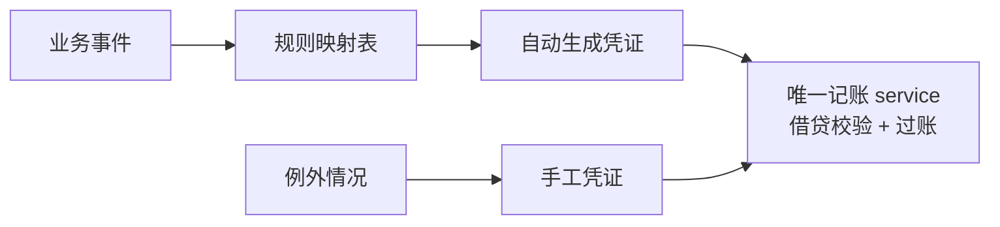

# 自建内账引擎:事件源自动凭证(模式篇)

> 这页讲我们怎么用一个轻量记账引擎,把业务事件自动变成会计凭证——写给想让内账「实时且不用人补录」的老板、IT 负责人和工程师。

**★ 开头先声明:本篇只讲记账引擎的技术模式与工程套路,不含任何真实财务数据、科目余额与公司主体安排。文中所有数字均为虚构示例。**

## 读完你会知道

- 财务日常怎么做到 **0 表格**:每天约 10 分钟、每月结账约 1 小时
- 为什么外账留在代账软件、内账自己建,两本账各管各的
- 「事件源自动凭证」是什么:业务发生即记账,月底不用补
- 凭证为什么必须收口在唯一 service,以及红冲重做的纪律
- 期初承接、实时钩子 vs 日终批量这些落地细节怎么选
- 财务模块最大的教训:先对口径,再写代码

## 先说结果:财务 0 表格,每天 10 分钟

这套引擎全部落地之后,财务的日常长这样:

- **数据全打通**。订货、生产、仓库、资金、报销(飞书审批流)的数据自动流入记账引擎,财务不再从任何系统导 Excel,也不再往任何系统手工录数——日常工作 **0 表格**。
- **银行流水直连**。银企直联自动拉取银行流水,与业务收付事件自动匹配入账,资金账不靠人对。
- **内外账自动衔接**。内账按外账口径自动汇总、推送给代账软件作做账底稿,财务不再手工整理外账素材。
- **人只处理例外**。每天需要人工介入的,只有**不到 5%** 自动匹配失败的账目,逐笔确认,几分钟处理完。

净效果:**内账这件事,每天约 10 分钟、每月结账约 1 小时**。对比传统「月底集中做账 + 系统间来回导表」的节奏,财务的时间从做表里解放出来,去做真正值钱的分析与管控。下面讲这套东西是怎么搭的。

## 为什么要自建内账

先说清楚我们**没有**做什么:我们没有替代代账软件,没有自己报税。外账(对外报税那本账)一直留在代账软件里,由专业财务和代账公司按税务口径处理——这件事外包给成熟工具是对的,合规风险不该自己扛。

我们自建的是**内账**,也就是管理会计那本账。管理层想要的东西,代账软件给不了:

- **实时**。老板想知道「这个月到今天为止赚没赚钱」,代账软件的节奏是月底集中做账,天然滞后一个月。
- **和业务系统打通**。订货、采购、库存、退款……这些数据全在我们自己的业务系统里。让财务每月手工从业务系统导数、再录进代账软件,既慢又容易错,而且颗粒度到不了单据级。
- **管理口径自由**。内账想按门店、按事业线、按资金账户切数据,外账的科目体系不为这个服务。

所以分工定成:**内账自建引擎,实时、自动、和业务打通;外账继续留在代账软件,管报税和对外报表**。两本账不打架——内账不碰税务口径,外账不追求实时。需要时,内账可以把汇总数据推送给外账系统,作为财务做外账的底稿参考。

这个引擎有多「轻量」?一套科目表、一张凭证表(头+分录行)、一个记账 service、一组自动凭证规则、几张报表——没有引入任何专业财务中间件,就是普通的 Django 模型和视图。餐饮连锁的内账复杂度撑不起、也不需要一套商业 ERP 财务模块。

## 核心模式:事件源自动凭证

传统做账的流程是:业务发生 → 攒单据 → 月底财务看着单据手工录凭证。我们把它倒过来:**业务事件发生的那一刻,系统自动生成凭证**。

哪些业务事件会触发自动凭证?我们覆盖的事件源包括:

- **订货收款** — 门店向总部订货并付款
- **采购入库** — 向供应商采购的货物入库
- **报销** — 内部费用报销审批通过
- **退款** — 订单退货退款完成
- **盘点损溢** — 库存盘点产生的盘盈盘亏
- **资金收付** — 银行账户的收付款事件

每类事件对应一条**规则映射**:事件类型 + 事件里的关键属性(比如商品类别、付款方式)→ 借哪个科目、贷哪个科目、金额从事件的哪个字段取。规则是数据,不是散落在各处的硬编码 if-else——新增一类业务想入账,加一条规则映射就行,不用改记账引擎本身。

这个模式带来两个直接好处:

1. **月底不用补账**。业务全年每天都在发生,凭证也全年每天都在生成。月底结账时要做的只剩检查和确认,而不是从头补录一个月的单据。
2. **凭证和业务单据天然关联**。每张自动凭证都带着来源事件的引用,从凭证能追到订单,从订单能追到凭证——对账时这条链路值千金。

手工凭证依然保留,但角色变了:**只处理例外**。规则覆盖不到的偶发业务、需要调整的特殊事项,才走手工录入。日常业务一张手工凭证都不该有——如果发现某类业务天天要手工录,那说明该给它加一条规则映射了。

## 唯一出口:凭证操作收口在一个 service

看过我们[积分体系](points.md)那页的读者会觉得眼熟——没错,又是唯一出口原则,而且在财务模块上执行得比积分还严。

凭证的**创建、过账、红冲、结账**,全部收口在单一 service 文件里。自动凭证走它,手工凭证也走它,报表模块只读不写。任何其他代码想直接 new 一条凭证记录、直接 update 一行分录,都视为违规。

这个 service 里守着几条硬规矩:

- **借贷不平直接拒绝**。凭证保存前校验借方合计 = 贷方合计,不平就抛异常,没有「先存了回头再改」这回事。这是复式记账的底线,引擎层面强制。
- **改错不改凭证,红冲重做**。已过账的凭证发现错了,不允许直接修改或删除——生成一张金额相反的红冲凭证冲销原凭证,再做一张正确的。三张凭证都留在账里,轨迹完整。这不是我们发明的,是会计的基本纪律,引擎只是把它变成了代码里绕不过去的约束。
- **结账即封存**。某个会计期间结账后,该期间不再接受新凭证和红冲;要调整只能在当前未结账期间做。

为什么收口这么重要?因为账的可信度是「全有或全无」的——只要有一条绕过校验的写入路径存在,所有报表数字就都要打问号。唯一出口把「账一定是平的」从团队约定变成了系统性质。

## 科目与报表

**科目表是预置的**。我们内置了一套适合餐饮连锁内账的科目模板(资产/负债/权益/成本/损益几大类,含常用末级科目),开账时一键初始化,再按自己的业务微调。不要让使用者从零建科目——科目编码体系是财务的地基,地基让专业模板打。

**报表也走模板**:利润表、资产负债表、现金流量表,每张报表的每一行对应「取哪些科目、怎么加减」的模板配置,报表引擎按模板从过账后的科目余额里取数。改报表口径改模板,不改代码。

一个具体建议:**现金流量表把直接法和间接法都做出来,互相校验**。直接法从资金收付事件直接归集,间接法从净利润倒推调整——两条完全独立的计算路径,理论上应该得到一致的经营现金流。我们两个都做了,不一致就说明某处规则映射有漏,这是一张免费的自动对账网。实践里它确实抓出过规则覆盖不全的问题。

## 期初承接:试算平衡不过,不许开账

内账引擎不是从公司第一天开始记的,历史数据在旧系统和代账软件里。所以需要一次**期初承接**:选一个开账日,把该时点所有科目的期初余额从代账软件导入进来。

这一步有一道铁闸:**试算平衡通过,才允许开账**。所有科目的期初借方合计必须等于贷方合计,差一分钱都不让开。听起来严苛,但期初不平的账,后面每一张报表都是错的,而且错得很难查——与其将来在报表里抓鬼,不如在门口把鬼拦住。

导入过程中常见的不平原因:代账软件导出口径和内账科目没对齐、漏了某些科目、方向搞反。这些都应该在开账前解决,而不是「先开账,回头调」。

## 实时钩子 vs 日终批量

自动凭证的触发方式,我们分了两条路:

- **实时钩子**:高频、单笔金额意义明确的事件——比如订货收款、退款——在业务事务完成的钩子里立刻生成凭证。管理层看到的账,和业务几乎零时差。
- **日终跑批**:低频的、或者需要按天汇总后才有会计意义的事件——比如某些汇总类损溢——由定时任务在日终统一生成。没必要为它们付出实时的复杂度。

选哪条路的判断标准很简单:**这个数字有人需要「现在」看到吗?** 有,走钩子;没有,走批量。批量永远比钩子好写好维护,不要为了「架构一致性」把所有东西都做成实时。

两条路共同的硬要求:**幂等**。钩子可能因为重试被触发两次,跑批可能因为失败被重跑——同一个业务事件绝不能生成两张凭证。做法不复杂:凭证上带来源事件的唯一标识,生成前先查这个事件是否已经入账,入过就跳过。这一条没做好,账面金额会悄悄翻倍,而且很久之后才被发现。

## 最大的教训:先对口径,再写代码

★ 如果这页只能带走一句话,是这句:**先把业务口径写成文档、让财务逐条确认,再写第一行代码。**

什么叫口径?举两个我们真实对过的例子(只讲问题本身,不涉及任何真实数据):

- **「订货款货两清怎么记」**——门店订货是先付款后发货的,那收到钱的时刻记什么?发货的时刻记什么?收入在哪个节点确认?预收要不要单独挂科目?工程师觉得「收到钱就是收入」天经地义,财务会告诉你完全不是这么回事。
- **「银行按收款账户核算」**——公司有多个银行账户,银行存款科目是记一个总数,还是按账户分设明细?对账的时候按哪个维度对?这决定了科目结构和资金类凭证的规则映射,建错了后面全要返工。

我们财务模块经历过的返工,**全部**来自口径没对齐——不是代码写错了,是代码正确地实现了一个错误的理解。而口径错误的返工特别贵:凭证已经生成了一堆,规则一改,历史凭证要不要红冲重做?报表历史数据还能不能看?每次都是一场清理运动。

所以流程必须是:工程师把每类业务事件「借什么、贷什么、什么时点、什么金额」写成一份人话文档 → 财务逐条看过、逐条签字 → 这份文档成为规则映射的唯一依据 → 之后任何口径变更,先改文档、财务再确认、然后才改规则。文档在前,代码在后,没有例外。

## 踩坑与红线

- **凭证金额悄悄翻倍**
  症状:某科目余额莫名比预期大,追查发现同一笔业务生成了两张凭证。
  根因:钩子被重试触发两次(或跑批重跑),自动凭证没做幂等。
  铁律:每张自动凭证带来源事件唯一标识,生成前查重;钩子和跑批都必须可安全重放。

- **报表数字对不上,查了三天**
  症状:利润表和明细账合计对不上,找不到差异来源。
  根因:存在绕过记账 service 的直接写库路径,借贷校验被跳过。
  铁律:凭证增删改只有唯一出口;发现旁路写入,当 P0 修,先堵路径再修数据。

- **口径变更引发连环返工**
  症状:某类业务的记账规则上线后财务提出「不该这么记」,历史凭证成批作废。
  根因:规则映射直接按工程师的理解写了,没让财务确认过口径文档。
  铁律:每条规则映射上线前,对应口径必须有财务确认过的文档;先文档后代码。

- **期初没平硬开账**
  症状:开账后每张资产负债表都差同一个数,月月如此。
  根因:期初导入时试算不平衡,想着「先用起来,回头调」。
  铁律:试算平衡是开账的前置闸门,不通过就不开账,没有临时豁免。

## 延伸阅读

- [积分体系:唯一出口原则](points.md) — 唯一出口这个模式的入门样板,财务是它的严格加强版
- [订货商城:价格快照与订单一致性](ordering-mall.md) — 内账最大的事件源,订货收款事件从这来
- [数据口径:最贵的一类坑](../03-pitfalls/data-caliber.md) — 口径问题的全书总论
- [复刻 prompt:M5 自建内账引擎](../05-replication/prompts/09-finance-ledger.md) — 想让 AI 帮你搭一个,直接从这开始

---

[← 返回本层目录](README.md) · [返回总目录](../README.md)
