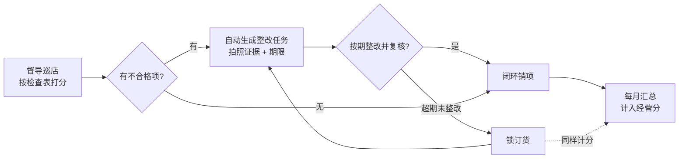

# 巡检与经营分:把门店管理变成一个分数

> 这页讲我们怎么把「督导巡店」从纸面检查表变成一条数字闭环,再把巡检、营业额、培训、日常运营等多个板块汇成一个每月更新的「经营分」。适合连锁品牌的运营负责人和要动手实现的工程师读。

**读完你会知道:**

- 巡检闭环的完整链路:打分 → 自动生成整改任务 → 超期锁订货 → 汇入月度经营分
- 为什么检查项必须结构化成工单,而不是让督导写自由文本
- 经营分「多板块加权 + 阶梯档位」的机制设计,以及为什么参数要留给你自己定
- 打分规则为什么必须版本化——月中改一次规则,不做版本化就是一次数据事故
- 月报怎么让分数「可解释」,让店长服气而不是抵触

## 为什么要把管理变成一个分数

连锁门店多了以后,总部对单店的感知会迅速稀释:督导跑一圈回来,口头汇报「A 店还行,B 店有点乱」,这种信息既没法对比、也没法追溯、更没法奖惩。我们的答案是把所有管理动作都折成数字,最后收敛成一个分数:

- 对**总部**,一个分数排序全部门店,资源(扶持、约谈、淘汰)按档位分配,不靠印象;
- 对**店长**,分数构成透明,知道自己丢分丢在哪、这个月补哪块能涨回来;
- 对**督导**,巡店从「走过场」变成有明确产出的工单流,查过什么、扣过什么都留痕。

一句话:分数不是目的,**可对比、可追溯、可解释**才是目的,分数只是载体。

## 巡检闭环:从打分到锁订货

整条链路是一个闭环,任何一环断掉,前面的动作都白做:

### 第一环:结构化打分

督导到店,按预先配置好的检查表逐项打分。检查项是**结构化数据**(项目、分值、判定标准、是否需要拍照),不是自由文本。这一点后面单独讲。

### 第二环:不合格项自动变整改任务

打分提交后,系统对每个不合格项**自动生成一条整改任务**,不需要督导手工再建。任务上带三样东西:

- **证据**:不合格现场的照片,巡检时当场拍;
- **期限**:整改截止时间,按问题类型给默认时限;
- **复核要求**:店长整改完提交照片,由督导或运营复核确认,才算真正闭环。

「自动生成」是关键。如果靠督导巡完店再手工录任务,漏录率会高到让整个体系失去公信力——店长会说「上次你也没让我改」。

### 第三环:超期未整改,锁订货

整改任务到期未闭环,系统自动**锁定该门店的订货权限**——店长打开订货商城会被拦截,提示先完成整改。这是整个闭环里最硬的一环,也是唯一让店长「必须现在处理」的抓手:

- 罚款伤感情且执行难;
- 扣分是一个月后才见效的慢变量;
- 锁订货是当天就疼的即时反馈——门店不订货就断货,没有人能拖。

锁的实现上有一个工程要点:我们系统里有多种「锁订货」的来源(整改超期锁、营业额录入不达标锁等),**豁免和解锁必须走统一入口**,不能各模块各写一套拦截逻辑。否则运营给某店豁免了 A 锁,B 锁的判断代码根本不知道,前台表现就是「说好解了怎么还锁着」。锁体系的完整设计见 [订货商城](ordering-mall.md)。

### 第四环:汇入经营分

巡检得分、整改闭环情况,每月汇总为经营分里的「巡检板块」得分。至此单次巡店的动作沉淀成月度经营指标,闭环完成。

## 经营分:多板块加权 + 阶梯档位

经营分是一个**满分 100 的综合分**,由多个板块加权构成——典型的板块划分如巡检、营业额、培训考核、日常运营(开收档打卡、日报等)几大类(示意分类,我们真实的板块构成与权重不公开)。机制上有两层:

**第一层:板块加权。** 每个板块各自算出板块得分,再按权重折算汇总。比如(示例数字,非真实数据):巡检 40%、营业额 25%、培训 15%、日常运营 20%。板块内部再往下拆到具体规则项,每项有自己的算法(达标率、阶梯计分等)。

**第二层:阶梯档位。** 总分不直接使用,而是**落到档位**里——比如(示例数字,非真实数据)90 分以上为 A 档、75–89 为 B 档、60–74 为 C 档、60 以下为 D 档。每个档位对应明确的管理动作:A 档给激励和授权,末档触发约谈、限制扩张资格等。档位制的好处是把「差 1 分要不要处理」这种扯皮问题消灭掉——管理动作挂在档位上,不挂在具体分值上。

> ★ 本书只讲机制。真实的板块构成、权重、档位分界线和对应管理动作属于我们的经营策略,不公开。复刻时请按你自己的业态和管理重点设定——权重本身就是你的管理导向的数字化表达,抄别人的没有意义。

## 规则工程化:打分规则必须版本化

这是本页最重要的工程教训,单独拿出来讲。

经营分规则**一定会改**——运营发现某项权重不合理、某个阶梯太松、要新增一个考核项,这是常态,一年改好几次很正常。问题在于:规则一旦改了,**历史月份的分数怎么算?**

如果规则是写死在代码里的一份配置,改完之后重算任何历史月份,得出的分数都和当时公布的不一样。店长上个月是 B 档,重算变 C 档,奖惩已经兑现过了——这就是数据事故,而且是最伤公信力的那种。

我们的铁律:

- **规则带生效日,版本化存储。** 每次修改产生一个新版本,标注生效日期;旧版本永不删除、永不修改。
- **月中改规则,只对生效日之后适用。** 计算某个月的分数时,按该月适用的规则版本算;跨版本的月份按约定口径处理(比如按天分段或以月初版本为准,提前定死,不留解释空间)。
- **历史月份按当时的规则算,永远可复现。** 任何时候重跑上个月的分数,结果必须和当时公布的一致。

这套东西实现起来并不复杂——规则表加 `version` 和 `effective_date`,计分时按月份取对应版本——但**必须在第一版就做**。等规则改过一次、历史分数已经被污染之后再补,你连「当时的规则是什么」都找不回来了。

## 月报:让分数可解释,店长才服气

分数体系最大的敌人不是算错,是**店长不认**。「凭什么我是 C 档?」如果运营答不上来,体系就名存实亡。我们的做法是每月自动生成一份**门店经营分报告**:

- **构成明细**:总分怎么来的,每个板块得了多少、扣在哪些具体规则项上,一条条列出来;
- **同比对比**:和上月比涨跌在哪个板块,是巡检掉了还是营业额板块掉了;
- **自动推送**:报告生成后自动推送到管理群,不用任何人手工整理。

效果是把「凭什么」的争论从运营和店长的口水仗,变成对着报告逐项核对——每一分都能指到具体的巡检记录、具体的营业额数据。店长可以不服气结果,但没法质疑过程。这也倒逼了上游:巡检记录必须留痕完整,否则报告里那一项就解释不清。

## 巡检工单化:结构化检查项 + 证据链

最后回头讲巡检本身的建模。核心原则:**检查项是结构化数据,巡检是工单,不是一篇作文。**

- **检查项结构化**:每一项有明确的名称、分值、判定标准、是否必须拍照。督导现场逐项勾选/打分,而不是写「卫生状况一般」这种没法计分也没法追溯的自由文本。检查表本身可配置,总部可以按阶段调整检查重点。
- **照片证据 + 定位**:不合格项必须当场拍照,巡检记录带位置信息——证明督导真的到了店、真的看到了问题。这既是对店长公平(有图有真相),也是对督导的约束(防止坐在办公室打分)。
- **整改闭环有截止与复核**:整改任务不是店长自己点「已完成」就结束——要提交整改后照片,由复核人确认。截止时间到了没闭环,就进入上面说的锁订货流程。

工单化的直接收益是所有环节可查询、可统计:哪类问题反复出现、哪个督导巡店频次不够、哪家店整改总是拖到最后一天,都是一条 SQL 的事。自由文本时代这些问题根本没法回答。

## 踩坑与红线

- **规则改了历史分数跟着变**
  症状:规则调整后重算或补算历史月份,分数和当时公布的对不上,奖惩已兑现,店长炸锅。
  根因:规则没有版本化,只有一份「当前规则」,任何计算都拿最新规则套历史数据。
  铁律:规则版本化 + 生效日,第一版就做;历史月份永远按当时规则算,重跑结果必须可复现。

- **豁免了还是被锁**
  症状:运营给门店解了整改锁,门店订货时仍被拦,查半天发现是另一个模块的锁逻辑在拦。
  根因:多种锁订货来源各自实现拦截判断,豁免只解了其中一处。
  铁律:所有锁订货的判断与豁免收敛到统一入口,新增锁类型必须接入同一入口,禁止另起炉灶。

- **整改任务靠人手工建**
  症状:巡检打了不合格,但没人建整改任务,问题不了了之,店长学会了「反正没人跟进」。
  根因:打分和整改是两个割裂的动作,中间靠人肉衔接。
  铁律:不合格项由系统自动生成整改任务,零人工干预;闭环状态机(待整改→待复核→已闭环/已超期)由系统驱动。

- **检查项写成自由文本**
  症状:巡检记录一堆「基本合格」「有待加强」,没法计分、没法统计、没法对质。
  根因:图省事没做结构化建模,直接给了个大文本框。
  铁律:检查项必须结构化(项目/分值/标准/拍照要求),自由文本只允许作为结构化项的补充备注。

## 延伸阅读

- [订货商城:价格快照与订单一致性](ordering-mall.md) — 锁订货体系的统一入口设计
- [营业额:录入、抓取与达标锁](turnover.md) — 经营分的重要数据来源板块
- [门店日常运营:开收档与工作日报](daily-ops.md) — 日常运营板块的数据来源
- [数据口径:最贵的一类坑](../03-pitfalls/data-caliber.md) — 规则版本化是口径问题的一个特例
- 复刻 prompt:[M4 巡检 + 经营分](../05-replication/prompts/06-inspection-score.md)

---

[← 返回本层目录](README.md) · [返回总目录](../README.md)
