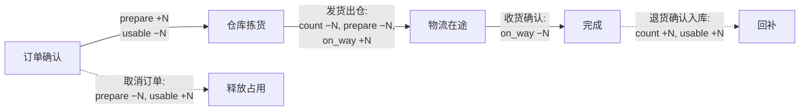

# 库存:四量模型与自动对账

> 这页讲我们怎么用「四个数量 + 一个唯一入口 + 一套对账兜底」把库存做对。适合准备上库存模块的 IT 负责人和工程师读——库存是最容易「账实不符」的模块,先想清楚再写代码,能省掉后面一年的对账人生。

**读完你会知道:**

- 四量模型(count / prepare / on_way / usable)各自的语义,以及谁在什么时机增减它们
- 为什么所有库存变更必须收口到唯一的 service 函数,任何业务代码都不许直接 update 字段
- 对账兜底怎么做:唯一出口保证正向正确,对账抓漏网之鱼
- 两个真实踩过的坑:浮点零头永远差一点点、盘点用分页切片漏盘
- 一个边界决策:门店端要不要做库存?我们的答案是不做,以及为什么

## 先写文档,再写代码

库存模块我们是先把「量的语义」写成一页文档、内部讲通了才动手写代码的。这个顺序很重要:库存字段一旦上线,每一行历史流水都依赖它的语义,事后改语义等于重建。

四个量的定义如下:

| 量 | 含义 | 谁增 | 谁减 |
|---|---|---|---|
| **count(在库)** | 仓库里物理存在的数量 | 入库(采购到货、生产完工、退货入库) | 出库(发货出仓、报损) |
| **prepare(备货中)** | 已被订单占用、等待拣货发出的数量 | 订单确认时占用 | 发货出仓时释放(同时扣 count) |
| **on_way(在途)** | 已发出、还没被收货方确认的数量 | 发货出仓时 | 收货确认时 |
| **usable(可用)** | 业务方「还能下单多少」看的数 | 随 count 增而增 | 随 prepare 占用而减 |

几个容易想歪的点:

- **usable 不是算出来临时用的,是持久化的字段。** 它满足恒等式 `usable = count − prepare`(在我们的语义下)。既然能推导为什么还要存?因为下单校验库存是最高频的读,而且这个恒等式恰好是对账时最好用的探针——它一旦不成立,说明有人绕过了入口改数据。
- **prepare 和 on_way 是两段不同的「不在手上」。** prepare 是「货还在仓里但已经名花有主」,on_way 是「货已经出门在路上」。合并成一个量看似省事,实际会让「发货了没」「收到了没」两个业务问题没法回答。
- **每一次增减都要能回答「哪个业务动作触发的」。** 这就是下一节的唯一出口。

## ★唯一出口:所有变更走同一个函数

这是本页最重要的一条,加星:**所有库存变更必须调用唯一的 service 函数,任何业务代码不得直接 update 库存字段。**

```
inventory_service.change(
    warehouse_id, goods_id,
    delta_count=?, delta_prepare=?, delta_on_way=?,
    reason='订单发货', biz_type='ship', biz_id=订单号,
)
```

(示意签名,字段名按你自己的约定来。)

这个函数内部做四件事,缺一不可:

1. **原子更新四个量**(数据库层面用 `UPDATE ... SET count = count + delta` 的原子写法,不要读出来加完再写回去——并发下必丢更新);
2. **写一条流水**:变更前后值、增量、业务类型、业务单号、操作人、时间。流水是库存的「账本」,没有流水的变更等于没发生;
3. **校验不变量**:任何量不允许减成负数,负了直接抛错回滚,让调用方在业务层面处理(比如提示库存不足),而不是让脏数据落库;
4. **零头吸零**(见下文踩坑一节)。

为什么要这么执拗?因为库存的错不是当场炸,而是三个月后盘点时发现账实差了一批货,那时候你面对的是几万条流水,如果其中还混着若干处「顺手 update 了一下字段」的野路子代码,根本查无可查。收口到唯一出口之后,**流水表就是完备的因果链**:任何时刻的库存值都能从期初 + 全部流水推出来。

落地上给团队(和 AI 助手)立的规矩:code review 里看到任何对库存字段的直接 `update()` / 裸 SQL,无条件打回;在项目的 CLAUDE.md 里也写明这条,让 AI 生成代码时就不会犯。

## 与订货联动:一张订单的库存生命周期

订货商城(见 [订货商城:价格快照与订单一致性](ordering-mall.md))是库存最大的调用方。一张门店订货单从下单到收货,库存动作全部走同一个入口:



对应到业务语言:

- **下单占用**:订单确认即占 prepare、减 usable——防止超卖的关卡在这里,不在发货时;
- **发货扣减**:出仓时 count 和 prepare 同减、on_way 增,货从「仓里」变成「路上」;
- **收货核销**:收货方确认后 on_way 清掉,这批货的生命周期结束;
- **取消回补**:发货前取消,只需释放 prepare;
- **退货回补**:退货**确认入库后**才回补 count,退货单创建时绝不提前加库存(仅退款不入库的场景另算,货没回来账就不能动)。

每一步都是一次 `inventory_service.change` 调用,带着订单号写进流水。出问题时按单号捞流水,一分钟看清这张单在库存上留下的全部痕迹。

## 对账兜底:唯一出口管正向,对账抓漏网

唯一出口保证了「走正门的变更都是对的」,但现实里总有漏网之鱼:某段老代码没改干净、某次人工修数据忘了写流水、某个极端并发路径。所以必须有第二道防线——**对账**。

做法(两选一或都上):

- **定时对账任务**:每天低峰期跑一遍,逐商品校验两件事:① 恒等式 `usable = count − prepare` 是否成立;② 当前四量是否等于「期初 + 流水累加」的推算值。任何一条不符,记为「漂移」,发告警到工程群,人工介入;
- **数据库触发器**:在库存表上挂触发器,变更落库的同时校验/记录,把发现漂移的时点从「第二天」提前到「当下」。我们实际采用了触发器方案,配合告警。

关键心法:**对账任务只报警,不自动修数**。自动修数等于把 bug 藏起来——漂移是症状,根因是某处绕过了唯一出口,你要抓的是那段代码,不是把数字抹平。上线初期告警会响几次,每响一次就消灭一个野路子调用点,一两个月后就安静了,这套系统才算真正闭环。

## 边界决策:门店端不做库存

这是个产品决策,不是技术决策:**我们只管总仓和代理仓的库存,门店端不做库存管理。**

理由很朴素——算账算出来的:

- 门店库存要准,前提是店员对每一次收货、领用、报损都及时录入。烤串门店高峰期人手全在炉子上,录入必然滞后、遗漏,数据很快失真;
- 失真的库存数据比没有更糟:总部看着假数做决策,门店还要背「账实不符」的锅;
- 门店真正的需求是「该订多少货」,这个用营业额和历史订货量能推,不需要门店维护库存。

**店员的执行成本 > 数据的收益,就不做。** 这条我们固化成了一个需求评审动作:任何需求提到「门店库存」,第一个问题永远是「门店现在真的在维护库存吗?」——到目前为止答案都是否,于是很多看似要做的功能直接消失了。

对复刻者的建议:别默认「库存当然要做到门店」。先想清楚你的门店业态里,谁、在什么时间点、有没有动力录数据。数据链条上最弱的一环是人,不是代码。

## 踩坑与红线

**坑一:库存永远差 0.0001**

- 症状:某商品可用量常年显示 `-0.0001` 或 `0.0003` 这类零头,既发不了货也清不掉,业务隔三差五来问。
- 根因:单位换算(箱↔个↔千克)和浮点运算天然产生微小残量,一次两次看不见,累积起来库存永远差一点点。
- 铁律:**在唯一变更函数里自动吸零**——变更落库前,结果的绝对值小于阈值(如 0.001,示例数字,非真实数据)就直接归零,并照常写流水注明「残量归零」。在出口统一处理,而不是让每个调用方自己四舍五入。

**坑二:盘点用分页切片,漏盘了没盘到的页**

- 症状:盘点提交后,盘盈亏结果明显不对——没出现在盘点界面当前页的商品,差异全被漏算。
- 根因:盘盈亏计算错误地基于「前端当前分页拿到的那一屏商品」做差异,翻页没看到的商品等于没参与盘点。
- 铁律:**盘盈亏必须在服务端遍历该仓全量商品算差异**,前端分页只是展示手段,绝不能成为计算口径。凡是「汇总/差异/对账」类计算,一律警惕它的输入是不是被分页、筛选悄悄裁剪过——这类口径坑在 [数据口径:最贵的一类坑](../03-pitfalls/data-caliber.md) 里还有一批同族案例。

**红线汇总**

- 任何业务代码直接 update 库存字段 → code review 无条件打回;
- 变更不写流水 → 视同没变更;
- 对账发现漂移 → 只告警查根因,不自动修数;
- 「门店库存」相关需求 → 先确认门店是否真的在维护库存;
- 退货 → 货未确认入库,账上一个数都不许动。

## 延伸阅读

- [订货商城:价格快照与订单一致性](ordering-mall.md) — 库存最大的上游调用方,占用/扣减/回补的业务语境
- [供应链协同:供应商 / 第三方仓 / 区域代理](supply-chain.md) — 多仓(总仓/代理仓/第三方仓)之后,四量模型怎么按仓扩展
- [积分体系:唯一出口原则](points.md) — 同一个「唯一出口 + 流水」模式在另一个资产域的复用
- [数据口径:最贵的一类坑](../03-pitfalls/data-caliber.md) — 盘点分页坑所属的坑族
- 复刻 prompt:[M3 库存](../05-replication/prompts/03-inventory.md) — 把本页原则喂给 AI 的现成指令

---

[← 返回本层目录](README.md) · [返回总目录](../README.md)
