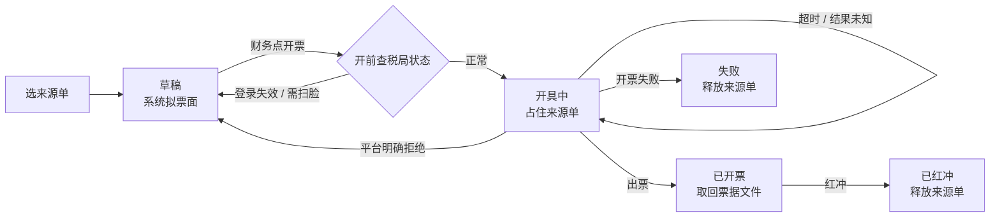

# 开票、税务与资金侧自动化:让钱和票自己对上账

> 这页接着[自建内账引擎](finance-ledger.md)往下讲:记账引擎跑顺之后,财务剩下的活集中在「钱怎么付出去、票怎么开出来、税怎么对上账、月底怎么关」这四件事上。我们把能交给系统的部分逐块交了出去,但在每一块都留了一道人握的闸。适合财务负责人、老板和要动手实现的工程师读。

**★ 本篇只讲机制与决策理由,不含任何真实金额、税率配置、主体安排与银行信息。文中数字均为虚构示例。**

**读完你会知道:**

- 保证金为什么要按「付款人」挂账,以及期初导入为什么默认只试跑
- 银行流水认领规则怎么从「影子」一步步转正,而不是一上线就动账
- 月结自动化的四件套:预跑、尾差核销、计提向导、代理账套自动关账
- 银企直连付款的三条红线,和「受理不等于到账」这件事
- 在线开数电票怎么防重复、税局扫脸状态怎么盯、税费申报登记怎么一次对上扣款
- 「一键」的边界在哪:系统不替人申报,也不替人扫脸

## 资金侧自动化

[内账引擎页](finance-ledger.md)讲过流水自动匹配的基本盘。这一节是后来长出的五块,共同的原则只有一条:**系统先算、先拟、先提醒,动钱和改账的那一下留给人,或者留给一个可以随时关掉的开关。**

### 门店保证金:按门店 + 付款人双维度挂账

保证金是**负债**,不是收入——收的时候记负债,退的时候冲负债,永远不进营收,也永远不开发票。这条定死之后,剩下的难点全在「这笔钱算谁的」:

- **只按门店挂不够。** 一个人开好几家店、门店转让换了加盟商、退款要退给当初付钱的那个人——这些场景都要求每一笔保证金同时记「哪家店」和「谁付的」。付款人不是必填维度,但收款、退款、银行分类三个写入口都会顺手带上。
- **查不到门店的进「待归属」桶。** 待归属的钱不可退,必须先由财务认领到门店;一个付款人对应多家店、按收款笔数又拆不开的,先整额挂在其中一家并打「多店待拆」标记,事后改挂。
- **转合同费用只能逐笔人工操作。** 保证金抵转让费这类动作,金额不能超过该店该付款人的余额,系统只校验、不自动转。
- **该退提示只认真正解约的状态。** 闭店、解约类状态且有余额才提示「该退了」;迁址不算(保证金跟着新址走),长期停业也不算(可能复业)。

**期初重分类导入默认试跑。** 历史保证金躺在代账软件的旧科目里,口径是按付款人记的,要搬进新台账按门店落位。导入命令默认只读:打印总额、每一笔的去向(门店 / 待归属 / 多店待拆)、拆不开的清单与原因、**导入后会出现负余额的门店预测**,以及新旧两本账的差异清单。财务确认试跑结果后,才带确认参数真落库——一张凭证、一个事务,任一步失败整体回滚;同一来源已有存活凭证则拒绝重跑,撤销就是红冲那张凭证再清掉导入标志。

### 银行流水认领规则:先影子,后转正

每条新的自动认领规则都有三档:**关 / 影子 / 正式**。影子档只把「本来会怎么判」记进一张影子表,不动任何业务数据;跑一段时间后,用人工实际处理的结果给它打分(准确率 = 判对 ÷(判对 + 判错)),达到门槛(示例:90%)才**考虑**转正,由人拍板。

真实的样子是参差不齐的:有的规则回测几乎全对、已经转正(比如下文的税局扣款配对);有的还在影子里攒样本;有一条「照同对手方历史分类」的规则准确率没过线,代码上线了但默认关着。转正也不是一刀切——先挑几单受控地手动跑正式逻辑,逐张核对凭证、流水状态、备注,全对了再改全局档位。档位是配置,不是代码:回滚就是把它改回影子。

### 月结自动化:预跑、尾差、计提向导、自动关账

- **月末预跑。** 每月初的前几天,系统每天把上月该有的暂估、税金、制造费用结转、电表倒推等草稿自动生成一遍,并把「还缺什么」列成清单推给财务。**出草稿,不自动过账**——过账仍是财务看过之后的一下。
- **尾差核销。** 单据级净额只差几毛钱(示例:≤0.5 元)的往来,每月初自动出一张汇总凭证冲掉。三道约束:每账套每次合计有上限(示例:300 元),超了整张不出并告警;一张单只核一次,红冲过的不再核;最近几天还有新凭证的单不核,免得和正在发生的业务抢。
- **计提向导 + 关账闸。** 结账按钮先弹向导,逐项检查工资、房租、仓配、税金、折旧这些「账单还没到但费用已经发生」的项目,缺哪项一键生成暂估草稿。缺项时拒绝结账,可以强制但留痕。闸本身做了防退化:草稿状态不拦、建议金额取不到不拦、闸自己出异常就放行——**关账闸拦错一次,财务就会学会每月盲按「强制」**。
- **代理账套跟随关账。** 代理账套跟随总部自动关账,每月固定一天兜底。上自动关账之前必须先确认一件事:单据的记账日要能落进可写期间,否则一关账,迟到的单据就再也记不进去。

### 银企直连付款:三条红线

付款由有权限的出纳在单据上点按钮发起,金额手输二次确认,首次付给某个账号要敲尾号核对。结果走三路回传——银行主动推送、秒级追查、定时兜底——任何一路拿到终态就自动入账(实际上绝大多数结果是靠查询拿到的,推送只是锦上添花)。三条红线写在代码和文档最显眼的位置:

1. **已发出的付款绝不重发。** 结果未知、执行中,都只能去查。系统里没有任何一处会自动重发,轮询任务从头到尾只调查询接口;运维手册里也明写「不许把在途指令手工改成失败再重发」——银行那边的付款单还在,重发就是重复付款。
2. **金额不精确相等不入账。** 银行回报的金额必须和发起时的金额快照一分不差,才确认付款出凭证;不等就挂「未知」并告警财务。
3. **退汇不自动红冲。** 付款成功之后仍可能被退回,这时入账已经发生。系统只标「已退回」并告警,红冲由人做;没处理完之前,这张单上的新付款会被闸拦住。

另外两个反直觉的事实:**受理不等于到账**——付款接口只是让银行受理并生成付款单,结果以查询或回调为准;**回单要等**——电子回单在付款后十几分钟到几十分钟才生成,我们不依赖推送,付款成功后主动去取,存进单据附件,**写入即私有**(回单上有双方全账号),展示时临时签名。能认出供应商的付款,回单图同时发到对方的采购群——**只报成功**,失败和退汇是我们内部的账务状态,对外一个字不说。终审后自动发起付款的能力也做了,但源码默认关。

### 设备采购:达门槛自动资本化

设备的付款申请照常按类别入账;等设备到货入台账时,系统按采购单明细**逐台**判断:单台单价达到门槛(示例:单台数千元)的部分做一张调账凭证转入固定资产并自动建折旧卡片,其余仍记费用。明细还是付款申请的占位行(合同没识别过)就不处理,等合同。只通知内部财务复核,不进申请人的提醒、更不发供应商群。

## 开票与税务

### 发票中心:在线开数电票

开票对接的是财税开放平台。销方主体、每个主体的纳税人身份和登录身份都**实时从平台拉**,不写死在代码里——主体会增减,登录人会换。

- **系统拟票面。** 按品目合并、逐行价税分离、合计等于逐行加总(自动平);税率按纳税人身份校验允许集合;企业购方必填税号,个人购方只能开普票,专票只开给企业。内部备注不上票面。
- **开票时轮询结果。** 先短间隔查几分钟;已出票号但附件没取全的,改长间隔再等一阵;超时不改状态,页面留「刷新」兜底。
- **防重复开票。** 来源单只要被「开具中 / 已开票」的记录占用,就不能再开:提交前预检,开票时行锁复核。最关键的一条:**网络超时、没拿到平台任务号时,记录保持「开具中」继续占住来源单**,提示财务先去税局核实——宁可卡住,也不重开。失败和红冲才释放。
- **保证金永不开票。** 它是负债;收款单里的保证金类型在校验层直接拒。

### 税局登录与扫脸状态:每天盯着,失效才说话

开票前提是该主体的税局登录有效、且登录人近期扫过脸。系统白天定时(示例:每小时)逐主体检测,四种状态:可开票 / 需扫脸 / 登录失效 / 检测失败。

- **首轮只记基线,不发消息**——上线时就已失效的主体不刷屏;
- **只在「迁移进」失效态时私聊**:需扫脸 → 直接发给登录账号本人一个**免登录、只对这一个主体、限时有效**(示例:12 小时)的扫脸链接;登录失效 → 告诉登录人本人去平台重新验证;
- **同一失效状态在去重窗口内只提醒一次,但主体恢复正常时清掉去重记录**——扫脸有效期是未知数,不能让恢复后的再次失效被去重吞掉;
- 检测失败不覆盖确定状态,连续失败几次才报「检测异常」;所有文案只出现手机尾号。
- 每次状态迁移都留痕,回头就能反推「扫一次脸能管多久」。

扫脸链接用签名令牌:只能操作令牌里那一个主体,取码限频,轮询只认本令牌取过的码;换签名盐即全部作废。

### 门店按订单申请发票

入口放在门店小程序的订单里:**只列可开票的订单**,开不了的不出现、不解释;同店同自然月可以合开一张,一单只开一次。「可开票规则」只有一处实现,列表、详情、提交全调它。抬头由营业执照图片识别生成、门店确认;发票由对应的销售主体开——销方已接入平台的,财务在后台一键开票(自动扣退货、运费单列、优惠分摊),开出后自动回填给门店;没接入的手工开票上传文件。订单发生退货后,已提交的申请自动标「需复核」。

状态如实说:门店入口开关默认关着;发票中心已开出过真票(个人购方),但门店申请走一键开票这条路还没经过真票实测,**企业购方和专票也都没实测过**。

### 税费申报登记:一次登记,扣款到了自动出凭证

社保、个税、增值税这类税费是**申报即扣款**:签了三方协议,税局直接从银行扣走,没有人需要转账。原先每个主体每个月提一张付款申请走审批,审批一拖,扣款流水就配不上单。现在改成:

1. 会计每月申报完,**一次性登记**所有「主体 × 税种 × 所属期 × 金额」(可以传表格、截图、文字,也可以在 IM 里 @ 财务助手,机器人出确认卡片,发起人本人确认才写入;整批有一行不过,一行都不登);
2. 系统拿登记行去配扣款流水:同一张扣款卡、税款类流水、单笔或几天内拆成的几笔**精确求和**等于登记金额、**双向唯一**才提议;
3. 配上就出凭证——**缴纳时借回的科目,就是当初计提或代扣时贷的那个科目**,这是科目映射的唯一判据;个人承担部分拆到代扣款;
4. 配不上的写明原因(还没扣 / 多解 / 与别的单争用),每天汇总提醒;月末向导只提示,不拦关账。

几条防错配的硬约束:**扣款日不得早于所属期第一天**(挡住「上月同额扣款还挂着,本月还没扣」);付款申请和登记行争用同一笔扣款时,**两边都不动**;登记时发现同期已有对应的付款申请,直接拒绝登记;银行对账里有人想把这笔扣款手工「分类」掉,而它唯一吻合某条登记行时,硬拦。上线前我们拿近一个季度的真实扣款当待处理重放:按正常方式登记,换三种登记粒度、提前或延后登记都没有错配,个别组合因多解而弃权——**弃权是我们要的结果**;唯一会错配的是把所属期填错的极端情况,正是上面那条硬下沿要挡的。个税的借方口径还在和财务最终确认中。

### 税局扣款付款申请:只登记,不转账

登记模式之外,老的付款申请模式继续可用,但系统会自动识别「这是税局扣款」——三条全满足才算:是付款单;明细全是税费或社保类;收款人户名**精确等于**税务机关,或账号是全零占位。**绝不按「税务」两个字的子串认**:付给税务师事务所的咨询费是真转账。识别为税局扣款后,所有银行付款的出口(按钮、催付、待付列表、自动下单)都经同一道闸,对它恒为否;单据显示「待税局扣款」,扣款流水到了自动确认付款并出凭证;过了约定天数还没配上,只私信提醒申请人去查,绝不催出纳。

### 「一键」的边界:不是自动申报

我们的系统**不登录税局、不替任何人申报、不替任何人扫脸**。申报由我们的财务在税局端完成,系统只做申报之后的事:登记申报额 → 配扣款 → 出凭证 → 提醒。开票的「一键」是拟票面加提交,前提是人看过票面、点了开票。

| 环节 | 系统 | 人 |
|---|---|---|
| 拟票面、校验税率与购方 | 自动 | 财务核对后点「开票」 |
| 税局扫脸 | 发专用链接、轮询结果 | **登录账号本人**扫码刷脸 |
| 税局登录失效 | 检测并提醒 | 财务在平台重新验证 |
| 税费申报 | 不做 | 会计在税局端申报 |
| 申报额登记 | 解析表格/截图、逐行校验 | 会计每月登记一次并确认 |
| 扣款配对与出凭证 | 唯一解才自动 | 多解/无解人工处理 |
| 银行付款 | 查询、入账、取回单;**绝不重发** | 出纳点按钮发起 |
| 退汇 | 告警、拦新付款 | 人工红冲 |
| 保证金期初导入 | 默认试跑、出预测与差异 | 确认后真跑 |
| 资本化调账 | 出凭证、建卡片 | 财务复核 |

## 踩坑与红线

- **结果未知时「再开一张试试」**
  症状:网络超时后重开,税局那边其实第一张已经开出来了。
  根因:把「没收到结果」当成了「失败」。
  铁律:结果未知 = 保持占用、先去核实;付款同理,在途只查不发。

- **按关键字识别「税局扣款」**
  症状:一笔付给税务师事务所的咨询费被当成税局扣款,不让走银行付款。
  根因:用「税务」子串判断收款人。
  铁律:识别规则用精确户名或结构特征(全零占位账号),并把真实反例写进测试。

- **上月的同额扣款配到了本月**
  症状:同一主体每月社保金额一样,上月一笔没处理的扣款被本月登记认领。
  根因:匹配窗口只看登记日前后,没看所属期。
  铁律:扣款日 ≥ 所属期首日作硬下沿;双向唯一才自动。

- **计提判据看摘要关键字**
  症状:向导认为工资已计提,实际只是一张摘要里带「计提」二字的产线补提凭证。
  根因:用文字匹配代替科目判断。
  铁律:判据只看「真借到了哪个科目」。

- **跨期暂估红冲让「账单已入账」误判**
  症状:上月账单本月入账、又红冲了上月暂估,系统按毛额以为本月账单已到,跳过了本月暂估。
  根因:判断用毛额,没有扣掉跨期红冲。
  铁律:「本期实际」按净额判断;但建议金额的历史基数仍用毛额,否则建议额会螺旋下降。

- **资本化按整单金额判断**
  症状:一单多台小设备合计超过门槛,整单被资本化。
  根因:没有单价时只能按整单——那是旧报销口径的妥协。
  铁律:有明细就按单台单价判。

## 延伸阅读

- [自建内账引擎:事件源自动凭证(模式篇)](finance-ledger.md) — 本页的地基:唯一记账出口、流水匹配、红冲纪律
- [费用审批与工资:把审批流做进自己的系统](expense-payroll.md) — 付款申请、出纳终审、工资计提的上游
- [资产台账](asset-management.md) — 资本化之后的实物台账与折旧卡片边界
- [数据口径:最贵的一类坑](../03-pitfalls/data-caliber.md) — 毛额与净额、窗口与下沿这类坑的同族案例
- 复刻 prompt:[M5 自建内账引擎](../05-replication/prompts/09-finance-ledger.md) — 先把引擎搭起来,本页各块都是它的扩展

---

[← 返回本层目录](README.md) · [返回总目录](../README.md)
