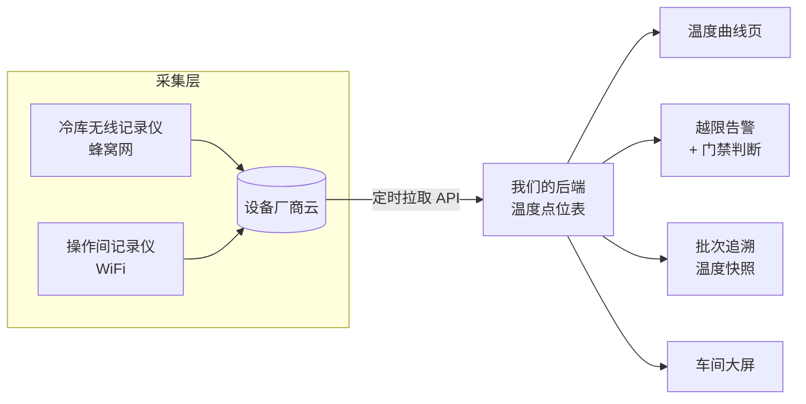

# 冷链温控与工厂 IoT:让设备自己说话

> 这页讲中央工厂和冷库的温度怎么从「人工抄表」变成「自动采集 + 有门禁的告警 + 能进追溯」,以及设备远程控制该做到哪一层。适合自建中央工厂、要过食品安全体系审核的老板、品控和工厂负责人读。

**读完你会知道:**

- 温度数据的三层结构:采集设备 → 平台拉取 → 应用(曲线/告警/追溯)
- 从第三方设备云拉数据的五个工程细节(限流、重叠窗口、空值、静默失败……)
- ★**告警门禁**:为什么「有告警就发」是这个模块最大的设计错误
- 来料验收的温度为什么必须是数值,以及手测与自动采集怎么对拍
- 设备远程控制的四个层级,以及一次停电复盘得出的结论
- 温度怎么接进批次追溯——粒度不对等于没做

## 三层结构

三层的分工要清楚:

- **采集层**买现成的。无线温湿度记录仪按场景选网络方式(冷库墙厚信号差用蜂窝网自带流量卡,操作间用 WiFi),自带电池和本地存储,断网能补传。这一层不要自研。
- **平台层是我们自己的**。定时把厂商云上的数据拉回自己的库——这一步不能省。数据在别人云上,你就没法做告警门禁、没法接追溯、续费到期数据就没了。
- **应用层才是价值所在**:曲线、告警、追溯、大屏,全部长在自己的数据上。

## 从第三方设备云拉数据的五个细节

我们接第三方设备云时踩的坑,几乎每一条都是「文档上没写」的:

1. **优先用实时接口,别默认历史接口可用。** 有的厂商云历史查询接口对新设备返回空数组(数据还没归档),而实时接口是有值的。定时拉实时 + 自己落库,反而是最稳的。
2. **给取 token 加节流闸。** 厂商接口普遍有频次限制,我们实测过一个限流错误码:并发或频繁取 token 会直接被拒。做法是 token 缓存 + 最小间隔节流,拿到限流错误就**直接抛出中断本轮**,而不是重试到把配额刷光。
3. **拉取窗口要重叠。** 每次拉「上次结束时间 − 30 分钟」到现在,靠唯一键去重。设备补传的数据往往是迟到的,窗口不重叠就永远漏掉这批。
4. **单点空值不能中断整轮。** 某个点位返回 null 时跳过它继续拉别的,否则一个故障探头能让全厂数据断掉。
5. **★「接口全通但一个温度都没有」要单独记一笔告警。** 这是最隐蔽的失败模式:所有请求都返回 200,解析也没报错,就是零条数据入库。如果只在异常时告警,这种情况会静默地持续好几天,直到有人打开曲线页发现是白的。**「成功但结果为空」必须是一个显式的告警分支。**

另外:**采集参数别写死在代码里**。温度上下限、误差带、探头对应的位置和用途,全部做成页面可配——这些值在工厂真的开始生产后会被反复调整,每次改都发一次版是不可持续的。

## ★告警门禁:这个模块最重要的一条

上线第一版我们做的是「温度越限就发告警」。结果:

- 空库在降温,温度当然超标 → 告警;
- 那间车间当天根本没排产 → 告警;
- 设备刚开机、探头刚换位置 → 告警。

一周之内,收告警的群里所有人都学会了无视它。**一个被无视的告警系统,比没有告警更危险**——它让你以为自己有监控。

所以我们加了一层**门禁**:告警发不发,由三个条件决定。

| 条件 | 判断依据 | 不满足时 |
|---|---|---|
| **有货** | 该库/该间当前有在存批次 | 不发 |
| **有工序** | 当天该区域有排产/报工记录 | 不发 |
| **过了观察期** | 设备刚启用/刚调整后的一段时间 | 不发 |

关键设计:**门禁只管「发不发通知」,曲线数据照常完整落库**。历史数据必须是全的——体系审核要看的是完整曲线,不是我们筛过的那份。门禁是通知层的策略,绝不能变成采集层的过滤。

这条经验可以推广到所有告警类功能:**告警的价值 = 命中率 × 被看见的概率**,而后者随噪声指数衰减。宁可漏一点,不要吵。

## 来料验收:温度必须是数值

食品安全体系(以及任何一次外部审核)对到货温度的要求是「有记录、可追溯、能证明」。我们最初的来料验收表单上,中心温度是一个**勾选项**(合格/不合格),看起来很省事,实际上等于没记录——事后谁也说不清那车货到底是多少度。

改造成三件事:

1. **数值化字段**:到货中心温度必须填具体数字,配合便携式中心温度计现场测;
2. **限值配置化**:不同品类的限值配在页面上,超限自动标红并要求填写处置措施;
3. **手测 ↔ 自动对拍**:同一时段冷库/冷藏车的自动采集温度与人工填写的数值做比对,偏差超过阈值时告警——这一条同时防「探头飘了」和「人随手填一个数」。

> 一个常见的顺序错误:先买了测温设备,却发现系统里没有地方填、关键控制点的限值也没配。**设备到货前,先把「测了往哪填、超了怎么办」这两件事在系统里做好。**

## 设备远程控制:四个层级,按成本选

「能不能远程开关机组、远程调温」是必然会被问到的下一个问题。我们排查一圈后的分级(从便宜到贵):

| 层级 | 做法 | 适用 | 代价 |
|---|---|---|---|
| L0 纯监测 | 只读温度,不控制 | 所有场景的起点 | 最低 |
| L1 厂商自带云 | 用设备厂商自己的小程序/云端开关调温 | 新设备、单一品牌 | 常常接近零 |
| L2 通用网关 | 工业总线 + 数据透传模块,把设备寄存器接进自己系统 | 多品牌混装 | 每台一个模块,**卡点是拿不拿得到寄存器表** |
| L3 电源侧控制 | 在总电源加接触器,由网络 IO 模块控制通断 | 任何设备,不依赖厂商协议 | 电气改造费 |

我们的定案是 **L1 + L3 组合**:日常开关调温用厂商自带能力(改造成本为零),远程断电/复位走电源侧接触器。选 L3 而不是死等 L2,是因为寄存器表要等厂商配合,而接触器方案「现在就能干」。

一次停电之后的复盘,补上了三条硬规矩:

- **弄清设备来电是否自启**。我们的机组停电恢复后不会自己启动——这意味着一次夜间停电可以毁掉一库货,而没有人知道。这件事必须在采购时就问清楚,并写进应急预案。
- **接线必须 fail-safe**:控制回路默认通电,控制器失联/自身断电时设备保持运行,而不是停机。**远程控制的默认态永远是「不干预」**。
- **接触器是「远程断电复位器」,不是日常开关**;必须配检修锁定(现场维修时物理断开,远程指令一律无效)和期望状态(系统知道每台设备应该是开还是关,状态不符时告警)。

## 接进追溯:粒度不对等于没做

温度数据的终点是**批次追溯**:某批产品在加工过程中,各段的温度记录是什么。这一段我们返工过一次——最初按「区域」记录温度日志,结果加工段的追溯页面永远是空的,因为加工是按**工位**组织的,区域和工位对不上。

铁律:**追溯的粒度必须和生产的组织粒度一致**。生产按工位报工,温度就要按工位归集;生产按批次流转,温度快照就要挂在批次上。粒度差一级,做出来的追溯就是一张空表——而且是那种「点开才发现是空的」的空表,平时看不出来。

同样的道理适用于**一码多点**的场景:一个包装码对应多个采集点位时,不要硬塞进追溯,否则追出来的是一团糊。宁可标注「该段无对应点位」。

## 踩坑与红线

**坑一:告警把人训练成无视告警**

- 症状:群里天天报温度异常,没人看;真出事那次也没人看。
- 根因:空库、无排产、刚开机这些正常状态被当成异常。
- 铁律:**告警走门禁,曲线照常全量落库**。门禁在通知层,不在采集层。

**坑二:「成功但为空」的静默失败**

- 症状:曲线页空白几天才被发现,期间没有任何告警。
- 根因:只在请求异常时告警,而失败模式是「请求全成功、零条数据」。
- 铁律:采集类任务必须有**结果量校验**,零结果本身就是一个告警条件。

**坑三:参数写死在代码里**

- 症状:改一个温度上限要发一次版,前端还写死了一套误差带,两边对不上。
- 根因:把「业务参数」当成了「实现细节」。
- 铁律:**限值、误差带、点位映射一律配置化**,前端从后端读,不留第二份真相。

**红线汇总**

- 第三方设备云的数据必须落到自己的库,不依赖厂商保存;
- 采集任务:节流、重叠窗口、空值容错、零结果告警,四件套齐全;
- 告警门禁只影响通知,不影响数据;
- 到货温度必须是数值,并与自动采集对拍;
- 远程控制默认态是「不干预」,必须有检修锁定;
- 追溯粒度与生产组织粒度一致,对不齐宁可留空。

## 延伸阅读

- [生产与成本:研发档案 / 工单 / 批次追溯(结构篇)](production-costing.md) — 温度数据的下游:批次与追溯
- [资产台账:实物、领用与保养提醒](asset-management.md) — 这些设备本身的台账与保养提醒
- [看板与车间大屏:数据怎么被真正看见](dashboards.md) — 温度曲线在车间大屏上的呈现
- [业务型 AI:视觉巡检与聊天即操作](../04-ai-engineering/business-ai.md) — 同一个工厂里的另一条感知线:摄像头
- 复刻 prompt:[M7 冷链与工厂 IoT](../05-replication/prompts/15-iot-factory.md)

---

[← 返回本层目录](README.md) · [返回总目录](../README.md)
