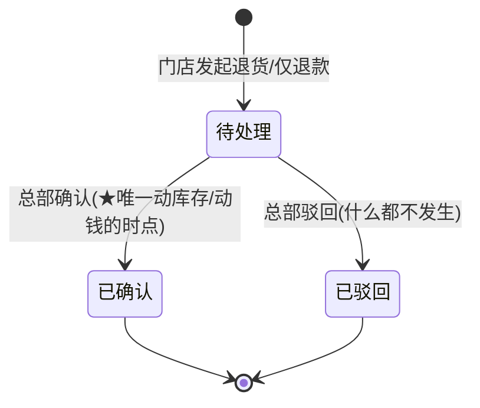

# 订货商城:价格快照与订单一致性

> 这一页讲整个系统的交易主动脉——门店向总部订货的内部 B2B 商城。谁的钱、多少钱、什么时候动库存,全在这里定规矩。想复刻交易类模块的工程师,以及被"历史订单金额怎么又变了"折磨过的老板,都该读。

**读完你会知道:**

- 为什么下单瞬间必须把价格快照进订单行,以及不这么做会烂在哪里
- 购物车加减数量为什么必须走数据库层的原子操作
- 多规格商品怎么建模才好统计,退货状态机什么时候才能动库存
- 改单退差价、订货锁、商品归档这些"周边"怎么设计才不留坑
- 导出功能为什么 CSV + UTF-8 BOM 比 Excel 库更稳

## 业务是什么:内部 B2B 的交易主动脉

先把场景说清楚:这不是面向消费者的商城,是**门店向总部订货**的内部 B2B 商城。店长在小程序上挑商品、加购物车、下单,总部仓库发货,货款按内部结算走。

别看是"内部系统"就掉以轻心。这个模块的订单数据是后面一整串模块的源头:库存扣减靠它、营业成本靠它、财务凭证靠它、对账导出靠它。它出一点数据不一致,下游全部跟着错。所以这一页讲的每条规矩,本质上都是一句话:**订单一旦生成,就是一份不可变更的事实记录。**

## ★第一铁律:价格快照

这是全模块最重要的一条,先讲透。

**做法:** 下单那一瞬间,把商品当时的价格、商品名、规格,原样复制一份存进订单行,字段统一加 `snap_` 前缀(`snap_price`、`snap_goods_name`、`snap_spec` 这类)。此后所有统计、退款、对账、导出,**一律只读订单行里的快照字段,绝不回头去读商品表的实时价**。

**为什么:** 商品价格是会变的——调价、促销、成本变动,都很正常。如果统计和退款去读商品表实时价,那么每次改价都在悄悄篡改历史:上个月的订货总额报表今天跑出来是一个数,明天调完价再跑就是另一个数;退款按新价退,门店和总部对账永远对不平。

快照之后,改价永远不影响历史单。历史订单显示的是"当时买的时候多少钱",这才是对账的正确语义。

一个虚构的例子(示例数字,非真实数据):某商品 3 月 1 日订货价 10 元,门店下单 100 份,订单行快照 `snap_price=10`。3 月 15 日调价到 12 元。3 月的订货报表、这单后来的退款,都按 10 元算——因为门店当时付的就是 10 元。如果读实时价,报表凭空多出 200 元,退款还会多退。

工程上的推论:

- 快照不只存价格。**商品名和规格也要快照**——商品后来改名、改规格描述,历史单还得能原样显示"当时买的是什么"。
- 快照发生在**创建订单行**这一个点,之后订单行的这些字段只读不写。
- 新人写统计接口时最容易犯的错就是顺手 join 商品表取价格。Code review 见到统计逻辑里出现商品表的价格字段,直接打回。

## 购物车:数量增减必须是原子 delta

购物车看着简单,并发问题最多。

**错误写法:** 读出当前数量 → 内存里 +1 → 写回去。这叫 read-modify-write,两个请求并发时会互相覆盖:店长手指连点两下"+",两个请求都读到 5,都写回 6,丢了一次加购。多端同时操作(店长手机 + 店里平板)时更明显。

**正确写法:** 加减数量走数据库层的 delta 原子操作——SQL 层面直接 `quantity = quantity + 1`(Django 里就是 `F('quantity') + 1`),数据库保证原子性,并发多少个请求都不会丢更新。

配套的细节:

- 前端连点是常态,不要指望前端防抖能兜底——防抖是体验优化,原子操作才是正确性保证。
- 减到 0 及以下的行为(删行还是拦截)要在同一个原子路径里处理,别拆成"先查再删"两步。

## 多规格 SKU:一规格一行,分组折叠

一个商品有多个规格(比如大袋/小袋)是常态。两种建模思路:

- **JSON 塞规格:** 一行商品,规格塞进一个 JSON 字段。看着省事,统计是灾难——想按规格聚合销量、算库存,得先解析 JSON,数据库索引也用不上。
- **一规格一行(我们的做法):** 每个规格独立一行记录,有自己的价格、库存、编码;同一商品的多个规格共用一个分组 id。列表展示时按分组 id 折叠,前端看到的还是"一个商品带多个规格",但数据库里每个规格都是一等公民。

一规格一行之后,订货统计、库存扣减、价格快照全都自然落到规格粒度,不需要任何特殊处理。多花的那点建模功夫,后面全赚回来。

## 类别决定配送方式,下单按配送方式拆单

商品类别上挂配送方式属性——冷链配送还是常温快递。这不是展示字段,它决定**拆单逻辑**:一次下单里既有冷链品又有常温品时,按配送方式拆成多张订单,各走各的物流链路。

拆单放在下单时做,而不是发货时再分拣,好处是每张订单从诞生起物流属性就是干净的:运费、发货仓、时效各自独立核算,不用在一张混合订单上打补丁。

## 退货:独立单据 + 状态机,库存只在终态动

退货不是"订单上改个标记",是**独立的退货单**,带自己的状态机。两条铁律:

1. **「仅退款」(退钱不退货)在终态确认前绝不动库存。** 仅退款流程里货还在门店(或根本没发出),中间任何状态都不该产生库存变动;只有状态机走到"已确认"那一刻,该退的钱退、该记的账记。如果在申请阶段就动库存,后面驳回、撤销时得做逆操作,逆操作一旦漏掉就是永久的账实不符。
2. **退货入库只发生在状态机到「已确认」那一刻。** 退实物的场景同理:货在路上、待验收,都不算库存;确认收货那个状态跃迁,才是唯一的入库时点。

把"动库存/动钱"收敛到状态机的一个跃迁上,是这类单据设计的通用心法:任何中间状态都可以随便加、随便撤,系统不会留下需要补偿的副作用。

## 改单与退差价:实收锚点 + 互斥锁

订单发出后要改(少发一件、换个规格),差价怎么退?

**锚点必须是实收金额。** 差价 = 门店实际付了多少 − 改单后应付多少,按这个差额自动原路退回。绝不能用"原价 × 数量差"之类的推算——一旦订单上有过优惠、有过前次改单,推算值和实收就对不上,要么多退要么少退。以实收为锚,改多少次单都能算对。

**并发改单必须加互斥锁。** 两个人同时改同一张单(运营在后台改,店长在小程序改),不加锁就会基于同一份旧数据各算各的差价,退款金额直接错乱。拿到锁才能进改单流程,改完释放;拿不到就明确报"该订单正在被修改"。这里省一把锁,省出来的全是资损。

## 订货锁体系:锁可以多,豁免入口只能有一个

订货能力是抓手——门店有些事不做,就锁它订货。我们陆续接了多个锁条件:

- 营业额录入率不达标(手动录入店近 N 天(示例)录入率低于阈值)
- 巡检整改超期未处理
- 年度运营费逾期未付

锁的判断各自独立,这没问题。踩过的坑在**豁免**上:早期每种锁各有各的豁免逻辑,运营要给某个门店临时解锁,得搞清楚是哪种锁、找到对应的三个地方之一去操作,经常解了这个漏那个。

后来的铁律:**豁免必须收敛到统一的一个入口管理**。所有锁在下单前走同一个检查点,豁免记录也在同一张表、同一个后台页面维护。运营解锁只有一个地方可去,新增一种锁条件也只是往这个检查点里加一条规则,不再新开口子。

## 商品治理:下架 ≠ 删除

商品生命周期管理的三条规矩:

- **下架不是删除。** 下架只是不再可购,数据还在。
- **归档 = 软隐藏 + 引用保护。** 真正要"清理"的商品做归档:列表里隐藏,但记录保留,且有引用保护——因为历史订单行还指着它,快照字段虽然自带商品名和价格,但商品主档(图片、类目归属)在追溯和展示时仍然有用。物理删除会让历史单变成断链。
- **改价留变更记录表。** 每次价格变动记一行:谁、什么时候、从多少改到多少。有了价格快照,改价记录看似冗余,实际上它回答的是另一个问题——不是"这单当时多少钱",而是"这个商品的价格是怎么变过来的",查价格纠纷和复盘调价策略都靠它。

## 导出:CSV + UTF-8 BOM,别赌 Excel 库

订货明细导出是高频需求。两个实战结论:

- **生产容器别依赖重型 Excel 库。** 我们真踩过:本地开发装了 openpyxl 一切正常,生产容器里没有这个包,导出接口直接 500。生产依赖越少越稳,导出这种功能犯不上为格式化赌一个大依赖。
- **CSV + UTF-8 BOM 是最稳组合。** 纯 UTF-8 的 CSV 用中文 Excel 打开会乱码(Excel 默认按本地编码猜);在文件头写入 BOM(不可见的 U+FEFF 字符)后,Excel 能正确识别 UTF-8,中文列名和内容都正常。一行代码换来零投诉。

需要复杂格式(合并单元格、多 sheet)再考虑上 Excel 库,且要确认生产环境依赖同步装好——但先问一句:这个报表真的需要吗?多数导出需求,固定表头的 CSV 就够了。

## 踩坑与红线

- **历史报表数字会漂**
  症状:同一个月的订货总额,不同日期跑出来不一样。
  根因:统计逻辑读了商品表实时价,改价把历史"改"了。
  铁律:单据统计一律读 `snap_` 快照字段,绝不读实时价。

- **购物车数量偶发少 1**
  症状:店长连点"+"三下,购物车只加了 2。
  根因:read-modify-write 并发覆盖,后写的把先写的吞了。
  铁律:数量增减必须走数据库层 delta 原子操作。

- **仅退款单退完钱库存多了一截**
  症状:仅退款(不退货)审批通过后,库存凭空多出对应数量。
  根因:入库动作挂在了中间状态,而不是终态确认。
  铁律:仅退款终态确认前绝不动库存;退货入库只发生在「已确认」跃迁那一刻。

- **改单退款金额对不上**
  症状:改过两次的订单,差价退款比门店实付还多。
  根因:差价按原价推算,没锚定实收金额;或并发改单没加锁。
  铁律:差价以实收为锚点计算;改单流程必须持互斥锁。

- **运营解锁解不干净**
  症状:给门店豁免了订货锁,门店还是下不了单。
  根因:多种锁各有各的豁免开关,解了一个漏了另一个。
  铁律:所有订货锁的豁免收敛到统一入口,一个页面管所有锁。

- **生产环境导出 500**
  症状:本地导出正常,线上点导出直接报错。
  根因:生产容器缺 Excel 库依赖。
  铁律:导出默认 CSV + UTF-8 BOM;要上重依赖先确认生产环境装了。

## 延伸阅读

- 复刻这个模块:[M3 订货商城 prompt](../05-replication/prompts/02-ordering-mall.md)
- 订单确认后库存怎么动:[库存:四量模型与自动对账](inventory.md)
- 订货锁的上游条件之一:[营业额:录入、抓取与达标锁](turnover.md)

---

[← 返回本层目录](README.md) · [返回总目录](../README.md)
