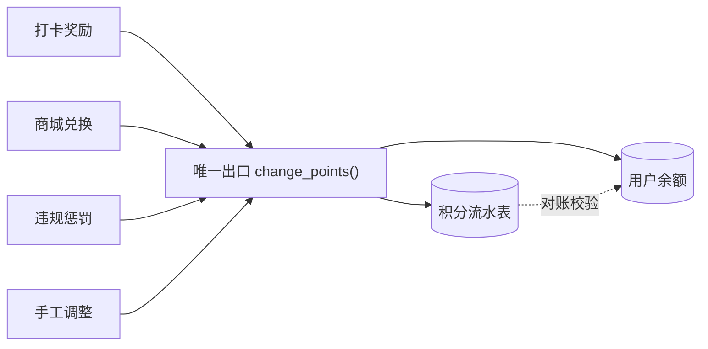

# 积分体系:唯一出口原则

> 本页讲我们最小、最干净的一个模块——积分,以及藏在它背后、贯穿全系统的「唯一出口」原则。它是这条原则的最小样板:读懂这一页,后面的库存模块和记账引擎,你会发现都是同一个模式的放大。

## 读完你会知道

- 为什么积分的增减必须收敛到一个函数入口,散落写库会烂在哪里
- 一条合格的流水要记哪五件事,以及它如何天然带来可追溯与防重
- 积分商城的兑换为什么不需要任何特殊逻辑——就是一笔负向变动
- 开收档打卡的加减分与次日结算怎么设计,结算任务为什么必须幂等
- 「唯一出口 + 流水 + 对账」三件套如何放大到库存和记账引擎

## 为什么从积分讲起

积分是整套系统里业务最简单的「改数值」模块:每个员工有一个积分余额,业务动作让它加一点或减一点,攒够了去积分商城换礼品。逻辑简单到一个初级工程师半天就能写完——也正因为简单,它最适合用来讲清一条我们全系统都在用的架构原则。

这条原则一句话:**任何会改动某个数值的操作,系统里只允许存在一个入口。**

积分如此,库存四量如此,内账引擎的凭证也是如此。三个模块复杂度差着量级,骨架是同一副。

## 唯一出口:一个函数管所有增减

我们的积分模块里,增减积分只有一个函数入口(内部叫 `change_points`,名字不重要,重要的是「只有一个」)。所有业务,不管什么理由要动积分,都必须调它:

- 开收档按时打卡 → 调它,正向加分
- 积分商城兑换礼品 → 调它,负向扣分
- 违规惩罚(缺卡、超时)→ 调它,负向扣分
- 运营手工调整 → 还是调它

任何视图、任何 Celery 任务,都不允许自己写 `UPDATE ... SET points = ...`。想加一种新的加分场景?写一行调用,传清楚理由,完事。

反面是什么样?积分逻辑散在五六个视图里,各自读余额、算新值、写回去。看起来每处都没错,合起来就是灾难:

- 并发下两处同时「读-改-写」,互相覆盖,分凭空消失或凭空多出;
- 某处忘了记日志,用户来问「我的分怎么少了」,你只能对着数据库发呆;
- 想加个「余额不能为负」的校验,得改五六个地方,总会漏一个。

收敛到一个函数之后,这些问题的解法都只写一遍:锁在这里加,校验在这里做,流水在这里落。

## 流水:每笔变动记五件事

唯一出口内部,除了改余额,必须同步落一条流水记录。我们每条流水记五件事:

1. **谁**——哪个用户的积分动了;
2. **何时**——发生时间;
3. **因何**——业务类型 + 关联单据(打卡奖励/兑换单号/惩罚事由/手工调整备注);
4. **变动多少**——带符号的增量,加分为正、扣分为负;
5. **变动后余额**——这笔落账之后余额是多少。

前四件事大家都会记,第五件「变动后余额」是很多人省掉的,但它值回票价:

- **可追溯**:把一个用户的流水按时间排开,每条的「上一条余额 + 本条变动 = 本条余额」应该严格成立。哪里断了,哪里就有问题,一眼定位。
- **防重**:结算任务要给某人发今天的打卡分,先查流水——同一业务类型、同一业务日期的记录已经存在,就直接跳过。流水本身就是天然的幂等凭据,不需要再另建一套「发过没发过」的标记表。
- **对账**:随时可以离线跑一个脚本,把每个用户的流水求和与当前余额比对,不一致就告警。这是三件套里的第三件,后面细说。

用户来问「我的分为什么变了」,客服直接把流水念给他听,不用工程师介入。这一条省下的沟通成本,远超多存一列的代价。

## 积分商城:兑换只是负向变动

积分商城是员工用积分兑换礼品的地方。听起来像个新模块,但在积分体系的视角里,它没有任何特殊逻辑:**兑换就是一笔负向变动,照样走唯一出口。**

- 兑换下单 → 调 `change_points`,变动为负,理由挂兑换单号;
- 余额不足 → 出口内的统一校验直接拒绝,商城侧不用自己判断;
- 兑换取消/礼品缺货退回 → 再调一次出口,正向冲回,理由挂原兑换单。

注意最后一条:**退回不是删除原流水,而是新增一笔反向流水。** 流水只追加、不修改、不删除,历史永远完整。这个「红冲」思想在记账引擎里是铁律,在积分这里先见一面。

## 行为激励:开收档打卡的加减分

积分不是为了做积分而做的,它服务于门店管理的行为激励。最典型的场景是开收档打卡(门店每日开档、收档时的例行打卡,详见[门店日常运营](daily-ops.md)):

- 按时完成开档/收档打卡 → 加分(比如 +20,示例数字,非真实数据);
- 超时或缺卡 → 扣分(比如 -50,示例数字,非真实数据),扣的比加的多,缺卡的代价必须显著大于按时的收益,激励才立得住。

这里有两个设计点,当年都是踩过才想明白的。

### 结算放到次日固定时间,不要实时算

打卡分不在打卡瞬间发,而是由定时任务在**次日的一个固定时间点**统一结算前一天的打卡情况。为什么要延迟?因为要给补卡留窗口:店长忘了在系统里打卡但实际按时开了档,允许在窗口期内补录。结算时间一到,以当时的最终打卡状态为准,该加的加、该扣的扣。

如果实时算,补卡就变成了「先扣分再退分」,流水噪音大,员工体验也差——刚补完卡还顶着一条扣分记录,申诉不断。

### 结算任务必须幂等

定时任务一定会重跑:服务器重启、任务超时重试、有人手工触发补数……都不稀奇。结算任务如果不幂等,重跑一次就重复发一轮分,比不发还糟糕。

我们的做法就是上面说的流水防重:结算某人某天的打卡分之前,先查「该用户 + 该业务类型 + 该业务日期」的流水是否已存在,存在即跳过。判据是业务唯一键,不是「任务今天跑过没有」这种易碎的运行时标记。这样任务随便重跑,结果不变。

## 推而广之:三件套

把积分模块抽象一层,你会得到一个通用模板。任何「改数值」的系统——积分、账户余额、库存数量、会计凭证——都是同一个三件套:

| 件 | 积分里的样子 | 放大到库存 | 放大到记账引擎 |
|---|---|---|---|
| **唯一出口** | `change_points` 一个函数 | 库存四量各走单点入口服务 | 记凭证只有一个 service 出口 |
| **流水** | 谁/何时/因何/变动/余额 | 出入库流水 | 凭证分录,只红冲不删改 |
| **对账** | 流水求和 vs 余额 | 流水推演 vs 四量现值,自动比对 | 试算平衡、科目余额核对 |

区别只在业务复杂度:积分是一个人一个数;库存是每个商品四个数(详见[库存:四量模型与自动对账](inventory.md));记账引擎是整棵科目树、每笔业务生成多条分录(详见[自建内账引擎](finance-ledger.md))。但每一层的骨架都一样:**入口收敛保证写入正确,流水保证可追溯可防重,对账保证错了能被发现。**

我们的建议是照这个顺序做:先用积分把三件套练熟——它业务最简单,出了错损失也最小——再去啃库存和记账。这也是本书复刻路线图把积分放在 M4 的原因。

## 踩坑与红线

- **症状**:用户积分对不上,排查无从下手,只能人工赔付了事。
  **根因**:多处代码直接 UPDATE 余额,没有流水,历史不可复原。
  **铁律**:增减只走唯一出口,出口内必落流水,余额永远可由流水推演出来。

- **症状**:结算任务重跑一次,全员多发一轮分。
  **根因**:任务不幂等,「发过没发过」靠任务调度器的记忆,而调度器的记忆不可靠。
  **铁律**:发分前先查流水的业务唯一键(用户 + 类型 + 业务日期),已存在即跳过。

- **症状**:补了卡的店长仍被扣分,申诉工单不断。
  **根因**:结算跑得太早,或实时扣分,没给补卡窗口留时间。
  **铁律**:结算固定在次日某时间点之后,窗口期内一律以结算时刻的最终状态为准。

- **症状**:兑换取消后直接删掉原扣分流水,月底对账对不平。
  **根因**:流水被修改/删除,破坏了「余额 = 流水之和」的不变式。
  **铁律**:流水只追加不删改,冲销一律新增反向记录。

## 延伸阅读

- [门店日常运营:开收档与工作日报](daily-ops.md) —— 打卡业务本身的设计
- [库存:四量模型与自动对账](inventory.md) —— 三件套的第一次放大
- [自建内账引擎:事件源自动凭证(模式篇)](finance-ledger.md) —— 三件套的终极形态
- 复刻 prompt:[M4 积分 + 开收档 + 日报](../05-replication/prompts/04-points-daily-ops.md)

---

[← 返回本层目录](README.md) · [返回总目录](../README.md)
