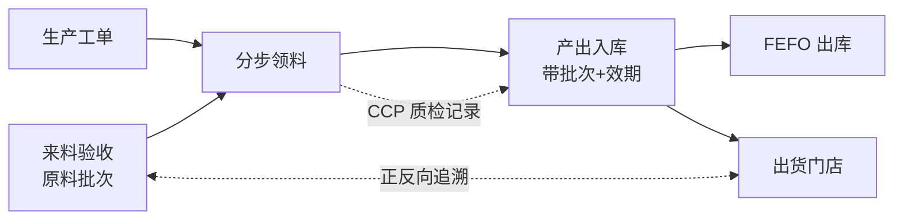

# 生产与成本:研发档案 / 工单 / 批次追溯(结构篇)

> 这一页讲自产品从「一份配方档案」到「一批可追溯的成品」的完整结构:研发档案怎么组织、单件成本怎么算准、生产工单和批次追溯怎么串成一条链。有中央厨房或自建工厂的连锁品牌,这是供应链数字化里最难啃、也最值钱的一块。

**★ 先声明:本篇只讲结构与模式,不含任何真实配方、原料用量与工艺参数。文中所有数字均为虚构示例,仅用于说明计算结构。**

## 读完你会知道

- 研发档案 = 配方 + 工艺 SOP + 多级 BOM,以及为什么它必须单独一个权限位隔离
- 成本卡的核心公式:毛料成本 ÷ 出成率 ÷ 批量产出,和多级 BOM 怎么逐级卷积
- 量纲铁律:一个「按箱采购、按克配方」的换算错误,怎么让全链路成本报表一起错
- 生产链路七件套:工单 → 分步领料 → 批次入库 → FEFO → CCP 质检 → 来料验收 → 正反向追溯
- 联产分摊和包装物建模——成本永远对不平时,先查这两处

## 研发档案:一品一档,机密隔离

每一个自产品(自己工厂生产的商品)对应一份研发档案,档案里三样东西:

- **配方**:原料清单 + 每种原料的用量;
- **工艺 SOP**:分步骤的操作说明,给车间照着做;
- **多级 BOM**:成品 ← 半成品 ← 原料的层级关系。比如「成品酱料 ← 调配半成品 ← 基础原料」(结构示例,非真实工艺),半成品自己也有配方和出成率,层层往下挂。

结构上没什么玄妙,真正的要点是**权限**:

配方和工艺是一家食品企业最核心的机密——比财务数据还核心。所以研发档案模块从第一天起就是**单独的权限位**,不复用任何已有的管理权限。实际效果是:连内部大多数同学都看不到这个模块的入口,只有极少数研发和管理岗有权限。列表接口、详情接口、成本卡接口全部走同一个权限校验入口,不留旁路。

> 经验:机密隔离要在建模时就做,不要等「先上线再说」。事后补权限位,你永远不确定有没有哪个接口漏了。

## 成本卡:三个除法算清单件成本

自产品的单件成本不是「原料加一加」那么简单,因为生产有损耗、有批量。我们的成本卡公式:

```
单件成本 = 毛料成本 ÷ 出成率 ÷ 批量产出
```

三个量的含义(以下为虚构示例数字):

- **毛料成本**:按配方投入的全部原料,各自「用量 × 原料单位成本」加总。比如一批投入原料合计 1000 元;
- **出成率**:生产有损耗,投 10kg 毛料只出 8kg 净料,出成率就是 80%。1000 ÷ 0.8 = 1250 元,这才是净产出对应的真实成本;
- **批量产出**:这一批做出 500 件,1250 ÷ 500 = 2.5 元/件。

**多级 BOM 逐级卷积**:半成品先按自己的配方 + 出成率 + 批量算出半成品单位成本,再作为「原料」进入上一级成品的毛料成本。层级不限,从最底层原料一路卷到顶层成品。任何一级的原料价格变了,重算就是从下往上跑一遍。

### ★ 量纲铁律:采购价必须除以换算率再进成本卡

这是整个成本体系里最容易错、错了最贵的一条:

**采购是按采购单位计价的(箱、袋、桶),配方是按配方单位用量的(克、毫升、个)。原料单位成本进成本卡之前,必须做一次换算:采购价 ÷ 换算率 = 配方单位成本。**

虚构示例:某原料采购价 200 元/箱,一箱换算 5000 克,那么进成本卡的必须是 0.04 元/克。如果漏掉这一除,成本卡会把它当 200 元/克——单件成本瞬间放大几千倍,而且这个错误会沿着多级 BOM 卷积到每一个用了它的成品,再流进所有引用成本的报表。

我们在这上面栽过跟头,所以定了铁律:

- 换算率是原料档案的必填字段,录入时校验;
- **这条换算逻辑要写成单元测试**——构造一个「按箱采购、按克配方」的原料,断言成本卡取到的是除过换算率之后的值。这个测试便宜到不值一提,但它守住的是全链路的成本正确性。

## 外采品成本:加权平均 + 一份口径总纲

不是所有商品都自产,外采品(直接从供应商买来卖的)没有配方,成本就是采购价。但采购价会波动,取哪一次的?我们的做法:

- **近 N 次采购加权平均(WAC)**:按最近几次采购的数量加权,平滑单次波动,又不会被半年前的老价格拖着走。N 取多少是经验值,常见取近 3~5 次(按自己业务调)。

于是全系统的成本口径就是一句话:

> **自产品走成本卡,外采品走采购加权平均价。**

这句话写进一份**成本口径总纲文档**,定死。所有报表——毛利分析、生产报表、内账凭证——引用成本时一律指向这份总纲,谁也不许自己发明第三种算法。口径类的坑我们在[数据口径:最贵的一类坑](../03-pitfalls/data-caliber.md)里单独展开过:两个报表用两种成本算法,业务同学对不上数,排查成本远高于当初写文档的成本。

## 生产链路:从工单到追溯

有了档案和成本,生产执行链路是这样一条线:



逐段说:

### 生产工单与分步领料

工单是生产的起点:做什么品、做多少、用哪份档案的配方。领料我们走**分步领料**——每道工序开工时各自领自己那一步的料,而不是工单一开就把全部原料一次性领走。

为什么?一次性领料看着省事,实际问题很多:后面工序还没开工,料已经从库存里扣掉了,库存账面和车间实物对不上;中途工单取消或改量,退料一团乱。分步领料让「库存扣减」和「实际消耗」在时间上对齐,每一步领了多少、剩了多少都有据可查。

一个实际教训:分步领料上线后,**老工单(按旧模式建的)不要强行迁移**,让它们按旧逻辑走完,新工单用新模式。生产链路上的数据迁移风险远大于收益。

### 批次、效期与 FEFO

产出入库时带**批次号和效期**,这是追溯和食品安全的地基。出库遵循 **FEFO(First Expired, First Out,先到期先出)**——注意不是 FIFO,先进的未必先到期(不同批次保质期可能不同)。FEFO 由系统在出库时按效期排序自动建议,不靠库管脑子记。

### CCP 质检与来料验收

- **CCP(Critical Control Point,关键控制点)质检**:生产过程中的关键节点留质检记录,和工单、批次挂钩。哪个环节设 CCP 是食品安全体系(HACCP 思路)的活,系统的职责是把记录结构化存下来、能按批次查出来;
- **来料验收**:原料入库前的验收环节,验收记录挂在原料批次上。这一环补上,追溯链才能从「成品」一路通到「哪一批原料、谁验收的」。

### 正反向追溯与召回模拟

批次贯穿全链之后,追溯就是查表:

- **正向**:某一批原料 → 用在了哪些生产批次 → 这些成品发给了哪些门店;
- **反向**:某门店的某批成品 → 来自哪个工单 → 用了哪些原料批次 → 各自的来料验收记录。

在追溯之上做**召回模拟**:假设某原料批次出问题,一键列出受影响的全部成品批次和收货门店清单。真出事的时候,这份清单就是黄金一小时里最值钱的东西;平时,它是给监管和大客户看的能力证明。

## 联产与包装:成本对不平的两个隐藏原因

两个不起眼但必须建模的东西,漏掉任何一个,成本就永远对不平:

- **联产(一次投料多产出)**:一批原料投进去,产出不止一种东西——比如一份原料分割出 A、B 两种半成品(结构示例)。这批毛料成本必须**按比例分摊**到各产出上(我们按产出的价值/数量比例分摊),不能全算给主产品。否则主产品成本虚高、副产品成本为零,两头都是错的;
- **包装物与废料单独建模**:包装材料(袋、盒、标签)是实打实的成本,要进成本卡;生产废料(损耗掉的部分)要有去处——它解释了「投入量」和「产出量」之间的差额。我们为包装物和废料单独建了模型(包括废料仓),之前没有它们的时候,盘点和成本核对总有一块糊账,谁也说不清差在哪。

一句话:**投入 = 产出 + 包装消耗 + 废料**,等式配平了,成本才算得清。

## 效率技巧:SOP 批量复制 + 待确认标记

建档案是个体力活:几十上百个自产品,每个都要配方 + SOP + BOM,按部就班一个个建,研发同学要建到明年。我们的提速办法:

- 同工艺的产品(比如同一类做法只换主料的一批产品),**SOP 支持批量复制**:选一个建好的模板品,一键复制工序结构到同类的几十个品;
- 复制出来的 SOP 自动打上**「待人工确认」标记**,列表里醒目可见。研发同学之后逐个核对、调整差异项、去掉标记。

先铺量、再确认,档案建设速度提了一个量级,同时「待确认」标记保证了没人会把未核对的 SOP 当成定稿拿去生产。这个「批量生成 + 人工确认标」的模式在别的模块也反复用得上。

## 踩坑与红线

- **成本突然放大几个数量级**
  根因:某原料采购单位与配方单位换算率漏除或填错,错误沿 BOM 卷积扩散。
  铁律:采购价 ÷ 换算率才准进成本卡;换算逻辑必须有单元测试守着。

- **两张报表毛利对不上,业务吵到老板那**
  根因:各自实现了成本取数,一个读成本卡、一个读最新采购价。
  铁律:成本口径总纲一份定死——自产走成本卡、外采走 WAC,所有报表引用同一出口。

- **库存账面和车间实物长期对不上**
  根因:开工一次性领料,扣账时点远早于实际消耗,中途变更退料混乱。
  铁律:分步领料,每道工序各领各的;已存在的老工单按旧逻辑走完,不强迁。

- **盘点总差一块,谁也说不清差在哪**
  根因:包装物和废料没建模,成本和数量的等式天然不闭合。
  铁律:投入 = 产出 + 包装消耗 + 废料,三项都要有模型有去处。

- **配方数据被无关同学看到**
  根因:机密模块复用了通用管理权限,某个列表接口没单独校验。
  铁律:研发档案独立权限位,所有接口走同一校验入口,建模时就做,不事后补。

## 延伸阅读

- [库存:四量模型与自动对账](inventory.md) — 领料、入库背后的库存扣减机制
- [供应链协同:供应商 / 第三方仓 / 区域代理](supply-chain.md) — 来料的上游:采购与供应商侧
- [自建内账引擎:事件源自动凭证(模式篇)](finance-ledger.md) — 生产与采购事件如何自动生成凭证
- [数据口径:最贵的一类坑](../03-pitfalls/data-caliber.md) — 成本口径总纲为什么必须只有一份
- 复刻提示词:[M5 生产 + 成本](../05-replication/prompts/08-production-costing.md)

---

[← 返回本层目录](README.md) · [返回总目录](../README.md)
