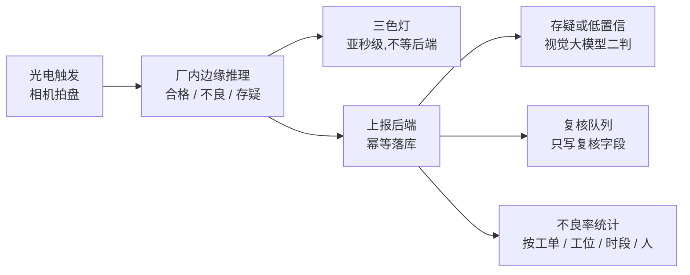
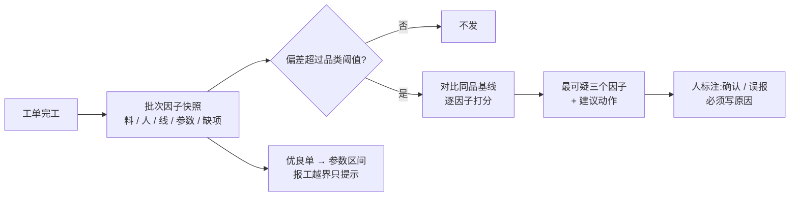

# 质检与计量:机器先看、先称,人来下结论

> 这页讲中央工厂里几条「机器先动手」的质检与计量线:产线视觉质检、电子秤读数与报工绑定、内包称重复核、工艺参数闭环与出成率异常定位,以及研发侧的试制记录、SOP 体检与草稿配方投产闸。共同的底线是:**机器负责看、称、算、提示,结论和标准只有人能改**。适合工厂负责人、品控、研发和工程师读。

**★ 同[生产篇](production-costing.md):本页只讲结构与机制,不含任何配方、工艺参数与出成率真实值,数字一律为示例。**

**读完你会知道:**

- 视觉质检一期为什么「只收集不扣钱」,机器判定为什么永远不被人工覆盖
- 秤读数怎么去抖、怎么绑到报工上,以及**为什么实称绝不能当出成率的分母**
- 内包称重复核的标准克重取数链,和「偏重不判、偏轻照判」的保守降级
- 出成率异常怎么自动定位到「最可疑的三个因子」,样本不够时为什么宁可闭嘴
- 试制、SOP 体检、草稿投产闸、产线产能这几道研发与排产侧的闸

## 视觉质检一期(试点中)

穿串线末端每过一盘,相机拍一张,厂内边缘机本地判三态并点亮三色灯——红灯亮了,工人当场把盘拿下返工,重穿后再过一次相机。**这条链上没有任何系统拦截**:后端只记录、统计、给人看,不拦货、不锁批。

状态要说清:**试点中**。线上跑的还是占位模型,结果主要用来验证链路;一期**只收集不扣钱**,不与计件工资挂钩——工人点「误判」直接进重训标注池,而不是进考核。几条设计红线:

- **点灯与落库解耦**。边缘机断网照样点灯、回网补传,所以上报必须幂等:同一工位、同一盘序、同一拍摄时刻重复上报,返回已有记录,不建第二条。
- **机器判定永不被人工覆盖**。人的结论只写复核字段,最终结论 = 有复核用复核、否则用机器。改掉机器结论,就再也算不出模型误判率,重训也没了真值。视觉大模型二判同样只写自己的字段。
- **不良的锚点是「盘」,不是批次**。为一盘不良去冻结整批,既拦不住那一盘,又误伤几百盘好货。批次、工单在这里只作统计溯源属性,绝不反向写。
- **不良率只按首判算**。返工盘重拍会新建一条记录,统计时同一盘的非首条排出分母——否则返工越多、不良率越低,口径就反了。这条要等周转盘刻上永久码才生效;一期没有盘码,宁可让返工复拍略微拉低不良率,也不把不同的盘错并成一盘。
- **工位机的质检卡不走缓存**。工人盯着看这一盘判没判过,缓存让他看到上一盘的结果,当场就认定「这东西不准」。

在此之上是**整改单闭环**:同一工位 + 同一商品 + 同一问题项短时间内反复不良(示例:90 分钟内 4 盘)自动开单 → 线长填原因与措施 → 点「已整改」→ 满若干个生产日后自动比较整改前后该项不良率(示例:各取 5 个生产日,下降四成算有效),样本不够就延期不判。占位模型阶段几乎没有确定的不良,这套闭环**目前基本不会触发**,是给模型成熟后预留的。

## 电子秤:读数去抖与报工绑定

秤接厂内边缘采集程序,读数一路进缓存(报工页「读磅」用的瞬时值),一路进历史表(对账用)。历史表必须**去抖**:只有稳定读数,且「与上一条已落库读数相差 ≥ 示例 0.1 kg」或「距上一条 ≥ 示例 2 分钟」才落库。前者抓「放上去 / 拿下来」那一刻,后者留心跳点区分「没动」和「掉线」。不去抖,每台秤一天能写出数万行同一个静止读数。

去抖做**两层**,判据相同:

| 层 | 职责 | 为什么需要 |
|---|---|---|
| 边缘侧(减量层) | 断网时只缓存值得落库的读数,重连补传,缓存有上限 | 不去抖的话断网一小时就是几千条,重连那一发直接把后端打爆 |
| 服务端(权威层) | 再判一次;基准丢了就无条件放行一条 | 边缘程序重启会丢本地基准,老版本也没这段逻辑;**宁可多一行,不可漏掉一次真称重** |

两条细节:补传的旧读数只进历史表、绝不写瞬时缓存,否则报工页会拿到一个「新鲜」的陈旧值;历史表写失败也不能连累瞬时读数,那是产线停摆级别的连坐。

**报工绑定**:

- 提交报工时,回看一小段时间(示例:3 分钟)内本工位秤的最后一条稳定读数,绑到这批报工上——工人先称、再选人、再填数,中间要花一两分钟;
- 多人一次报工会建多行,读数编号每行都写,**净重只写第一行**——行行都写,汇总就成了几倍投入量,而这种错不报警、只会让出成率好看;汇总侧再按读数编号去重一次,两道都留着;
- 录入与实称差超过示例 4% 时提示「请核对」,**只提示不拦人**;产出单位不是公斤的工位只绑定不比较,量纲不同硬除出来的百分比是垃圾数。

**★ 红线:实称只作对账维度,绝不当出成率分母**。秤只装在部分工位,前处理、配料等工位没有秤,实称覆盖的不是「这单全部投料」。拿它当分母,会在没秤的工位上**静默算错**,还会把所有历史基线一起漂掉。出成率的分母口径只有一份;秤回答的是「录的数和秤上的数对不对得上」,不是「投了多少料」。同理,「录入与实称不符」只在**同班组多单同向偏离**时才出异常报告,一单的偏差不点名。

## 内包称重复核

内包按袋报工,秤闲着;而**净含量**恰恰是内包最该盯的质量指标——少给是计量监督与客诉风险,多给是白送成本。于是把内包台秤改作复核:**整件放上去**,比较「袋数 × 每袋标准克重 + 皮重」与实称,判合格 / 偏轻 / 偏重(容差示例 ±2.5%,可按品类覆盖)。整件称比逐袋抽更贴现场,分母大,偏轻是不是系统性的一称就看出来。

- **每袋标准克重只有一条取数链**:包装换算阶梯 → 每袋支数 × 规范克重 → 规格文本里明写的「克 / 袋」,命中即停;都取不到就返回「缺什么」,原话显示给工人,他才知道该找研发补什么。**每件袋数只认包装阶梯**,不拿订货单位的换算率兜底——那个数在部分商品上会差十几倍。
- **标准逐条快照**:档案以后改了克重,历史复核不跟着变。
- **皮重要真称**:袋、盘的默认皮重是估的,页面上标「皮重未校准」;外箱不设默认值,没称过的箱型**偏重一律不判、偏轻照判**——没减箱重只会让读数偏大,减都没减还偏轻,那就是真偏轻。
- **判不了也落库,但不进合格率分母**:拿档案缺口去算不合格,等于冤枉产线。
- **预览不落库**(工人会反复放拿试);**只提示不发群**(一响报警就会有人把复核关掉);复核重量**绝不进出成率**。

## 工艺参数闭环:出成率异常定位

出成率偏差告警只会喊「这单不对」,喊完没人知道查哪。我们给每张完工工单拍一行**批次因子快照**:用了哪些原料批次和供应商、来料验收结论、班组、产线、关键工艺参数(时长、温度)、关键控制点失败数——以及**缺了哪些因子**,下游不许假装有。

偏差超过品类阈值(示例:4 个百分点)时,拿同品近期的单(示例:近 20 单,只收实称投料的非联产单)做基线逐因子对比:原料批次 / 供应商、班组、产线按「同组多单同向偏离」判,工艺参数按稳健离群分数判;各因子分数统一刻度后排序,**取最可疑的三个 + 一段人话建议**推到工厂群,无异常不发。几条纪律:

- **先规则后统计,不上机器学习**:样本量撑不起,规则可解释;
- **样本不足就闭嘴**:基线少于示例 6 单不出报告,拿两单编出来的「最可疑因子」比不给结论更坏;
- **人的标注是结论**:确认或误报必须写真实原因,重算只刷计算字段,绝不覆盖人的标注;
- **参数优良区间**:取出成率排前列的单(示例:前四分之一),用分位数区间而不是最大最小值——一个手滑的极值就能把区间撑到没意义;报工时越出区间只提示、**不拦人**,新配方、试产、换设备天然越界。

## 研发与排产侧的几道闸

- **试制记录:采纳只出草案**(接口已上线,页面陆续补齐)。研发每试一次存一条结构化记录(配方快照、关键参数、投入产出、成本、多评委感官打分),样本够了出可解释分析(秩相关、最高分区间、成本最优),每条都带样本数和「相关不等于因果」。成本复用成本卡同一个算法做试算,不另造口径;出成率只在投入产出同量纲时才算。点「采纳」**只吐一份档案草案**,人逐行核对后仍要走研发档案的保存与启用门槛——**试制绝不自动改写研发档案**。
- **SOP 体检**。规则引擎扫全部研发档案,问题分「阻断 / 风险 / 优化」三级,保存档案即时校验、每周出报告;忽略必须写原因,已处理的问题再次命中标「复发」。阻断级只留会卡住生产或关键控制点判定的规则——全库都命中的规则设成阻断,等于没有阻断。
- **草稿配方投产闸**。研发档案还是草稿或已停用时,建生产工单会被拦下要求确认;人工强制放行要留痕,**自动排产永不强制**;每日纪律报告点名「草稿档案在制工单」。同一批改动把关键控制点实测改成**收口前必录**,由服务端按限值判定合格(不信客户端自报),超限必须填纠偏措施才能提交。
- **产线产能挂产线,不挂工位**。日产能 = 台数或人数 × 每小时产能 × 班次,可按品类覆盖每小时产能;挂工位还得逐岗配人,维护不动。一期只做登记与排产负荷提示,不改排产决策;按产能封顶顺延是二期。

## 人机边界

| 类型 | 例子 |
|---|---|
| **硬拦** | 草稿档案投产(须人确认放行)、关键控制点缺录或超限无纠偏 |
| **只提示** | 视觉不良(三色灯)、录入与实称不符、工艺参数越界、装量偏轻 |
| **只出草案** | 试制采纳、出成率校准建议、品类归类建议 |
| **只有人能改** | 研发档案与标准、复核结论、异常标注原因 |

## 踩坑与红线

- **秤装上以后,出成率突然「变好」了**
  根因:多人报工每行都写了同一次称重的净重,汇总成了几倍投入。
  铁律:净重只写第一行,汇总再按读数去重;实称只作对账,不进出成率分母。
- **返工越多,不良率越低**
  根因:返工盘重拍被当成新的一盘计进分母。
  铁律:不良率按首判算;人工复核只写复核字段,不覆盖机器判定。
- **一盘不良,整批被冻结**
  根因:把盘级质检结论写回了批次状态。
  铁律:不良锚点是盘,批次只作统计属性,绝不反向写。
- **整件复核把「没减箱重」判成偏重**
  根因:箱型皮重没称过,拿通用值或干脆不减就判。
  铁律:皮重未知时偏重不判、偏轻照判;判不了的不进合格率分母。

**红线汇总**:视觉质检一期只收集不扣钱;实称绝不当出成率分母;样本不足不出结论;试制只出草案;参数越界只提示不拦人。

## 延伸阅读

- [生产与成本:研发档案 / 工单 / 批次追溯(结构篇)](production-costing.md) — 研发档案、成本卡、工单与报工的结构
- [认证记录自动生成](certification-records.md) — 净含量复核与视觉复核怎么进出厂检验记录
- [机组联网与收工自动关机](equipment-automation.md) — 同一车间里的冷机自动化
- [智能采购与排产](smart-supply.md) — 自动排产与投产闸的衔接
- [数据口径:最贵的一类坑](../03-pitfalls/data-caliber.md) — 分母口径为什么只能有一份
- 复刻 prompt:[M5 生产 + 成本](../05-replication/prompts/08-production-costing.md)

---

[← 返回本层目录](README.md) · [返回总目录](../README.md)
