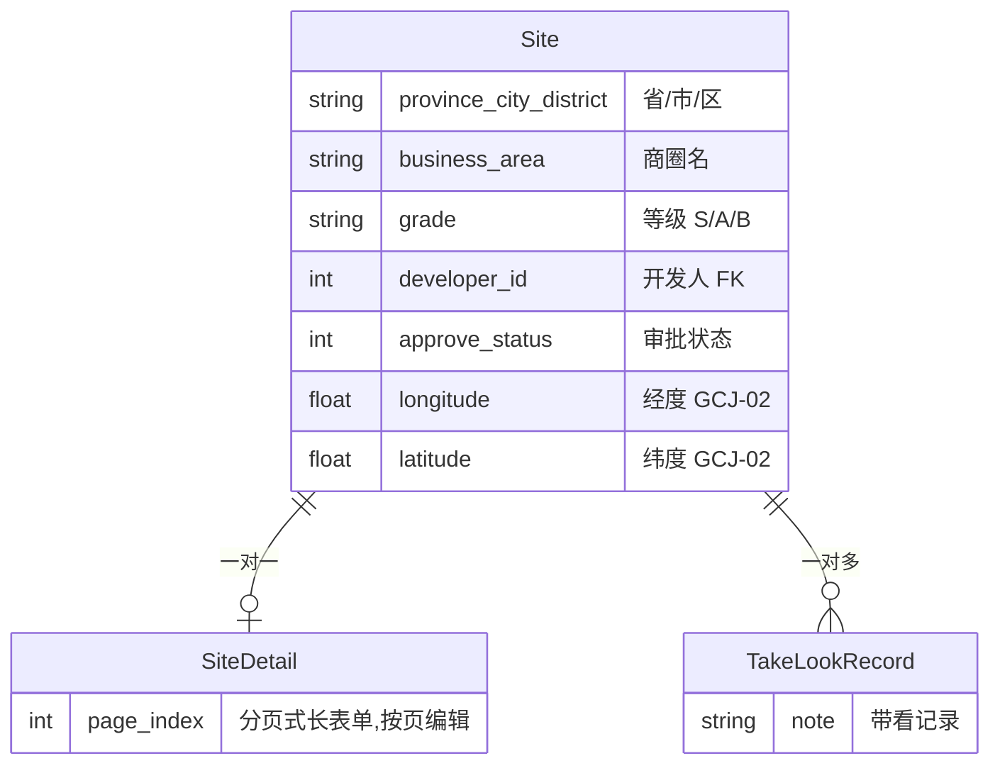

# 选址工具:评估 SOP 与地图打点

> 这一页讲我们怎么把「选址」从拓店同学的个人经验,变成一套有数据、有流程、有 AI 参与的工具:三张表撑起全部业务,一份 SOP 文档让 AI 出评估初稿,公开数据做空白市场排序。给拓店负责人和要复刻这套工具的工程师看。

**读完你会知道:**

- 选址业务用三张表就能建模:主表 + 一对一的定铺详情 + 带看记录
- 经纬度为什么直接存主表、坐标系为什么全国统一用 GCJ-02、地图打点接口为什么只给精简字段
- 怎么把选址评估 SOP 固化成文档,让 AI 出报告初稿、人复核签字
- 人口热力和空白市场分析用什么公开数据、地图 API 免费配额的 QPS 坑在哪
- 审批流和选址周报怎么把整个流程闭环

## 选址业务长什么样

连锁拓店的日常大致是这样:开发人在某个城市跑商圈,看中一个铺位,登记进系统;带着加盟商或者内部同事去实地看铺,留下带看记录;觉得靠谱就填一份很长的「定铺评估表」,提交给上级审批;审批通过才进入签约流程。

痛点也很典型:

- 铺位信息散在微信聊天记录和 Excel 里,谁看过哪个铺、评估到哪一步,没人说得清
- 评估质量全看开发人的个人经验,新人写的评估报告和老手差一个量级
- 老板想看「全国铺位分布」「哪个城市该优先拓」,只能靠开会问

选址工具就是冲着这三个痛点做的:**一张地图看全局,一套 SOP 保下限,一条审批流管闭环。**

## 数据模型:三张表

**选址主表(Site)** 是核心:省/市/区、商圈名、铺位等级(S/A/B)、开发人(外键指向员工表)、审批状态、经纬度。一个铺位一条记录,列表、地图、审批都围着它转。

**定铺详情(SiteDetail)** 和主表一对一。定铺评估表内容非常多——房租、面积、周边业态、人流测算、房东信息、各种现场照片——一次性填完体验很差,也容易填一半丢失。所以我们把它设计成**分页式长表单**:详情表带一个页码字段,前端按页(0~5 共六页)分块编辑、分块保存,填到哪页存哪页。这个设计不花哨,但对一线开发人非常友好——他们经常是在铺位现场用手机填的。

**带看记录(TakeLookRecord)** 一对多挂在主表下:谁、什么时候、带谁看了这个铺,看完什么反馈。它让「这个铺聊到什么程度了」有了客观依据。

三张表之外没有更多花样。选址业务的复杂度在流程和评估,不在数据结构——建模时忍住别过度设计。

## 经纬度:字段设计与坐标系

几个当时纠结过、后来证明做对了的决定:

**坐标系全国统一用 GCJ-02。** 国内主流地图服务(高德、腾讯等)都用 GCJ-02(俗称火星坐标系),GPS 原始坐标(WGS-84)在国内地图上会有几百米偏移。全国业务只要涉及地图,第一天就要定死坐标系,并在字段注释里写清楚——否则不同来源的坐标混进同一张表,打出来的点位漂移,排查起来极其痛苦。

**经纬度直接存主表,两个浮点字段。** 早期我们试过从截图、地址文本里解析坐标,都不可靠。最终方案最笨也最稳:前端让开发人在地图上选点,选完直接把 `longitude`/`latitude` 写进主表。坐标是地图打点的一等公民数据,不要藏在任何衍生结构里。

**地图打点接口只返回精简字段。** 「全国铺位一张图」要一次性渲染所有有坐标的铺位,如果复用列表接口返回全量字段,几百个点位就是一个巨大的响应。所以我们单独做了一个打点接口:只返回 id、商圈名、经纬度、等级四样,且只返回有经纬度的记录;点开某个点位再按 id 调详情接口。列表接口才给全量字段,并且支持可选分页。**地图要的是「多而轻」,列表要的是「少而全」,两个接口各干各的。**

## AI 评估:SOP 固化 + 初稿 + 人签字

这是选址工具里 AI 介入最深的一环,思路一句话:**把老手的评估方法写成文档,让 AI 照着文档干活,人只做复核。**

具体做法:

1. **先把 SOP 固化成一份文档。** 我们把资深开发人评估铺位的完整方法论整理成一份选址评估 SOP,维度包括人流(时段、动线方向)、竞品(密度、价格带)、租金(占营收比的合理区间)、可视性(招牌是否被遮挡)、动线(顾客自然路径是否经过)等。这份文档本身就有价值——没有 AI 它也是新人培训教材。
2. **AI 按 SOP 出评估报告初稿。** 把铺位的登记信息、现场照片、周边数据喂给 AI,要求它严格按 SOP 的维度逐项评估、逐项给结论,输出一份结构化的评估报告初稿。
3. **人复核、修改、签字。** 初稿回到开发人和审批人手里,该改的改,最终结论由人确认。

这里的分工原则值得单独说:**AI 提效,人担责。** 选址是重决策——一个错误选址的代价是以年计的亏损——AI 的角色是把「按 SOP 逐项过一遍」这个机械但费时的工作做掉,把人从格式劳动里解放出来,专注判断。绝不能让「AI 说这个铺能开」成为决策依据,签字的永远是人。

另一个隐藏收益:AI 按 SOP 出报告,倒逼 SOP 本身写得可执行。哪条维度写得含糊,AI 的输出立刻暴露出来——这是对 SOP 质量的免费测试。

## 人口热力:公开数据 + 地图 API

评估铺位绕不开「这个位置周边有多少人」。我们的数据来源两条腿:

- **政府公开的人口网格数据**:普查口径的人口栅格,精度到公里网格,免费、覆盖全国,做商圈级别的人口密度判断够用。
- **地图开放平台的 API 补充**:周边 POI(小区、写字楼、学校)检索等,补充网格数据缺的「业态结构」信息。

这条链路上我们踩过一个结结实实的坑,放到下面「踩坑与红线」里详说:地图开放平台免费配额的 QPS 低到个位数,批量跑数据不做节流,整批任务会死得非常难看。

## 空白市场分析:把拍脑袋变成看数

拓店优先级的讨论,最容易变成「我觉得那个城市行」。我们做了一个空白市场分析工具,思路很朴素:

- 用**人口**、**夜间灯光**(公开的夜光遥感数据,反映经济活跃度)等公开数据,给每个候选城市算一个「城市性价比」——大致可以理解为「消费潜力 ÷ 进入成本」的粗糙代理
- 按性价比给城市排序,叠上我们已有门店的分布,空白的高分城市就是拓店优先级

要坦率说清楚它的边界:**这个分数不精确,也不需要精确。** 夜光数据反映不了商圈质量,人口数据抹平了消费结构差异。它的价值在于把拓店会议的讨论起点从「我觉得」换成「先看数,再讨论数据外的因素」——决策质量的提升来自讨论方式的改变,不是来自分数本身。

## 审批流与选址周报

流程闭环靠两样东西:

**审批流**:开发人填完定铺详情后提交 → 指派审批人(支持多选,比如拓店负责人 + 运营负责人同时审)→ 审批人在系统里通过或驳回。审批状态落在主表字段上,列表页一眼能看到每个铺位卡在哪一步。审批类接口和普通接口用不同的权限位控制——能看铺位的人不一定能审批。

**选址周报**:每周定时任务自动汇总本周新增铺位、带看情况、审批进展,生成周报推送到拓店群。周报的作用不是好看,是**让流程停滞无处藏身**——一个铺位三周没动静,群里所有人都看得见。推送用的就是日常办公 IM 的群机器人,实现成本很低。

## 踩坑与红线

**★ 地图 API 免费配额 QPS 是个位数,批量任务必须节流排队**

- 症状:批量给几百个铺位补周边数据,任务跑到几十个就开始整批失败,报限流错误。
- 根因:地图开放平台免费配额的并发限制远比想象中严——QPS 只有个位数(示例:假设 QPS=3,以平台当期文档为准),朴素的循环调用瞬间超限,而且限流后连续失败还会污染已跑完的部分。
- 铁律:所有调用地图 API 的批量任务,一律过节流队列(按配额留安全余量),失败单条重试而不是整批重跑;任何新接的第三方 API,写批量逻辑前先查限流条款。

**坐标系不统一,点位漂移几百米**

- 症状:地图上部分点位明显偏出商圈,偏移量还很一致。
- 根因:混入了 WGS-84(GPS 原始)坐标,没转 GCJ-02 就入库。
- 铁律:入库只收 GCJ-02;任何新坐标来源接入前,先确认它输出什么坐标系,不确定就在边界处强制转换。

**从截图/文本解析坐标,不可靠**

- 症状:解析出的坐标时对时错,错的还不好发现。
- 根因:坐标被藏在非结构化载体里,解析逻辑永远追不上格式变化。
- 铁律:坐标是一等公民,让用户在地图上选点直接写字段;历史数据一次性回填,解析逻辑退役。

## 延伸阅读

- [CRM 招商:线索管道与公海](crm.md) — 选址通过之后,线索怎么流进招商管道
- [门店日常运营:开收档与工作日报](daily-ops.md) — 同样「定时任务 + 群推送」模式的另一个应用
- [复刻 Prompt:M4 选址工具 + CRM 招商](../05-replication/prompts/11-site-crm.md) — 把这一页喂给你的 AI 助手动手建

---

[← 返回本层目录](README.md) · [返回总目录](../README.md)
