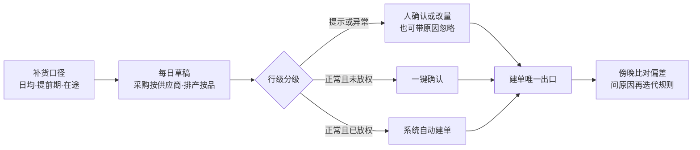

# 智能采购与排产:从每日草稿到按品放权

> 这页讲我们怎么把「补货口径算出该买该做多少」和「人真的下出一张单」之间那段人工搬运交给系统:每天出草稿,只让人看拿不准的行,人的修改自动变成参数,稳定的品逐个放权给系统自己下单,再用一个「问原因」闭环让规则持续迭代。适合供应链负责人和准备做采购自动化的工程师读。

**读完你会知道:**

- 为什么默认是「草稿 + 人确认」,以及什么条件下才让系统自己下单
- 采购规则为什么挂在「供应商 × 商品」上,采购周期、忽略记忆、当班日各管什么
- 排产黑名单:算不准的品为什么必须落库可见,而不是静默消失
- 「简单模式」:一条人讲得清的公式,和它刻意绕开、刻意保留的闸
- 放权白名单「关 → 影子 → 开」怎么流转,下错单的代价怎么封顶;以及预测、评分卡、采购群机器人各守什么红线

## 一、骨架与现状

一句话:**系统把最难的部分(算多少、折量纲、查缺料、选哪家)做完,「要不要真下」先留给人,再按品逐个放权。** 采购与排产共用一副骨架:

三条纪律贯穿全模块:**不重算上游口径**(日均、提前期、在途、安全天数全部来自[补货链路](supply-chain.md)那一个出口,两处各算各的就会「预警说缺、草稿说够」);**只走建单唯一出口**(页面、群里、自动任务最后都调同一个建单函数);**草稿是快照**(每天删旧建新,已确认、已忽略的不动,商品资料后改也不回写历史草稿)。

| 能力 | 状态 |
|---|---|
| 每日采购草稿 | 已上线;推内部采购群已开,推供应商微信群默认关、可开启 |
| 每日排产草稿 + 黑白名单 | 已上线;推送出厂默认关,可开启 |
| 简单模式 | 可选策略,我们目前开启 |
| 按品放权白名单 | 机制已上线,放权的品以每日评估为准 |
| 偏差问因闭环 | 已上线 |
| 需求预测 | 影子运行,默认不喂采购 |
| 供应商评分卡 | 计算与月报已上线,管理页面未做 |
| 采购群机器人(查单、确认、发票、送货单转单) | 已上线 |

## 二、采购草稿:规则挂在「供应商 × 商品」上

需求口径给的是**净需求**,不是**能下的单**:供应商有起订量、只按整箱发,有的料货源本来就紧。这些规则存在「供应商 × 商品」这一行供货关系上(同一个品换一家买,规则就不同):起订量、订货倍数、货源紧张度、首选供应商、采购提前期(用历史实测的高分位回填,中位数会低估长尾),以及采购周期。

- **采购周期 = 一次买够几天的量,不是多久买一次。** 它只替换净需求里的「补到天数」,出不出这一行仍只看是否跌破安全线,所以**急单当天照出**。「一个月买三轮」是周期的涌现结果,不必另建批次表;周期比安全天数还短时按安全天数算。
- **先过滤,再凑整。** 净需求不足[示例:半天]用量的残差不出行(明天攒够了自然再出);判据用凑整**前**的原始量,否则就成了「凑到 5 件所以值得买」。没配倍数的品默认向上取整到整件。
- **忽略记忆。** 复盘发现,被人忽略的行绝大多数第二天原样再出现,人只能每天重点一遍。于是按(供应商, 商品)记住「人说过先不买」,按理由分档静默:「已下单」静默一个提前期,「暂不需要」静默一个采购周期(封顶[示例:10 天]),「换供应商」「数据有问题」**不静默**——那是去改档案的诉求,静默掉只会让档案永远没人修。
- **急单豁免,被压的行绝不静默。** 跌破人工设的库存下限、或有真实台账且撑不到提前期的行,任何闸都压不住;被闸压掉的行在推送卡片上单列一段「今天另有 N 行没列出来」。
- **按板块配节奏。** 草稿行带采购大类标签(原料、辅料、包材、竹签、外采成品)方便分工;节奏按**原料、辅料、外购**三板块配:当班日与每月固定日(两者「或」)、近期已采购就不出(默认关)、跌破下限时补多少、忽略静默天数。**没保存过的板块一律现算默认值,引擎不建空种子行**——一行全空的记录会被读成「每天都出」,打开一次页面就悄悄改了生产行为。

## 三、排产草稿:宁可不排,也不错排

排产比采购更该保守:工单一建,车间队列挂上、领料仓按它备料、计件工资跟着走,错一张的代价远高于多点一次确认。引擎做三件事:

1. **件 → 千克 → 投料量。** 需求是「件」,投料是「千克」,中间必须过一次[包装换算阶梯](supply-chain.md)的每件净重,再除以出成率。省掉这一步,投料能差两个数量级,工单却看着挺像回事。
2. **缺料预检只标注不拦截。** 按原料够不够倒推少排,会把「该催采购」的信号变成「少排一点」,把问题藏起来。
3. **黑名单落库可见。** 没配方档案、没维护出成率、配方用量与实际耗用偏离超过[示例:3 倍]、量纲折不出来的品,照样生成一行草稿,但标「拦截」写清原因,不推确认、绝不自动建单。静默消失 = 每天少排几个品而没人知道;落一行带原因的,人才会去补数据,补好后次日自动回到正常建议。

允许系统直接开工单的白名单**只认按品授权,不认按仓**:「这个仓全部自动」只要一个配方参数错,就成批投产,料出了仓收不回来。

## 四、简单模式:一条人讲得清的公式

老引擎叠了很多道闸,业务问「凭什么是这个数」时很难一句话答清。简单模式是一条**可选策略**,按段开关、参数不发版可调:

- **外采成品**:日均 = 上个自然月销量 ÷ 30,近期明显放量时改取近期日均(只抬不压)。**触发**只看「库存 + 在途 < 底线」(底线 = 日均 × (提前期 + 缓冲)),触发后**补到** 日均 × 覆盖天数[示例:12 天] + 底线 − 库存 − 在途,再按起订量、倍数取整;同一供应商有品触发时,该家其余撑不到一个周期的品顺路凑单。
- **自产成品**:日均 × max(覆盖天数, 生产间隔 + 缓冲) + 底线 − 库存 − 在制;每天最多排[示例:3]个品(按优先级与可撑天数排队,延后的单列「缺货风险」),间隔未到不排,单日投料设封顶。
- **改规格 = 新建商品 + 声明继任**:新品继承前代销量(按换算率折算),旧品不再出建议。直接改原商品的换算率,历史全部错位。
- **绕开与保留**:它绕开忽略记忆、近期已采购、改量系数、微量过滤这些「给老引擎打补丁」的闸;**保留**下架兜底、三级取价、单价量纲闸、超期在途剔除、黑名单与行级分级。

开启后,简单模式产出的**正常级**行默认直接走自动下单,不必先熬资格窗口;人在白名单页强制关掉的品仍然关,下一节的硬前提与金额阀一条不放松。

## 五、从人确认到按品放权

**第一步:人只看拿不准的行。** 每行生成时分级:异常(急单、无单价、单价存疑、建议量与该品近几次实际采购量差太多)、提示(首次出现、只有别家参考价)、正常。推送只逐行列异常和提示,正常行一键确认。人的修改自动回写成参数:多次同向改量就调「改量系数」(钳在区间内,只用上次调整之后的新证据,防同一批证据天天复利),反复以「低频」忽略就拉长采购周期。**每条调整留痕可回滚,当前值已被人改过则拒绝回滚**,不覆盖人的判断。

**第二步:按品放权。** 采购按「商品 × 供应商」、排产按「商品」评资格,三档流转:

- **资格**:窗口内(示例:近 30 天)草稿出现足够多次、确认率高、确认时大幅改量的占比低、生成的单零作废;外加静态条件——单价来源可信、付款账户能确定、供货关系与供应商有效。
- **影子期只记不下**:记下「如果自动会下什么」,与之后几天人实际下的单比偏差,人没下单算全偏。满[示例:10 天]且平均偏差≤[示例:20%]才升「开」;任一天不达标立刻退回「关」,重新观察。
- **开了也只碰正常级的行**,提示与异常照样留给人。
- **安全阀**:单张、单日累计金额各设上限,超了整张留草稿待人确认并在群里提醒;自动工单每天限量;付款账户定不了就转人工。
- **人工覆盖**:强制开或关必须填原因;**总闸一关,连影子都不记**,用于紧急止血。

## 六、偏差问因:没按系统来,就问为什么

每天傍晚把当天草稿与实际建的采购单、工单逐品比对,归成五类:系统没建议人下了、实际比建议多或少(超[示例:15%]才算)、草稿被忽略、到期没人处理、系统压掉了人却做了。一张卡片汇总发给采购负责人,群里回「原因 编号 需求突增」或一句自由文本都能解析落库;每周出「类型 × 原因」周报和规则迭代建议。

两条设计:**覆盖闸**——近[示例:45 天]从没进过草稿的品是系统本来就不管的,只落库不提问,周报单列「覆盖缺口」,否则负责人每天被问一堆系统压根没算的品;**只读比对**——这个闭环只写自己的偏差表、只发内部群,不改任何草稿和单据。

## 七、需求预测:影子对照,不喂采购

预测 = 去年同周的**店均量** × 店均趋势 × 当前下单门店数 × 节假日系数,给出未来几周(示例:6 周)的中位数与偏保守的高分位两档。四个因子各落一列,页面照着念就是解释;**不用黑盒模型**,采购是花钱的动作,业务要能当场问「凭什么」。

- **店均口径防双计**:写成「总量 × 趋势 × 门店系数」,开店增长会被算两遍;
- **停卖判据先于同比**:去年卖得好、近期归零的品,走同比会被趋势下限托成「去年的一半」;
- **原料是盲区**:门店不订原料,预测对它不出数,草稿上必须显示「—」而不是 0——0 会被读成「预测说不用买」;
- **自评顺序是硬的**:每周先回填上周实际、再算误差、最后重算新一批;中位数用加权绝对误差评,高分位只用「实际落在它之下的周数占比」评,评错对象比不评更误导。

现状是**影子运行**:草稿上多一列「预测口径建议量」并排对照,喂采购的开关默认关;打开前提是回测结果填好、线上自评跑满[示例:10 周]。

## 八、供应商评分卡

把散在验收、温度、出成率、到货、退货、采购价几处的事实,按「供应商 × 原料品类 × 月」固化成一行成绩单,折成质量、交付、价格三个分(权重可配,示例:45 / 35 / 20)和 A~D 等级。

- **缺指标不惩罚**:当月没数据的项退出加权、权重摊给其余项并在明细写明——按 0 分算等于惩罚「我们还没装摄像头」;
- **混料不归因**:出成率是整单一个数,主料掺了两家就跳过,宁可样本少也不给好供应商泼脏水;
- **价格看同品涨幅**:只比两个月都买过的同一个品、按本月金额加权;「本月均价 ÷ 上月均价」只要多买两吨贵料就能做出一个「涨价」;
- **往月不回溯**:口径改了只影响当月,否则「上个月掉到 C」会随口径漂,没法追责;
- **用在哪**:来料验收页开单前提示「这家这个料该注意什么」;每月初发月报,**只发我方采购与品控,绝不发供应商群**。

## 九、采购群机器人:三件事,一条底线

机器人在各供应商的采购群里,底线是:**群里坐的是外部供应商,而供应商之间互为竞对。**

- **绑定与硬过滤。** 群和供应商的绑定由后勤手工配,群名相似度只排候选、绝不自动绑——绑错就是把 A 家的单价和未结金额说进 B 家的群。唯一例外:群名按固定模板内嵌供应商编号(编号是主键,无同名歧义),且改群名的人必须是我方员工。供应商编号由服务端在每次工具调用前注入,模型看不见也改不了;确认草稿、开单、改单、作废只认我方员工,唯独「标记已发货」供应商本人可做。写之前一律复述、等「确认」,同一条消息按消息号去重(回调重投一次就是多下一张真采购单)。推群的草稿**不带金额,也不带「货源紧张」标记**。
- **发票识别:只认唯一解。** 供应商发发票图或电子发票文件,机器人识别后按「分」比对本家近期(示例:60 天)未开满票的采购单:单张精确相等且只有一张,或若干张金额之和**唯一**等于票额,才自动登记;同额多张、多解、无解只报候选,请人回「登记到某单」。判「是不是发票」要保守,糊了歪了也当发票、请重拍,只有确定不是发票才静默——吞掉一张真发票,谁都不会知道。
- **送货单转采购单:须我方员工确认。** 建单要花钱,所以不像发票那样被动扫描,必须有人**引用**那张单据图并 @机器人。品名只在本供应商的合作商品里匹配,最高分够高(示例:≥70)**且**领先第二名足够多(示例:≥15)才算认出,近似平局不猜,列进「认不出的行」并附最接近的候选;**单位不做换算**,原文数量原样复述;我方员工回「确认」才落单。

## 十、人机边界

| 环节 | 系统做 | 人做 |
|---|---|---|
| 草稿 | 每日算量、凑整、选家、分级、查缺料 | 看异常与提示行;确认、改量或带原因忽略 |
| 参数学习 | 从人的修改中自动调系数与周期,全部留痕 | 不认同就回滚;人改过的值系统不碰 |
| 放权 | 评资格、跑影子、按档建单、超上限停手 | 强制开关须填原因;总闸止血 |
| 黑名单品 | 落库标原因,绝不自动建单 | 补配方、出成率、包装阶梯 |
| 偏差 | 比对、分类、发卡片、出周报 | 回原因,决定规则怎么改 |
| 采购群 | 查单、复述、识别发票与单据、按唯一解登记 | 我方员工确认一切花钱的写操作 |

## 踩坑与红线

**坑一:闸压掉了行,只记了个条数**
- 症状:降噪闸让草稿明显变短,而被压掉的品只在日志里留了一个计数——业务看草稿上没有,很容易当成「不用买」。
- 根因:「压掉」和「解释为什么压掉」没有同批上线。
- 铁律:**任何压行的闸,必须与「今天压掉了哪些、为什么」的展示同批上线**,逐条点名进推送卡片的固定段落。

**坑二:库存台账为零,被当成「最紧急」**
- 症状:两道降噪闸上线后几乎一行都没压下去,因为几乎每行都判成了急单。
- 根因:不少原料、辅料根本没维护库存台账,账面恒为 0,「可撑天数 = 0」于是全员紧急。
- 铁律:**台账为 0 是「没有信号」,不是「紧急信号」。** 急单判据要求有真实台账;没台账的品该去补台账、设下限。

**坑三:一张样本就判配方不可信,断货前一张草稿都没到人手里**
- 症状:某品连续多天的排产草稿全被黑名单拦截、次日过期,直到断货。
- 根因:「配方与实际偏离」只有一张完工单做样本,那张单产出录错一次就能造出几倍偏离。
- 铁律:**样本不足只标红、不拦截**(同时不进一键确认与自动建单);样本够了或偏离到数量级才拦。拦截是最贵的动作,证据要配得上它。

**坑四:按老自由文本自动调参,差点把主原料改成「一个月买一次」**
- 症状:回写规则上线当天试算,一次要把几十条供货关系的采购周期拉长,含几种主原料。
- 根因:老的忽略理由是自由文本,那段时间的「不需要备货」多半是库存口径错位造成的假建议,不是品真的低频。
- 铁律:**自动改参数只认结构化原因**(下拉必选之后的数据),老文本只用于展示;上线前先试算看会改什么。

**红线汇总**

- 草稿引擎不重算上游口径,建单只走唯一出口;急单任何闸都压不住,被压的行必须可见;
- 黑名单行落库可见,绝不自动建单;放权按品不按仓、只碰正常级行,有单张与单日上限和总闸;
- 需求预测在回测与自评达标前只做影子,原料段显示「—」不显示 0;
- 供应商群:按供应商硬过滤,花钱的写操作只认我方员工,推送不带金额;发票只认唯一解,单据转单不猜单位。

## 延伸阅读

- [供应链协同:供应商 / 第三方仓 / 区域代理](supply-chain.md) — 补货四层与包装换算阶梯,本页的上游口径
- [库存:四量模型与自动对账](inventory.md) — 在途、可用量的语义,以及门店缺货治理
- [生产与成本:研发档案 / 工单 / 批次追溯(结构篇)](production-costing.md) — 配方、出成率、工单,排产草稿的落点
- [质检与计量](quality-control.md) — 来料验收与出成率数据,评分卡的事实来源
- [业务型 AI](../04-ai-engineering/business-ai.md) — 「AI 只提议、人拍板」的同族红线
- 复刻 prompt:[M8 智能采购与排产](../05-replication/prompts/17-smart-supply.md)

---

[← 返回本层目录](README.md) · [返回总目录](../README.md)
