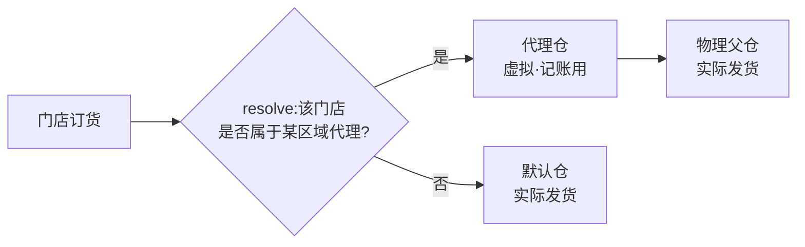

# 供应链协同:供应商 / 第三方仓 / 区域代理

> 这一页讲总部之外的供应链三方怎么接进系统:上游供应商、中间的第三方代仓(仓配一体服务商)、下游的区域代理。适合要做多方协同、又不想把系统改成一团乱麻的 IT 负责人和工程师读。

**读完你会知道:**

- 多品牌经营时,供应商档案怎么按品牌隔离,报价为什么要区分含票/不含票
- 对接第三方仓配服务商的传统 B2B 套路(MD5 签名 + 异步回调),以及联调环境的一条铁律
- 区域代理为什么不建物理仓,「虚拟仓 + 一个 resolve 函数」如何把取仓逻辑收敛到一处
- 上架同步、按代理导出对账、分账记账的联动思路
- 采购单到入库的闭环怎么和验收、库存模块共用一套通道

## 一、供应商档案:隔离、报价、留痕

供应商模块看起来是最"没技术含量"的一块,但有三个设计点,不早做后面会返工。

### 1. 多品牌下按品牌隔离

当一家公司同时运营多个品牌时,同一个供应商可能只跟其中一个品牌合作。供应商账号登录系统后,**只能看到自己合作品牌的数据**——商品、订单、对账单全部按登录品牌过滤。

实现上不复杂:供应商与品牌建立绑定关系,所有供应商侧查询强制带上品牌过滤条件。关键是**从第一天就把品牌维度放进数据模型**,而不是等第二个品牌上线了再去补——补的时候你会发现历史数据没有品牌归属,只能人工回填。

### 2. 报价区分含票 / 不含票(开票门槛式计价)

现实里的供应商报价往往不是一个数,而是两个:开票价和不开票价。我们把这件事显式建模:

- 每个供应商报价可以维护含票价与不含票价两档;
- 采购下单时按实际约定选用哪一档,系统据此计算应付;
- 是否达到开票门槛(比如约定年采购额超过某个数才开票——示例场景,具体门槛属商务约定)影响实际结算口径。

不这样做的后果:报价表上只有一个"单价",财务对账时发现供应商实际开票金额和系统应付对不上,每个月都要人肉解释差异。**把现实里存在的两个价,老老实实建成两个字段**,比事后打补丁便宜得多。

### 3. 发票与对账留痕

供应商发票的收取、核对全程在系统内留痕:哪张采购单对应哪张发票、票面金额与应付差异多少,都可追溯。这不是为了好看——当采购量上来之后,"这批货到底开没开票"这种问题,靠聊天记录和 Excel 是查不清的。

## 二、第三方代仓对接:传统 B2B 的标准套路

当自有仓储能力不够时,会引入仓配一体服务商(第三方代仓):货放在对方仓库,由对方履约配送,我们的系统需要和对方系统对接。

这类传统 B2B 对接有一套非常典型的模式,和互联网平台的 OAuth + RESTful 风格完全不同:

- **鉴权:MD5 签名。** 双方约定一个密钥,每个请求把参数按规则拼接后加密钥做 MD5,对方验签。没有 token 刷新,没有 OAuth,就是最朴素的签名。
- **交互:异步回调。** 你调对方接口下达指令(比如创建入仓单),对方先同步返回"已受理",实际处理结果通过回调推给你——入仓完成、出仓完成、库存变动、配送轨迹更新,每一类都是一组"我方推送 + 对方回调"的接口对。
- **接口分组:** 入仓单一组、出仓单一组、库存同步一组、配送轨迹一组。四组接口各自独立,回调各有各的报文格式。

### 对接的正确姿势

1. **对接文档先行。** 在写第一行代码之前,先把双方接口文档逐条过一遍,把字段映射、状态机、回调时序写成自己的对接文档。B2B 对接的文档往往有歧义和过时之处,先对文档能省掉大量联调时间。
2. **错误码表逐条对。** 对方的错误码表拿到手后逐条确认含义和我方的处理策略(重试?报警?人工介入?),不要等生产上冒出一个没见过的错误码再抓瞎。
3. **回调必须幂等。** 异步回调可能重复推送,处理逻辑要能安全地收到同一条回调多次。

### ★ 联调环境铁律

**联调必须在有公网回调地址的环境做。** 对方系统的回调是推到你的公网地址上的,本地开发环境没有公网入口,**永远收不到回调**。我们踩过这个坑:在本地把推送方向调通了,回调侧怎么等都没反应,白耗了时间——问题根本不在代码,在网络拓扑。

正确做法:推送方向可以在本地开发和自测,但一旦进入需要回调的联调阶段,直接部署到有公网地址的测试/预发环境去调。别在本地跟回调较劲。

## 三、区域代理与虚拟仓:一个 resolve 函数收敛所有取仓逻辑

区域代理是介于总部和门店之间的一层:某个区域的门店订货,货权和结算归代理,但代理**不建物理仓**——建仓成本高、管理重,对代理和总部都是负担。

我们的解法是**虚拟仓**:

- 每个区域代理在系统里有一个"代理仓",但它只是一个记账实体,不对应任何物理库位;
- 代理仓挂在总部的某个物理仓之下,作为它的"虚拟子仓";
- 实物始终存放在物理父仓,拣货发货也由物理仓执行;代理仓上记录的是**归属于该代理的库存数量和交易**。

### 取仓逻辑只有一个入口

门店订货时,系统需要决定"这一单从哪个仓出"。这个判断我们收敛成**一个 resolve 函数**,规则是:

- 门店所在区域**有区域代理** → 走代理仓,实际发货取代理仓的**物理父仓**;
- **没有**区域代理 → 走该门店的默认仓。

关键纪律:**全系统所有需要"取仓"的地方,只调这一个 resolve 函数**。订货下单、库存扣减、对账报表……谁都不许自己写一遍 if-else。这样做的好处在改规则时体现得淋漓尽致:后来取仓规则调整,我们只改了 resolve 一处,全链路行为同步生效;如果当初逻辑散落十几处,这种调整就是一次全库 grep + 逐处修改 + 逐处回归的灾难。

## 四、上架同步与代理维度对账

虚拟仓要能用,还需要两个配套机制:

- **上架同步:** 总仓商品上架时,自动同步到各代理仓——代理不需要(也不应该)手工维护"我这能卖什么",总部上什么,代理仓就有什么。这一步做成自动的,消灭了一类"总部上了新品、代理仓查不到"的运维工单。
- **按代理维度导出库存对账:** 库存报表支持按代理拆分导出,每个代理能拿到一份只含自己归属库存的对账单。虚拟仓的库存数字是记账结果,定期和代理对账是维持信任的基础动作。

## 五、分账思路(概念级)

代理仓上发生的每笔交易,按归属方拆分记账:哪部分收入/成本归代理、哪部分归总部,在交易发生时就打上归属标记,并与自建内账引擎联动——分账数据作为事件源之一,自动生成对应的记账凭证,而不是月底靠 Excel 手工分。

具体的分成比例、结算周期、条款设计属于商务范畴,每家的谈法都不一样,这里不展开。工程上要记住的只有一条:**归属标记在交易发生时刻打,不要事后推算**——事后推算意味着规则一变历史就对不上。

## 六、采购闭环:采购单 → 验收 → 入库

供应链的最后一环是把货真正收进来,这条链路我们刻意做得"无新意":

1. **采购单**:向供应商下达采购,记录供应商、商品、数量、约定价(含票/不含票口径见上文);
2. **来料验收**:货到后走验收流程——这一步**和生产模块共用同一套验收能力**(生产的来料验收见 [生产与成本](production-costing.md)),不为采购单独造一套;
3. **入库**:验收通过后入库,库存变动**走库存模块的唯一出口**,绝不直接改库存数字(唯一出口原则见 [库存:四量模型与自动对账](inventory.md))。

"无新意"是刻意的:验收和库存都是已有模块的能力,供应链模块只负责编排,不重复造轮子。任何绕过唯一出口直改库存的捷径,最终都会以对不上账的形式还回来。

## 踩坑与红线

**本地联调等不到回调**
- 症状:第三方仓推送方向一切正常,回调接口在本地怎么都收不到数据,联调停滞。
- 根因:对方回调推的是公网地址,本地开发机没有公网入口,报文根本到不了。
- 铁律:涉及异步回调的联调,必须在有公网回调地址的环境做;本地只调推送方向。

**取仓逻辑散落多处**
- 症状:改了一处取仓规则,订货正常了,库存扣减和报表却还走老逻辑,数字对不上。
- 根因:取仓判断被复制到了多个模块,各自演化,改动无法同步。
- 铁律:取仓逻辑收敛成一个 resolve 函数,全系统只调它;新代码想自己写 if-else 判断仓库,一律打回。

**品牌隔离事后补**
- 症状:第二个品牌上线,供应商登录后看到了别的品牌的采购数据。
- 根因:供应商侧查询没有强制品牌过滤,数据模型里品牌维度是后补的,历史数据无归属。
- 铁律:多品牌是既定方向的话,供应商档案第一天就带品牌维度,所有供应商侧查询强制按登录品牌过滤。

**错误码见招拆招**
- 症状:生产环境冒出一个没处理过的第三方错误码,单据卡在中间状态没人知道。
- 根因:对接时只调通了正常流程,错误码表没有逐条确认处理策略。
- 铁律:对接文档先行,错误码表逐条对,每个码都要有明确策略(重试/报警/人工),不留"到时候再说"。

## 延伸阅读

- [库存:四量模型与自动对账](inventory.md) — 入库走的唯一出口在这里定义
- [生产与成本:研发档案 / 工单 / 批次追溯(结构篇)](production-costing.md) — 与采购共用的来料验收
- [自建内账引擎:事件源自动凭证(模式篇)](finance-ledger.md) — 分账数据如何变成凭证
- [订货商城:价格快照与订单一致性](ordering-mall.md) — resolve 函数的主要调用方
- 复刻 prompt:本模块无独立 prompt,相关内容拆在 [M3 订货商城](../05-replication/prompts/02-ordering-mall.md)、[M3 库存](../05-replication/prompts/03-inventory.md)、[M5 生产 + 成本](../05-replication/prompts/08-production-costing.md) 中

---

[← 返回本层目录](README.md) · [返回总目录](../README.md)
