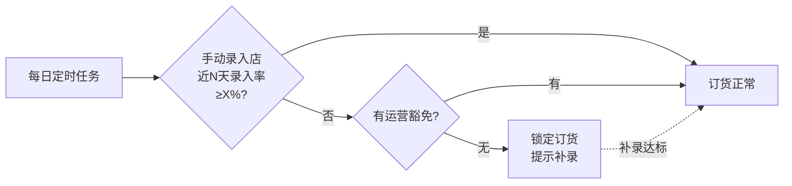

# 营业额:录入、抓取与达标锁

> 这一页讲营业额数据怎么进系统、怎么保证它是真的、以及怎么用一把「达标锁」逼出录入率。做连锁数据化的老板和 IT 负责人建议精读——营业额是所有看板的地基,地基是虚的,楼盖得再漂亮也是虚的。

**读完你会知道:**

- 营业额数据的两条来源:店长手动录入 + 外卖平台半自动抓取,各自的边界在哪
- 「录入率达标锁」是什么:不好好录营业额,就不能订货
- 为什么催了无数次也没解决的录入率,一把锁就解决了
- 营业额口径怎么定(实收/费前费后/堂食外卖),以及口径文档为什么必须只有一份
- 营业额看板该有哪几块,录入率本身为什么也要上看板

## 双来源:手动录入 + 平台抓取

不是每家店都有 POS,也不是每套 POS 都开放接口。与其等一个「全自动对接」的完美方案,不如先把数据收上来。我们的营业额是两条来源拼出来的:

- **手动录入**:没有 POS 对接的门店,由店长每天在小程序里录入当日营业额。字段拆到堂食/外卖等渠道,录的是实收。
- **平台半自动抓取**:美团/饿了么/京东等外卖平台的营收,靠浏览器插件半自动抓取商家后台数据回传后端,不用店长手抄平台数字。抓取机制的细节见[外卖平台集成](delivery-platforms.md)。

两条来源各管一段:手动录入覆盖堂食和平台抓不到的部分,平台抓取覆盖外卖。系统按渠道分开存,不要混在一个数字里——后面讲口径时你会看到为什么。

这个组合的好处是**上线快、覆盖全**:哪怕一家店什么系统都没有,只要店长有手机,当天就能开始出数。坏处是手动录入天然不可靠——这就引出了本页的主角。

## ★录入率达标锁:不录入,就不能订货

手动录入最大的敌人不是录错,是**不录**。店长忙起来忘了录、懒得录、觉得录了也没人看,数据就断档。断档的营业额数据是没法用的:看板缺口、排行失真、经营分算不准,全链条跟着坏。

我们的解法是一把自动锁:

- 系统滚动统计每家手动录入店近 N 天(示例:14 天)的**录入率**——应录天数里实际录了几天。
- 录入率低于阈值 X%(示例:70%,非真实参数),**自动锁定该店的订货功能**。店长打开订货商城,看到的是「录入率不达标,请补录后再订货」。
- 补录到达标,锁自动解开,不需要人工干预。

(图中 N/X 为占位符,取值属于内部规则参数,不对外)

### 豁免:留一个口子,但只留一个

锁是死的,门店是活的:新店刚开业没有历史数据、门店装修停业、店长住院换人……总有合理的例外。所以锁必须配**豁免机制**,由运营同学为特定门店临时豁免。

关键设计是:**豁免走统一入口**。我们系统里不止这一把锁(整改超期也会锁订货),所有「锁订货」的豁免都收敛到同一个模块处理,而不是每把锁各写一套豁免逻辑。好处:

- 运营只需要学一个操作,不用记「这个锁去 A 页面解、那个锁去 B 页面解」;
- 豁免有统一的记录和审计,谁豁免的、豁免到什么时候,一查就有;
- 以后加第三把、第四把锁,豁免逻辑直接复用。

## 产品思考:为什么一个锁比十次催报表管用

这是本页最值钱的一段,讲的不是技术,是机制设计。

上锁之前,我们试过所有「软」办法:群里催、报表通报、开会点名。效果都是脉冲式的——催一次好三天,然后回落。根因很简单:**录营业额对店长没有利益挂钩**。录了,数据是总部看的;不录,自己一点损失没有。指望人长期做一件对自己没好处的事,是机制设计的失败,不是执行力的失败。

「不录入就不能订货」把这件事扭过来了:订货是门店的生命线,不订货第二天就断货。录入从「帮总部干活」变成「自己经营的前置条件」。锁上线之后,录入率的提升是台阶式的,而且**不回落**——因为约束是系统自动执行的,不依赖任何人持续盯着。

一句经验:**能用系统约束解决的,不要用管理动作解决。** 催报表消耗的是管理者的精力和店长的耐心,锁消耗的是零。

### 锁上线要配公告与缓冲期

但注意,锁不能悄悄上。直接上线的后果是:某天早上一批店长突然发现订不了货,客服炸锅,门店觉得总部在搞突然袭击。我们的做法:

1. **提前公告**:提前若干天在门店群/小程序公告规则——什么条件会锁、怎么解锁、找谁豁免;
2. **缓冲期**:上线后先只提示不真锁(或先对录入率极低的店生效),给门店留出补录和养成习惯的时间;
3. **上线后头几天盯客诉**:把误锁(比如新店没历史数据被误伤)当 P0 处理,快速豁免并修规则。

规则本身是对的,不代表可以粗暴执行。锁的目的是养成习惯,不是制造对立。

## 口径:实收为准,一份文档,全站引用

营业额这个词,十个人有十种理解:含不含平台佣金?退款算不算?堂食外卖合并还是分开?口径不统一,看板做得越多,吵架越多。我们的原则:

- **以实收为准**:营业额指实际到手的钱,不是挂牌流水。平台费前(顾客支付口径)/费后(商家实收口径)是两个数,分开存、分开展示,不允许混算。
- **堂食/外卖分开**:来源渠道不同、费率结构不同,合并数只在汇总层做,明细层永远分开。
- **口径写进文档**:上面这些定义,连同每个字段的准确含义,写成一份口径文档放在仓库里。
- **所有看板引用同一份口径**:任何新看板、新报表,营业额字段一律引用这份文档的定义,不允许在代码里另起炉灶自己定义一个「营业额」。

最后一条是最容易破的。两个看板对同一家店显示不同的营业额,业务方对系统的信任会瞬间归零,而且修复信任比修复 bug 难得多。口径问题的完整讨论见[数据口径:最贵的一类坑](../03-pitfalls/data-caliber.md)。

## 看板:数据收上来,要让人看得见

营业额看板我们做了这么几块,都不复杂,但组合起来够用:

- **日/月维度**:单店和全体的日营业额曲线、月度汇总,支持按渠道(堂食/外卖)拆分;
- **门店排行**:按营业额排名,给运营开会用——排行榜是最便宜的激励工具;
- **环比**:本期 vs 上期,识别趋势拐点,比绝对值更能说明问题;
- **录入率看板**:录入率本身就是一个指标,单独上看板,低于红线 X%(示例:70%)的门店标红告警。

最后一条值得强调:**数据质量指标要和业务指标放在同一块屏幕上**。运营看营业额排行的同时就能看到哪些店的数据不可信,而不是等月底对账才发现某家店缺了半个月数据。录入率红线告警 + 达标锁,一个负责「让人看见」,一个负责「逼人行动」,两个配合才是闭环。

## 踩坑与红线

**症状**:催报表、群通报、开会点名,录入率脉冲式回升又回落。
**根因**:录入对店长没有利益挂钩,软约束不改变收益结构。
**铁律**:数据质量问题优先找利益挂钩的系统约束,「不录入就不能订货」这类设计一招顶十次催。

**症状**:锁上线当天客服被打爆,门店抱怨总部突然袭击。
**根因**:规则没有提前公告,也没给缓冲期,新店等边界情况被误伤。
**铁律**:任何自动惩罚类功能上线,必须配公告 + 缓冲期 + 误伤快速豁免通道。

**症状**:两个看板对同一家店的营业额显示不一致,业务方开始不信任系统。
**根因**:各看板在代码里各自定义「营业额」,费前/费后、含不含退款没对齐。
**铁律**:口径文档全站只有一份,所有看板引用它;新报表复用既有取数逻辑,禁止另起炉灶。

**症状**:锁越加越多(录入锁、整改锁……),豁免逻辑散落各处,运营解锁要翻好几个页面。
**根因**:每把锁独立开发时各写了一套豁免。
**铁律**:所有「锁订货」类约束的豁免收敛到统一入口,统一记录、统一审计。

## 延伸阅读

- [外卖平台集成:插件半自动抓取模式](delivery-platforms.md) —— 外卖营收数据怎么半自动抓回来
- [巡检与经营分:把门店管理变成一个分数](inspection.md) —— 经营分也消费营业额数据
- [数据口径:最贵的一类坑](../03-pitfalls/data-caliber.md) —— 口径不统一的代价
- 复刻 prompt:[M4 营业额 + 看板](../05-replication/prompts/05-turnover-dashboards.md)

---

[← 返回本层目录](README.md) · [返回总目录](../README.md)
