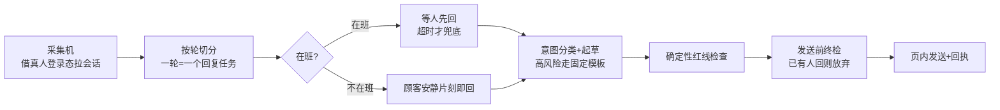
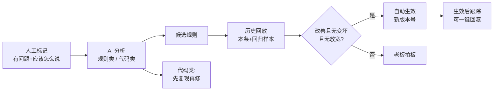

# 线上客服 AI:顾客消息代回、紧急电话与「待优化」闭环

> 这页讲我们怎么让 AI 接住外卖平台上的顾客消息:三个平台的消息由 AI 起草并代回,该交人的交人,真紧急的打电话问门店老板;再用一个控制台把值班客服、AI、门店三方的活串起来,用一条「人标一句 → AI 改规则 → 回放把关 → 生效可回滚」的闭环让它越用越对。适合外卖占比高、高峰期和夜里回不过来消息的运营负责人读,工程师读第二节以后。

**读完你会知道:**

- AI 代回为什么不是「接个大模型就发」:按轮切分、等人先回、发送前一刻终检、按内容判重
- 转人工之后为什么还要「补一句安抚」,以及过了时限为什么宁可不发
- 对话式紧急电话的人机边界:先问「要不要我先回」、只认门店本人、涉钱一律转人工
- 值班客服控制台该看哪几个数,兼职客服的账号为什么要和办公系统隔离
- 「待优化」闭环怎么做到规则只追加、守卫关不掉、红线只收紧、随时可回滚

## 为什么让 AI 接一线

外卖平台对商家回复速度有考核(示例:顾客发消息后 5 分钟内要有回复),而顾客消息分布极不均匀:午晚高峰门店忙着出餐顾不上看,深夜和清晨没人值班。我们原来靠一位兼职客服值晚班,回复率恰恰掉在门店最忙的时候。

翻完历史对话,结论很朴素:大部分回复是「收到 / 稍等 / 我帮您联系门店」,真正有价值的是**动作**——查订单状态、转告门店、转告骑手、把该交人的交给人。所以我们没有训练专门的模型,而是**意图分类 + 历史相似问答做示例 + 确定性规则红线**,大模型只负责「起草一句得体的话」。

分工从第一天就定死:**值班时间内人优先、AI 兜底;值班时间外 AI 先回;投诉、食安、退款、情绪激烈的,AI 只说固定安抚并交人。**

## 代回流水线:从一轮消息到一条发出去的回复

- **按「轮」而不是按「条」**。顾客常连发三四条才说完一件事。连续的顾客消息归成一轮,一轮只产生一个回复任务;任何一方回复即切轮。
- **发送借平台自己的页面**。采集机是一台常驻的专用电脑,用真人账号登录各平台商家后台,发送时调用页面里平台自带的发消息能力——不复刻签名、不对抗风控,和[外卖平台集成](delivery-platforms.md)的插件思路一脉相承。
- **终检在发送前一刻**。起草到发出之间可能隔几十秒,门店也许已经回了。发送前再拉一次会话最新几条:已有人回 → 放弃;顾客又追加 → 打回重新起草(有次数上限)。
- **高风险意图不让模型自由发挥**。退款、食安、情绪激烈、只发了图片的,一律固定模板 + 转门店群(带上顾客原图和订单卡片)。模型稿出口再过一道确定性检查:不许替门店承诺(「已退款」「给您补送」)、没有订单状态时不许报进度、不许泄露内部信息。
- **订单说人话**。给门店和老板一律说平台的当天序号(「美团今天 12 号单」),不说一长串订单号——门店看得懂才会去处理。

## 判重与转人工:按内容,不按次数

最早的限流是「同一会话一段时间内最多回 N 条」(示例)。复盘发现两种坏结果同时存在:同一句空话对同一个顾客连发好几遍,真正的新诉求却被频控挡掉。改成**按内容判重**:我们回过、人工还没接手、顾客就同一诉求再追问(原话高度相似、同一意图、投诉后补图……)→ 不再重复空话,发一句交接话术,正式交人工并生成待办。

交人工之后还有隐患:人可能也没空,顾客晾着,平台照样按超时考核。于是加了**补一句安抚**:已交人工的会话,到预定时刻(示例:顾客首条后三分多钟,各平台按自己的发送延迟分别配)仍没人回,AI 补一句中性的「已经在帮您跟进」。两条硬约束:

- **过了时限不迟发**。补发有硬截止(示例:平台考核线前几十秒),过了就丢弃并告警——迟到的安抚没用,还会和人工回复撞车。
- **通道坏了不排队**。发送通道熔断或采集机失联时不排队等恢复,直接告警给人。

门店状态也要看:闭店的门店,交接话术不能说「已反馈门店」,改为引导顾客联系平台客服——说了做不到的话比不说更糟。

## 骑手沟通与撤回追踪

顾客的「放门口别敲门」「送到几楼」该给骑手,不是给门店。各平台骑手通道能力不同,按平台分档:

- **骑手与顾客同会话**的平台:直接在会话里说;骑手已经答了的不再插话,顾客对骑手说的话也不回。
- **平台每单自建三方群**的:骑手入群后在群里转达,未入群先转门店群并挂起、入群后补发;这类通道按平台单独开关,先限额灰度。
- **没有骑手通道**的平台:不假装能转,引导顾客在订单页点「联系骑手」。

一个容易漏的细节:**我们发给骑手的转达消息,不算「回复了顾客」**。早期它被当成我方回复,切轮和终检都以为顾客已经有人理了。

撤回单独记:三个平台的撤回事件(谁撤的、撤的哪条、是不是我们的代回)进一张事件表,撤回的消息不进正常消息流。门店撤回我们的代回是强信号——那句话可能说错了,会进复盘。

## 对话式紧急电话:先问,再动手

有些消息等不起群消息:顾客说吃出异物、扬言投诉、长时间没人回、点名找老板。这时系统给门店老板打电话,分单向播报(念完告警就挂)和对话式(AI 跟老板对话,把老板的决定变成动作)两种,由开关分三档控制——关、影子(只记录不拨号)、正式。本页只讲机制:

1. **触发与限频**:命中触发意图才打;同一会话当天只打一次;时段外不打。食安和投诉威胁类,哪怕客服已先回也照打——**只有门店本人回复了顾客才算处理过**,这类事要门店拿主意。
2. **开场先表明身份并问一句**:「我是总部的外卖服务助手,您门店在外卖平台上有一条紧急顾客消息……需要的话我可以帮您先回复顾客。」
3. **只认门店本人的口头确认**:老板说「回吧」,AI 才把拟好的回复送去发送;确认那一刻只说「我这就发」,**发送成功后**再同步一条到门店群,绝不提前说「已发」。
4. **涉钱一律转人工**:老板说「给他退了吧」,AI 不执行,只把老板原话记成一条涉钱待办,交值班客服到平台上操作。
5. **老板说「我自己处理」**直接标记已接手;说「等会打给我」,调用回拨工具真的排一通回拨。

电话里最怕**假承诺**。示例:门店在电话里说「等三分钟再打」,系统应把它当成一次明确的延后指令、真的排一通回拨,而不是拒绝;如果没有回拨能力,模型却顺口答「好的我三分钟后联系您」,就是假承诺。现在有两层:回拨是真工具;另有一道确定性**许诺守卫**,模型说了「会联系您 / 给您回电」却没调对应工具,这句话直接截掉。开场白、沉默挂断、超时收尾、听不清复述这些固定环节全部规则直出、不进模型,既快又不会说错。

## 逐通复盘:AI 栏和人工栏并存

每一通电话都由离线评审模型逐通复盘:结论(好 / 一般 / 差)+ 问题标签(假承诺、没听懂、该做没做、不该做却做了、口径红线、啰嗦、慢、该转没转……)+ 具体哪一轮哪句 + 建议改法。实时通话用低延迟模型,复盘用更强的离线模型——**实时生成和离线评审分开选型**。

人复核只写「人工结论」一栏,**不覆盖 AI 原标**;生效结论 = 有人工看人工,没有看 AI。网页只开放写人工栏,AI 标注走内部通道,不开网页写口子。测试通话和影子记录默认不列、不进统计,免得演示数据污染接通率。

## 值班客服控制台

兼职客服不在我们的办公 IM 里,控制台给值班客服一套**独立账号**(手机号 + 密码):凭证只在控制台自己的接口路径下生效,拿它调别的接口一律「未登录」;改密、重置、停用都让已签发的凭证立刻全部作废;连续输错锁定一段时间。

| 板块 | 看什么 |
|---|---|
| 总览 | 需回复轮数、回复率、限时内回复率、**首个回复方构成**(值班客服 / 门店 / AI / 没人回);超时清单按等待时长倒序 |
| 当前待回 | 还在等回复的会话,每条显示「还剩多久 AI 接手」 |
| 待办 | 交人工的事;**涉钱的置顶**,标完成必须填实际执行金额,与老板原话金额不一致自动标出 |
| 电话 / 发送失败 / 撤回 | 每通电话的逐轮记录与复盘;没发出去的、被撤回的 |
| 排班与交接班 | 当班 / 顶班 / 无人值班;每天凌晨生成上一班的交接摘要 |

**排班直接决定 AI 的行为**:登记为「无人值班」的班次等同请假,AI 立即代回,该交人的照样进待办。待办推送跟着当班人走:值班客服当班推个人微信(涉钱逐条推,其余定时汇总),顶班客服当班推办公 IM 私信,无人值班就攒到下一个有人的班次第一轮汇总。

口径局限要写在页面上:平台订单数据分不开「取消」与「接单后全额退款」,部分退款大多拿不到金额——**控制台原样标「原因未采集」,不拿推测值填空**。

## 「待优化」闭环:人标一句,规则改一条

值班客服或运营看到一条不好的代回或电话,点「有问题」、选问题类型、写「应该怎么说」。这条标记是**真值**:当场写回原有人工评审字段,下次起草就被当作正例 / 反例喂给模型。然后:

1. **分析**:离线评审模型判断这是话术规则问题、需要改代码、两者都有,还是不成立;
2. **回放**:规则类生成候选版本,拿本条 + 以往人工标过「没问题」的同类样本(示例:最近 20 条)回放。对照组是**现行规则今天重跑**,不是当时的线上输出——否则这几天修掉的代码缺陷会被记成规则的功劳;
3. **生效判定**:本条改善、回归没有变坏、规则没有放宽,三条同时满足才自动生效,否则转老板拍板;
4. **跟踪与回滚**:生效后盯一段时间(示例:14 天)的同类样本,再犯标「仍有问题」;任一版本可一键回滚,回滚时同步标注受影响工单「已回滚、停止跟踪」。

**规则覆盖层的三条铁律**:**只追加**——覆盖层是附在提示词后的一段文字,条数有上限,写明「与上面的规则冲突时以上面为准」;**守卫关不掉**——红线词、假承诺、无据报进度、内部泄露这些确定性检查都在模型输出**之后**执行,覆盖层写什么都绕不过;**红线只收紧**——新规则落在涉钱、隐私、替门店承诺、品牌口径领域且带「可以 / 允许 / 不用」类许可语气,或出现「忽略 / 例外」类绕开措辞,一律不能自动生效。

**代码类**走另一条路:先做「复现检查」,用现行代码把这条样本重跑一遍,已不复现就记「当前代码已不复现」、不建单;仍复现才给改码机器人建一张自动修复单。改完必须带测试,测试在隔离、断网的环境里全部通过,且改动低风险、不涉及数据库迁移、只动后端,才免确认上线,上线后私信负责人(改了什么、何时部署、怎么回滚);任一条不满足就停在人工确认,同一条标记只自动修一次。这条链路已接通,首个真实工单仍在观察。

## 人机边界

| 事项 | AI 做 | 人做 |
|---|---|---|
| 普通顾客消息 | 值班外先回;值班内超时兜底 | 值班内优先回 |
| 投诉 / 食安 / 退款 / 情绪激烈 | 固定安抚 + 转门店群 | 门店定方案 |
| 免单、补偿、退款金额 | 绝不承诺,只记待办 | 门店决定,值班客服执行 |
| 紧急电话里老板的决定 | 拟稿;本人口头确认后发出并同步门店群 | 口头确认;涉钱由值班客服在平台操作 |
| 差评回复与申诉 | 起草并提交(补图证据环节默认关);失败进人工待办 | 门店可按店关闭自动回复 / 申诉、改为自己做 |
| 电话与代回复盘 | 逐通标注 | 复核只写人工栏,不覆盖 AI |
| 规则优化 | 分析、出候选、回放、跟踪 | 标记真值;放宽类由老板拍板;可回滚 |

## 踩坑与红线

**坑一:门店明明回了,系统以为没人回**
- 症状:店员已在手机上回了顾客,几分钟后我们又补发一句「稍等」。
- 根因:商家 App 上手打的回复带着「平台代发」标记,被角色判定当成了平台自动回复。
- 铁律:**谁说的这句话,要拿真实样本逐来源核对**;拿不准的来源宁可当人工,不当自动。

**坑二:按条数频控,空话照发、真诉求被挡**
- 症状:同一句空话连发,顾客的新问题反而没回。
- 根因:频控只数条数,不看内容。
- 铁律:**按内容判重**;同诉求二次追问就交人,不重复空话。

**坑三:模型说出系统做不到的承诺**
- 症状:电话里 AI 答应「三分钟后联系您」,实际没人会打。
- 根因:模型会顺着对方说,而动作能力在工具里,不在话里。
- 铁律:**每一种承诺都要对应一个真工具;说了却没调工具,由确定性守卫截掉**。

**坑四:后台标签页里的长连接隔几分钟就断**
- 症状:某平台的消息采集每隔几分钟掉线一次。
- 根因:浏览器对后台标签页的定时器强节流,心跳发不出去,平台接入点空闲即断。
- 铁律:采集用**独立可见窗口**,或把计时挪到不受节流的执行环境;长任务状态落盘,不放页面里。

**坑五:回放比错了对象,把修缺陷的功劳记给规则**
- 症状:一条候选规则回放「明显改善」,生效后同类问题照旧。
- 根因:拿新规则和当时线上输出比,中间几天代码修复的效果被算进了规则。
- 铁律:**对照组必须是「现行规则今天重跑」**;逐字相同直接记持平,不交评审模型。

**红线汇总**

- 涉钱只记待办不执行,金额永远由门店定;
- 紧急电话只认门店本人口头确认,确认后才发、发成功才说;
- 覆盖层只追加、守卫关不掉、红线只收紧,任何版本可回滚;
- 人工复核不覆盖 AI 原标,AI 标注不开网页写口子;
- 测试与影子数据默认不进统计。

## 延伸阅读

- [外卖平台集成:插件半自动抓取模式](delivery-platforms.md) — 采集机、门店映射与商品上下架
- [业务型 AI:视觉巡检与聊天即操作](../04-ai-engineering/business-ai.md) — 「AI 只标记」「采纳只出草案」同族红线
- [机器人体系:改码机器人 + 岗位 AI 助手](../04-ai-engineering/bots-architecture.md) — 自动修复单与评审任务的执行端
- [巡检与经营分:把门店管理变成一个分数](inspection.md) — 外卖违规标注怎么倒扣经营分
- 复刻 prompt:[M8 线上客服 AI](../05-replication/prompts/16-wm-ai-service.md)

---

[← 返回本层目录](README.md) · [返回总目录](../README.md)
