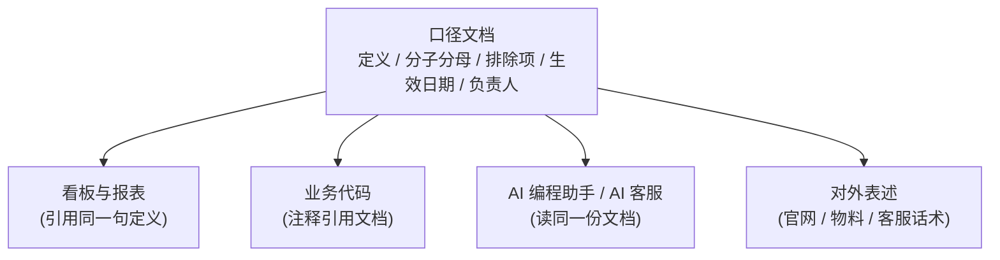

# 数据口径:最贵的一类坑

> 这一页讲的不是某个 bug,而是一类系统性的坑:同一个指标,不同人算出不同数。老板、IT 负责人、写代码的同学、以及给你写代码的 AI,都该读。

**读完你会知道:**

- 为什么技术坑浪费的是天,口径坑浪费的是月
- 我们真实踩过的十九个口径坑,每个的症状、根因和最终定下的铁律
- 「口径文档」长什么样:一个指标一段话,定义、分子分母、排除项、生效日期、负责人
- 为什么 AI 时代口径文档更重要——人和 AI 必须读同一份

## 为什么口径坑最贵

先说结论:**技术坑浪费天,口径坑浪费月。**

技术坑的特点是「炸得响」:接口 500、任务没跑、页面白屏,当天就有人找上门,当天或几天内修完。它疼,但疼得诚实。

口径坑完全相反。它不报错、不崩溃,系统一切正常地跑着——只是两张报表上的「营收」差了几个点,两个部门各拿一份数在会上争,谁也说服不了谁。等追到根上,发现一边算的是流水、一边算的是实收,而这个分歧已经存在了三个月:三个月的报表要重算,基于错数做的决策要重新评估,部门之间的信任还得慢慢修。

回头盘我们这些年的返工和扯皮,**几乎全部来自口径不一致**,而不是代码写错。代码写错有测试和报错兜底;口径不一致没有任何系统会替你报警——两边的代码都「对」,只是对的不是同一件事。所以我们把口径坑单独立一页,放在踩坑层的压轴位置。下面十九个案例都是真实踩过的,按「症状 → 根因 → 铁律」讲。

## 踩坑与红线:十九个真实案例

### 1. 在职口径相反:两张表,两个方向

- **症状**:凡是涉及「在职员工」的报表都容易算错,而且错法飘忽——有的报表多几个人,有的少几个人,复查代码又「看不出问题」。
- **根因**:系统里有两张人员相关的表,各自都有表示「在职」的状态字段,但**布尔方向是反的**——一张表里状态等于某个值表示在职,另一张表里同样语义的字段却是相反方向。两张表在不同时期由不同需求长出来,当时都「合理」,合在一起就是地雷。每写一个新报表,都得先想清楚这次 join 的是哪张表、方向是哪边;想错一次,就错一个报表。
- **铁律**:状态字段的语义**全库统一**(至少新表必须与既有约定同向),并且把每张表的状态语义写进口径文档。我们最终没敢改历史表结构(牵连太广),但在项目的 AI 指南(CLAUDE.md)和口径文档里用加粗标注了这对反向字段——现在人和 AI 写新代码前都会先撞见这条警告。

### 2. 营收 = 什么:流水还是实收?

- **症状**:外卖看板、财务报表、给管理层的月报,三处的「营收」对不上。
- **根因**:「营收」这个词在不同人嘴里不是一个东西——是顾客支付的流水,还是平台扣完佣金和活动费后的实收?平台费前还是费后?没人明确定义过,每个开发同学按自己的理解写。
- **铁律**:我们最终定了**实收口径**(平台费后、实际到账的那个数),写进口径文档,并且要求所有看板的营收字段**引用口径文档里的同一句话**——不是各自转述,是引用。转述会走样,引用不会。

### 3. 闭店率:分子分母吵了很久

- **症状**:同一批门店,不同人算出的闭店率能差出一倍。这个数对招商和管理层判断都很关键,吵了很久。
- **根因**:分子分母的每一个细节都有歧义:新签还没开业的店算不算分母?装修中、转让中这类特殊状态的店算闭店还是算存活?今年闭的店除以历史全部门店,和除以今年门店,是完全不同的两个数。
- **铁律**:最终采用**队列法**——按签约月份把门店分组(每个月签约的店是一个「队列」),跟踪每个队列后续的存活情况;特殊状态的店(转让中等)从分子分母中**剔除**,单独统计。并且:**口径变更必须留生效日期**——哪天起按新口径算、之前的数是旧口径,写清楚,否则历史对比全是糊涂账。

### 4. 价格用哪个:历史订单金额会变

- **症状**:上月的订货报表这周再拉一遍,金额变了。没人改过订单,数据却「自己动了」。
- **根因**:早期订单金额是**实时 join 商品价格表**算出来的。总部一改价,所有历史订单的「金额」跟着变——历史被现在污染了。
- **铁律**:**交易数据一律快照**。下单那一刻,把价格、商品名等所有会变的字段复制一份冻结在订单里,统计永远读快照字段,绝不读实时价。这是我们全系统最重要的口径铁律之一,详细做法见[订货商城页](../02-modules/ordering-mall.md)。

### 5. 平台门店 ID:废弃字段还有代码在读

- **症状**:部分门店的外卖数据对不上号,时好时坏。
- **根因**:门店主表上有个存外卖平台门店 ID 的字段,后来因为一个门店可能对应多个平台门店,改成了**单独的映射表**。但旧字段没删,也没清理干净——还有零散代码在读它,而它已经不再维护,数据是陈旧的。两个「真相源」,一个是活的,一个是死的,读到死的那个就出错。
- **铁律**:平台 ID 这类映射关系**单独建表,作为唯一真相源**;字段一旦废弃,**全库 grep 把读它的代码清干净**,并在口径文档和 AI 指南里标注「此字段已废弃,真相源是 XX 表」——否则 AI 补代码时看见字段名合适,照样会读它。

### 6. 库存哪个准:多处直写导致漂移

- **症状**:系统库存和实物盘点对不上,而且差异没有规律,查不出哪一笔错了。
- **根因**:库存数量被十几处业务代码**直接加减**——订货扣一次、退货加一次、盘点改一次……任何一处漏写、重复写或者并发写,数字就漂了,而且没有留痕,无法追溯。
- **铁律**:库存变更收敛到**唯一出口函数**,所有业务只准调它,不准直写字段;再配**自动对账**兜底,定期用流水重算库存,和字段值比对,差异报警。详见[库存页](../02-modules/inventory.md)。

### 7. 已读口径:平台没有已读 API

- **症状**:我们做了工作日报功能,管理层想知道「谁读了」。结果发现所用的 IM 平台**根本没有已读状态 API**,这个数拿不到。
- **根因**:不是技术没做好,是把「已读」当成了天然存在的数据——它不存在,得自己定义。
- **铁律**:自建已读记录表,并把口径**明确写死:「点开即已读」**——用户点开日报详情页就记一条,不承诺「读完」也不承诺「读懂」。口径写在文档里,谁来问「已读是什么意思」,答案都是同一句话。拿不到的数据,与其含糊,不如定义一个拿得到的、写明白它是什么。

### 8. 双口径灰度:新埋点不能一刀切

- **症状**:官网上线了新的访问统计埋点,初期数据量明显偏低——不是流量真的低,是埋点覆盖还没铺满、部分环境没触发。如果直接切新口径,趋势图会出现一个假的「断崖」。
- **根因**:新统计口径上线的头几天,数据天然不完整;旧口径虽然粗,但连续。
- **铁律**:新旧口径**并行跑一段**,期间对外仍展示旧口径;设一个客观的切换条件(我们用的是「新口径单日数据量达到某个阈值」,示例:单日 ≥ 50 条即视为覆盖正常——示例数字,非真实数据),达标后才切换;**切换日期写进文档**,图表上这一天前后的数据分属两个口径,看图的人要知道。

### 9. 对外口径统一:AI 会一本正经说错话

- **症状**:我们给客户群配了 AI 客服机器人。有一段时间,机器人对品牌的某些表述和官网、和运营同学对外的说法**不一致**——每个版本单看都「像那么回事」,合在一起就是自相矛盾。
- **根因**:品牌对外的关键表述(定位、成立时间、业务范围这类)散落在各处:官网文案一份、机器人 system prompt 里一份、运营同学脑子里一份。AI 的特点是**不管拿到什么口径都说得斩钉截铁**,错的口径它也照样自信输出。
- **铁律**:对外口径收敛成**一份口径文档**,官网、宣传物料、AI 客服的 system prompt 全部引用它;口径更新时,同步更新所有引用点(尤其别忘了 AI 的 prompt——它不会自己知道口径变了)。

### 10. 折算陷阱:分子和分母不在同一个时间窗

- **症状**:某项费率指标畸高,据此发出的诊断结论把门店冤枉了一遍。
- **根因**:分子是整月的费用,分母却只有半个月的收入——因为该数据源是从月中才开始有数据的。两个数各自都对,凑在一起就是错的。
- **铁律**:**任何比率,先确认分子和分母覆盖的是同一段时间、同一批对象**。数据源有起始日的,按「实际有数据的天数」双向折算,只折一边比不折还糟。这类结论要发给业务方之前,先随机抽两三个样本人工验算。

### 11. 基准陷阱:零值样本把中位数压到地板

- **症状**:凡是发生了某项支出的对象,都被判定为「高于中位数」。
- **根因**:中位数是在全部样本上算的,而其中半数样本该项支出为零。
- **铁律**:**做基准比较前先问「这个基准的样本该不该包含零值」**。费率、单价这类指标的基准,通常只应取真正发生了该项业务的样本。顺带一条同族纪律:**汇总默认给中位数**,均值单独标注——少数极端值对均值的操纵力,远超大多数人的直觉。

### 12. 跨来源同名字段,语义可能完全错位

- **症状**:三个来源都有一个叫「申诉状态」的字段,照抄一份映射逻辑,结果把「申诉失败」当成了「申诉成功」——而这个结果要用于门店考核。
- **根因**:字段名相同、含义不同。枚举值的数字编码在不同来源之间没有任何一致性保证。
- **铁律**:**每个来源的枚举值都要用真实样本逐一验证语义**,验证依据连同映射表一起写进文档。这类错误永远不会报错,只会安静地给出一个方向相反的结论。

### 13. 实称不能当出成率分母

- **症状**:产线装了电子秤、报工能自动读秤,有人提议「出成率以后就用秤上的实称算,比手填准」。
- **根因**:秤没装全——只有部分工位有秤,实称汇总只覆盖了部分投料和产出。拿它做分母,出成率会随「今天哪道工序用了秤」上下跳,看起来像工艺波动。
- **铁律**:实称汇总只作对账维度(录入与实称对不上就提示),**绝不当出成率的分母**;覆盖到全量之前,任何比率都不许混用两个来源。见[质检与计量](../02-modules/quality-control.md)。

### 14. 机组「关没关」:点表里根本没有这个状态

- **症状**:要回答「这台机组关了没」时,系统给出的「已关机」经不起追问——同一个「待机」读数,既可能是关了,也可能只是到温停机。
- **根因**:某品牌总线直连机组的通讯点表里没有「已关机」状态——开关机是一个只写的脉冲命令,没有回读位;「待机」既可能是关了,也可能是到温停了,协议层面分不开。
- **铁律**:读不出来的状态不许猜。输出改成「此刻没在转」并附「确定性:否」,对外只说「没在运行(已关机或到温停机不可分)」,绝不说「总开关已关」。

### 15. 运行状态位恒为 0:不是读法错,是它从不置位

- **症状**:几台机组两周、十几万条读数的「运行状态」全是 0,同期库温却在正常波动。后果是系统恒判「已关机」,自动关机从没真正下发,频繁启停告警也从没报过。
- **根因**:先证伪「读法错」(同一次读的温度字段在变,帧格式、偏移、字节序都对),再查到机型参数里「启停控制」出厂默认是某个联动模式——这个模式下该状态位**从不置位**。
- **铁律**:字段恒定不变时,先怀疑字段在本现场的语义,再怀疑代码;运行态改由状态位域、输出功率、转速共同判定,文档写明「此字段不可靠」。修好前先想副作用:自动关机从此会真的对这几台下发。见[机组联网与收工自动关机](../02-modules/equipment-automation.md)。

### 16. 补贴重算对没有台账的店会二次给钱

- **症状**:补发上月补贴的试跑里发现,两家当月没有补贴台账的店,重算后会冒出「未发放」记录——真跑的话,打款通道会把它们再发一遍。
- **根因**:按月重算补贴的函数遇到当月**没有补贴台账**的店,会新建一行「未发放」记录;而打款通道正是按「未发放」捞单。
- **铁律**:重算前置预检,当月无台账或已发放的店直接拦下、人工判断;单独补发先记资金流水、再建「已发放」行并带上流水号作防重锚。**「重算」不是只读动作**。

### 17. 订货单只能作废,不许删

- **症状**:有人要求「把这几张测试订单删掉」。
- **根因**:订货单挂着明细、日志、收款、积分兑换、凭证;物理删除会丢审计留痕,而且删不干净——凭证还在,单据没了。
- **铁律**:订货单一律只能**作废**,作废链路自带回退库存、退券、回补预存、红冲凭证;删除接口保留但对任何订单都拒绝,机器人和修数脚本同样适用。见[订货商城](../02-modules/ordering-mall.md)。

### 18. 门店总数:按品牌过滤、排除测试店、筹建也算

- **症状**:有人裸查门店表的「营业中」数量去校对对外稿件,得出「稿件夸大」的结论——其实是他自己算错了。
- **根因**:门店表里混着另一个品牌的门店和测试店;对外口径的「门店总数」除了营业中,还包括筹建中和休息中。少任何一个条件都是错数。
- **铁律**:门店总数只有一个口径函数(品牌 + 排除测试店 + 状态集合),看板与对外内容都调它;校对前先按它取数、允许几家的实时波动,**不许临时手写聚合**。

### 19. 一店多店号:费用按店号分别判

- **症状**:一家门店在同一外卖平台开了第二家店,运营费的计费结果怎么算都有人觉得冤。
- **根因**:旧口径按门店取一个评分、合计实收——但两个店号评分不同,用哪个都会冤枉另一个。
- **铁律**:每个店号用**自己的评分**判是否计费,不达标的店号不计入收费基数,再按门店求和;新口径带生效日,之前的账期重跑仍按旧口径。见[外卖平台集成](../02-modules/delivery-platforms.md)。

## 方法论:一个指标,一段口径文档

十九个坑,十九条铁律,收敛下来其实是一套很朴素的方法论。

**每个重要指标,写一段口径文档**,固定五要素:

| 要素 | 写什么 |
|---|---|
| 定义 | 一句话,这个指标是什么(例:营收 = 平台费后实际到账金额) |
| 分子 / 分母 | 比率类指标必写,精确到表和过滤条件 |
| 排除项 | 哪些数据不算(测试店、特殊状态店、内部单……) |
| 生效日期 | 本口径从哪天起生效;之前是什么口径 |
| 负责人 | 口径有疑问找谁,变更谁拍板 |

然后是三条配套纪律:

- **代码注释引用文档**:实现指标的代码,注释里写「口径见 XX 文档 XX 节」,不要把口径复述一遍——复述会和文档漂移,引用不会。
- **人和 AI 读同一份**:口径文档同时是给新同事的入职材料和给 AI 编程助手的上下文(我们放进 CLAUDE.md 的索引里)。AI 写报表代码之前读过口径文档,和没读过,产出质量是两个世界——没读过的 AI 会自己「合理推断」一个口径,而且推断得非常自信。
- **口径变更走评审**:改口径不是改一行 SQL,是改所有下游报表的含义。变更要有人拍板、留生效日期、通知所有引用方(包括更新 AI 的 prompt 和文档)。

```mermaid
flowchart TD
    D["口径文档<br/>定义 / 分子分母 / 排除项 / 生效日期 / 负责人"]
    D --> A["看板与报表<br/>(引用同一句定义)"]
    D --> B["业务代码<br/>(注释引用文档)"]
    D --> C["AI 编程助手 / AI 客服<br/>(读同一份文档)"]
    D --> E["对外表述<br/>(官网 / 物料 / 客服话术)"]
```

一句话总结:**口径是产品,不是约定俗成。** 没写下来的口径等于没有口径;写下来但有两份的口径,比没有还糟。

## 延伸阅读

- [订货商城:价格快照与订单一致性](../02-modules/ordering-mall.md) — 「交易数据一律快照」的完整实现
- [库存:四量模型与自动对账](../02-modules/inventory.md) — 「唯一出口 + 对账」的完整实现
- [核心域:门店 / 员工 / 角色权限](../02-modules/core-domain.md) — 在职口径这对反向字段所在的模块
- [营业额:录入、抓取与达标锁](../02-modules/turnover.md) — 营收口径的落地场景
- [CLAUDE.md:给 AI 的入职手册](../04-ai-engineering/claude-md-practice.md) — 怎么让 AI 和人读同一份口径

---

[← 返回本层目录](README.md) · [返回总目录](../README.md)
