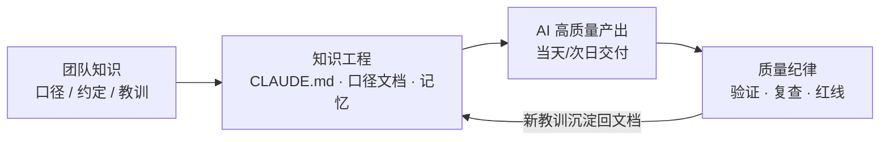

# AI 工程层导读

> 这一层讲我们怎么用 AI 建成并日常运营前面三层的所有系统——以及怎么让 AI 越过「开发工具」的身份,直接上岗干业务(盯摄像头巡检、在群里当客服办事)。它与烤串、门店、供应链都无关——任何行业的小团队都能照抄,所以很可能是全书对同行最值钱的一层。

## 读完你会知道

- 为什么「极小团队 + AI」能维持一套全链路系统的日常迭代,大部分需求当天或次日交付
- AI 工程的本质不是「让 AI 写代码」,而是一套**知识工程**:把团队脑子里的东西变成 AI 可读的文档
- 我们的五块拼图各管什么:机器人体系、业务型 AI、CLAUDE.md、跨会话记忆、质量纪律
- 这五块的阅读顺序,以及哪一块最该先抄

## 这一层在讲什么

前面三层(架构、业务模块、踩坑)讲的是「我们建了什么」。这一层讲「我们是怎么建的」——更准确地说,是怎么让 AI 编程助手成为团队里干活最多的那个「人」,并且持续可靠地干下去。

先把效果说清楚(定性描述,不给虚构人效数字):

- 一个极小的技术团队,维持着覆盖订货、库存、财务、生产、外卖、巡检等全链路系统的日常迭代;
- 业务同学在飞书里@机器人提需求,大部分需求当天或次日交付上线;
- 新模块从设计到可用,通常以「天」为单位,而不是「周」。

能做到这一点,靠的不是某个神奇 prompt,而是长期积累出来的一套工程化方法。这一层把它拆成五篇。

## 五篇导读

### [机器人体系:改码机器人 + 岗位 AI 助手](bots-architecture.md)

AI 怎么接入日常工作流。我们做了两类机器人:**改码机器人**——业务同学在飞书群里@它描述需求或报 bug,它读代码、改代码、走人工审批后部署,是「需求→上线」链路的入口;**岗位 AI 助手**——按岗位(研发、财务、选址等)配备的答疑助手,各自挂载该岗位的知识库,替工程师挡掉大量「这个数怎么算的」式提问。这篇讲这套体系的架构、审批闭环和人设管理。

### [业务型 AI:视觉巡检与聊天即操作](business-ai.md)

前面讲 AI 帮我们造系统,这篇讲 AI 直接上岗干业务:**看**——AI 视觉巡检(进店问候 / 营业时间 / 穿戴合规三条检测线,督导每月来几次,AI 每天在岗);**答**——门店微信群里的答疑客服;**办**——聊天即操作,店长在群里发一句话就能录堂食营业额、兑积分、领券。这篇讲三种形态的落地姿势、鉴权与幂等的工程四件套,以及「机器人只是又一个客户端,写操作必须走既有唯一出口」这条第一铁律。

### [CLAUDE.md:给 AI 的入职手册](claude-md-practice.md)

AI 每次会话都是「新员工第一天上班」,CLAUDE.md 就是它的入职手册:项目结构、编码约定、业务名词对照表(业务同学说「订货」对应代码里哪个模块)、文档索引、部署注意事项。这份文件写得好不好,直接决定 AI 干活是「一次到位」还是「反复返工」。这篇讲我们怎么组织它、怎么维护它、哪些内容值得写进去。

### [记忆方法论:让 AI 越用越懂你的系统](memory-methodology.md)

CLAUDE.md 管「静态知识」,记忆体系管「动态经验」:每次会话踩过的坑、拍板过的口径、模块的历史沿革,都沉淀成一条条带索引的记忆文件,下次会话自动带上。做了半年后,AI 对系统的了解程度接近一个老员工——它知道哪个字段已废弃、哪类改动必须先确认、上次同类需求是怎么做的。这篇讲记忆的组织方式、写入时机和瘦身策略。

### [AI 产出的质量纪律](ai-review-discipline.md)

AI 产能上来之后,最大的风险不是「写不出来」,而是「写出来的东西看着对、实际错」。这篇讲我们兜住质量的纪律:改动必须冒烟验证、涉及数据口径必须对照口径文档、大批量 AI 产出必须安排对抗性复查、机密和红线写进 system prompt 而不是靠口头叮嘱。纪律听起来不性感,但它是前面三篇能放心跑起来的前提。

## 点题:先有知识工程,后有 AI 产能

如果这一层只能记住一句话,记这句:**AI 工程的本质不是「让 AI 写代码」,而是把团队知识变成 AI 可读的文档体系,再用纪律兜住质量。**

写代码本身 AI 早就会了。真正拉开差距的是:它知不知道你的系统里「在职」有两种相反的判断口径?知不知道订货单据必须读价格快照而不是实时价?知不知道上个月同样的需求为什么被否掉?这些知识原本散落在老员工脑子里,AI 一条都拿不到。我们做的事,就是把它们一件件搬进 CLAUDE.md、口径文档和记忆文件——搬得越多,AI 的产出质量越接近老员工。

这是一个飞轮:知识越全 → AI 产出越准 → 迭代越快 → 新教训越多 → 沉淀回文档 → 知识更全。业务型 AI 同样骑在这个飞轮上——它答疑用的知识库、办事守的红线,都来自同一套知识工程。如果你只想先抄一块,从 [CLAUDE.md 实践](claude-md-practice.md)开始——它成本最低、见效最快,其余三块都建在它之上。

## 延伸阅读

- [踩坑实录:怎么读这一层](../03-pitfalls/README.md) — 第三层的坑,大多已经按本层方法沉淀成了 AI 可读的文档
- [数据口径:最贵的一类坑](../03-pitfalls/data-caliber.md) — 口径文档为什么是知识工程里最值钱的部分
- [AI 复刻路线图与里程碑](../05-replication/README.md) — 把本层方法用在「从零复刻」上的完整路线

---

[← 返回总目录](../README.md)
