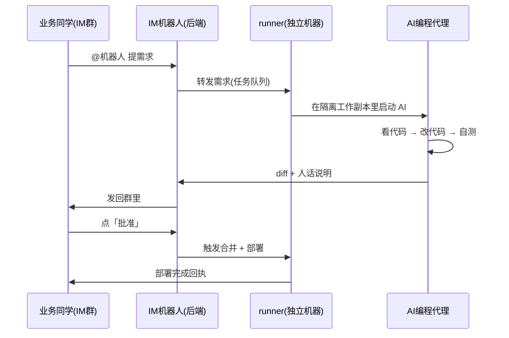

# 机器人体系:改码机器人 + 岗位 AI 助手

> 这一页讲我们把 AI 落到日常工作里的两个抓手:一个会改代码、走审批、自动部署的「改码机器人」,和一组按岗位分工的「AI 助手」。适合想让 AI 真正干活(而不是只聊天)的老板、IT 负责人和工程师读。

**读完你会知道:**

- 两类机器人怎么分工:一类动代码,一类答业务
- 改码机器人从「群里提需求」到「上线」的完整闭环,以及人在哪里握闸门
- 一个机器人怎么同时管四个仓库(后端/前端/小程序/官网)而不改乱
- 岗位助手的四件套:人设 + 素材库 + FAQ 知识库 + 红线
- 这套东西大概花多少钱、值不值

## 全景:IM 里的一支「数字员工」队伍

我们把所有机器人都挂在企业 IM(我们用飞书,换钉钉/企微同理)里,统一交互方式就一个字:**@**。

- **改码机器人**:@它提需求——「订单导出加一列」「这个报表数字不对」——它自己看代码、改代码、发回改动说明,人点一下审批,它自动合并部署。一个「需求 → AI 改码 → 人审批 → 自动部署」的完整闭环。
- **岗位 AI 助手**:财务、研发、选址、运营、供应链、客服答疑,每个岗位一个机器人、一个人设。业务同学在群里@对应的助手问问题、要材料,它按自己岗位的知识和边界回答。

两类机器人的本质区别:改码机器人**有副作用**(会改动生产系统),所以它的整条链路围绕「人握审批闸门」设计;岗位助手**只读不写**(回答问题、生成材料),所以它的设计重心在「答得准、不越界」。

为什么放 IM 里而不是做个独立网页?因为业务同学本来就活在 IM 里。多开一个系统,使用率就砍半;@一下就能用,才会真的被用起来。

## 改码机器人:需求到上线的闭环

### 架构

整条链路四个角色:IM 机器人(收发消息)、runner(跑在一台独立机器上的执行器)、AI 编程代理(我们用 Claude Code)、人(审批)。

分步骤说:

1. **收需求**:业务同学在群里@机器人,用大白话描述要什么。IM 机器人(挂在业务后端上)收到消息,落库成一个任务。
2. **转发给 runner**:runner 是跑在一台独立机器上的常驻进程,轮询任务队列领活。把执行环境和生产后端分开,是为了 AI 改码再怎么折腾也伤不到线上服务。
3. **AI 在隔离副本里改码**:runner 为每单任务开一个隔离的工作副本(git worktree),从主干最新代码切出来。AI 编程代理在里面读代码、改代码、跑自测——**绝不直接碰主干**。
4. **产出 diff + 人话说明**:改完后,机器人把两样东西发回群里:代码 diff(给工程师看)和一段人话说明(给提需求的业务同学看,「改了什么、为什么、影响哪里」)。
5. **人点审批**:群消息上带审批按钮。有权限的人看过说明(必要时看 diff),点批准。
6. **自动合并 + 部署**:批准后 runner 自动把这单的分支合入主干,按目标仓库的部署方式发布上线,并在群里发部署完成回执。

关键设计只有一句话:**AI 干所有体力活,人始终握着审批闸门**。没有人点批准,任何一行代码都进不了主干。这一道闸门让我们敢把改码开放给非工程师提需求——最坏情况就是 AI 改错了、审批人不批,成本是零。

### 多仓能力:一份地图管四个仓库

我们的系统横跨四个代码仓库(后端 API、管理端前端、门店小程序、官网,见[四端拆分](../01-architecture/four-repos.md)),而业务需求经常是跨仓的——「加个字段」往往意味着后端加接口 + 前端加列。

让机器人跨仓干活,靠的不是硬编码,而是**一份多仓地图文档**,内容就是一张表:

| 仓库 | 本地路径 | 主干分支 | 部署方式 |
|---|---|---|---|
| 后端 | (路径) | main | 拉代码 + 服务热重启 |
| 管理端前端 | (路径) | master | 构建产物叠加 + CDN 刷新 |
| 门店小程序 | (路径) | master | 构建后人工提审(平台强制) |
| 官网 | (路径) | main | 蓝绿部署脚本 |

机器人接到需求先判断涉及哪些仓,然后照地图去对应路径开工作副本、往对应主干合并、按对应方式部署。新增一个仓库,只要在地图上加一行,机器人就会干了。

这里有个诚实的边界:小程序的发布必须人工提审(应用平台的强制流程),机器人只能做到「构建好、告诉你去提审」。自动化做不到全程无人,但把绝大部分环节自动化掉,也已经值回票价。

### 会话记忆:需求可以聊着改

真实的需求很少一次说清。第一版做出来,业务同学看了说「列的顺序换一下」「金额要保留两位」——这种来回如果每次都当新任务重开,AI 就得重新理解一遍上下文,又慢又容易走样。

所以我们做了**多轮会话接续**:同一单任务的后续消息,resume 上一次 AI 会话继续聊,而不是重开。AI 记得自己刚才为什么这么改,增量调整就快而准。配套的规矩:

- 每单任务始终在自己的隔离 worktree 里干活,多轮修改都发生在同一个副本上;
- 只有审批通过才合入主干,聊多少轮都不影响线上;
- 任务关单后 worktree 回收,不留垃圾。

### 交付纪律:群里不刷屏

机器人最容易招人烦的不是答错,是**话多**。我们踩过这个坑:早期机器人把中间产物(临时脚本、半成品截图、心路历程)一股脑往群里发,群直接没法看。后来立了纪律:

- **只发最终结果**:一条消息 = 人话说明 + 成品(diff/图/文件),中间产物一律不发;
- **发图和文件走统一上传通道**:所有媒体先传到统一的文件服务再引用,不散落各处,格式也统一;
- 调试期间在隔离环境里自己看,验证通过才对群说话。

这条纪律看着琐碎,实际决定了机器人「像个靠谱同事」还是「像个话痨实习生」。

## 岗位 AI 助手:一岗一人设

改码机器人服务的是「系统要改」;岗位助手服务的是「人有问题」。我们按岗位拆成六个助手:财务、研发、选址、运营、供应链、客服答疑。每个助手由四样东西构成:

1. **人设文档**:定义语气和职责边界。财务助手严谨、逢数字必给口径;研发助手务实、涉及食品安全法规绝不打包票(「符合 GB2760」这种话不替人背书);选址助手按固化的评估 SOP 走流程。边界同样重要——助手知道什么不归自己管,该转人工就转人工。
2. **素材库**:该岗位的 SOP、模板、示例文档,放在一个按岗位分目录的素材区。助手回答时优先引用素材库,而不是凭模型的通用知识发挥。
3. **FAQ 知识库**:按岗位分的问答对,沉淀高频问题的标准答案。业务上有新口径,往 FAQ 里加一条,所有人得到的答案立刻一致——这比培训快得多。
4. **红线写死在 system prompt**:有些规矩不能靠模型「自觉」,必须硬编码在系统提示词里。最典型的一条:**成本价绝不外泄,对外只报订货价**。不管谁问、怎么绕着问,这条都在提示词层面卡死。类似的还有品牌口径、对外话术禁区。

### 答疑机器人:把知识库变成同事

六个助手里对日常效率提升最直接的,是产品答疑机器人。做法很朴素:把整个产品的知识库——每个模块有什么功能、每个数字的计算口径、常见操作问题——整理成一份结构化文档,喂给答疑机器人。

之后业务同学遇到「这个报表的数是怎么算的」「为什么我这单被拦了」,@一下机器人就有答案,不用再去打断产品或工程同学。按我们的体感,这**明显减少了支持性打扰**——而且机器人的答案永远出自同一份文档,比「问不同的人得到不同说法」强得多。

维护成本也低:口径变了改一处文档,机器人立刻同步。这份知识库本身还是新员工培训材料,一份投入三份产出。

## 成本感受

定性地说(不给真实数字):这套体系的开销就两块——大模型 API 调用费,和一台跑 runner 的小型服务器。两项加起来的月成本,**远低于雇一名初级工程师**;而产出面上,它 7×24 待命、同时服务所有岗位、响应以分钟计,远高于一名初级工程师能覆盖的范围。

更重要的是它改变了需求的经济学:以前一个小需求要排期,业务同学干脆不提了;现在@一下十几分钟出 diff,大量「不值得排期但值得做」的小改进真的被做了。系统就是被这些小改进一点点磨出来的。

## 踩坑与红线

- **机器人刷屏惹人厌**
  症状:群里满是机器人的中间脚本、半成品、试错消息,业务同学开始屏蔽群。
  根因:没有交付纪律,AI 把工作过程当成了工作结果。
  铁律:只发最终结果,说明+成品一条消息;媒体走统一上传通道。

- **AI 直接改主干**
  症状:未经审的改动混进主干,和别人的工作冲突,回滚困难。
  根因:图省事让 AI 在主干工作副本上直接干活。
  铁律:每单任务独立 worktree,合主干的唯一路径是人工审批。

- **红线靠模型自觉**
  症状:助手被追问几轮后把内部成本价说了出去。
  根因:敏感规则只写在知识库正文里,当成普通知识,模型在长对话中会「让步」。
  铁律:成本价、机密口径这类红线必须写死在 system prompt,不进普通知识库层。

- **多轮需求每次重开会话**
  症状:第二轮修改时 AI 忘了第一轮为什么那样改,越改越偏。
  根因:把每条消息当独立任务,丢失上下文。
  铁律:同一单任务 resume 会话接续,在同一 worktree 上增量改。

## 延伸阅读

- [CLAUDE.md:给 AI 的入职手册](claude-md-practice.md) —— 机器人「看得懂代码库」的前提
- [记忆方法论:让 AI 越用越懂你的系统](memory-methodology.md) —— 会话记忆之上的长期记忆
- [AI 产出的质量纪律](ai-review-discipline.md) —— 审批闸门背后的质量方法
- [业务型 AI:视觉巡检与聊天即操作](business-ai.md) —— 机器人体系面向门店一线的另一半:看店、答疑、办事
- [M6 岗位 AI 助手(复刻 prompt)](../05-replication/prompts/10-ai-assistant.md) —— 想照着搭一套,从这里开始

---

[← 返回本层目录](README.md) · [返回总目录](../README.md)
