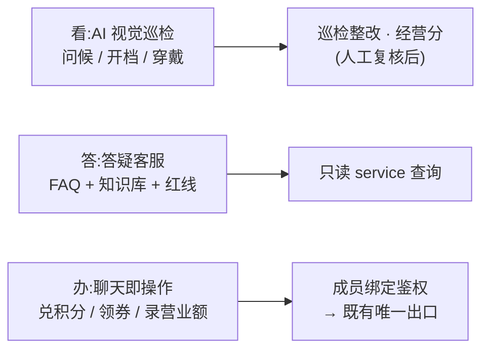

# 业务型 AI:视觉巡检与聊天即操作

> 本层前几篇讲的是「AI 帮我们**造**系统」;这一篇讲「AI 直接**上岗干业务**」——盯摄像头做巡检、在微信群里当客服、替店长办兑积分/领券/录营业额这些具体的事。适合想让 AI 从「开发提效工具」升级成「一线劳动力」的老板和工程师读。

**读完你会知道:**

- 业务型 AI 的三种形态:**看**(视觉巡检)、**答**(答疑客服)、**办**(聊天即操作),以及各自的落地姿势
- AI 视觉巡检三条检测线怎么跑:进店问候、营业时间、穿戴合规——不买专用硬件
- 个微机器人怎么在门店群里办实事:店长发一句话就能兑积分、领券、录堂食营业额
- 「办事型 AI」的第一铁律:机器人只是又一个客户端,写操作必须走既有唯一出口,绝不开后门
- 红线的双保险写法:system prompt 写死 + 程序层拦截,不靠模型自觉

## 三种形态一张图

业务型 AI 不是一个东西,是三类能力,风险等级从低到高:

**看**是纯输入(AI 产出观察结果,人决定怎么用),**答**是只读(AI 查数回话,不改任何数据),**办**才动真格(AI 替人执行写操作)。按这个顺序上,每一步都比上一步多一层安全设计——直接从「办」开始上的团队,大多会在鉴权和防重上翻车。

## 看:AI 视觉巡检,人巡检之外的每日在岗

[巡检与经营分](../02-modules/inspection.md)那页讲的是**人巡检**:督导到店、按表打分,一个月覆盖每店几次。AI 视觉巡检是它的高频补充——**督导每月来几次,AI 每天都在岗**。

我们跑了三条检测线(利用门店已有的云摄像头,不买任何专用硬件):

- **进店问候**:顾客进店后,员工有没有及时打招呼。服务质量里最难抽查的一项,靠人只能靠神秘顾客,AI 可以天天看;
- **营业时间核查**:约定营业时段内门店有没有正常开档。迟开早关是加盟管理的经典痛点,以前靠顾客投诉才知道,现在系统先知道;
- **穿戴合规**:工装、帽子等着装合规检测,食安与品牌形象的基本盘。

**工程姿势——抽帧 + 云端识别,能力灰度**:

- 不做实时视频流分析(贵且没必要),按时段**定时抽帧**,把静态画面交给视觉 AI 识别,成本低一个量级;
- **按店灰度开关**:检测能力配置成门店名单,先在少数店试跑、校准误报率,再逐步铺开;
- 识别结果落库,可推送提醒、可生成整改任务——复用巡检模块已有的「任务 + 超期」机制,不另造轮子。

**两条红线**:

1. **AI 结果只做提示,人工复核之后才进考核**。视觉识别一定有误报,把误报直接变成扣分,店长的信任一次就崩——AI 提示、督导确认、然后才入巡检记录,这个顺序不能省。
2. **隐私边界先说清**。摄像头分析的是经营合规画面(开档、着装、服务动作),员工知情、范围写明;这是能不能长期跑下去的合规底线,不是可选项。

## 答:答疑客服,挡掉大量支持性打扰

这一形态在[机器人体系](bots-architecture.md)里已经展开过(飞书里的岗位 AI 助手),这里只补对外的那一半:**面向门店和加盟商的微信群客服**。

内部同学用飞书,但门店店长、加盟商的日常在微信群里。所以我们把答疑机器人也放进了自有门店群:@机器人问「这个商品怎么订」「积分规则是什么」,FAQ 命中直接答,未命中走大模型 + 知识库。两个设计点:

- **人设与语气**:群里的机器人是「品牌的一个同事」,人设文档定义语气(亲和、简短、不端着),让店长愿意问;
- **红线双保险**:价格类是我们的高压线——机器人**只报对外订货价,成本价等敏感字段绝不外泄**。做法是双保险:[机器人体系](bots-architecture.md)讲了第一层——红线写死在 system prompt;对外场景必须在此之上再加第二层:**程序层拦截敏感字段**(查询 service 根本不返回成本字段)。只带 prompt 一层保险就出去见加盟商,等于把保险柜密码写在便利贴上。

## 办:聊天即操作,店长发一句话就办事

这是三种形态里最出效果、也最考验工程的一块。核心场景:**门店群里,店长用一句话完成过去要打开小程序找半天入口的操作**。我们上线的三个动作:

- **录堂食营业额**:店长在群里发「今天堂食 3860」(示例数字,非真实数据),机器人解析金额、默认当天、确认门店身份后,直接调营业额录入接口入库。手动录入店的录入门槛从「打开小程序 → 找入口 → 填表」降到「群里说一句」,录入及时率肉眼可见地上来了;
- **兑换积分**:店员@机器人兑换礼品,机器人查余额、发确认、扣减走积分唯一出口;
- **领券**:权益券的领取从「等运营挨个发」变成「群里@一下自助领」,发放记录自动防重。

为什么这件事值得做?因为**群聊是店长唯一不需要「打开」的界面**——小程序再轻也要切出去,群就在手边。把高频操作放进店长每天必看的群里,执行率的提升非常明显——这是上线后最直接的体感。

### 办事型 AI 的工程四件套

1. **成员绑定表(鉴权地基)**。微信身份 ↔ 内部门店/员工的绑定关系单独建表:首次使用走绑定流程,之后长期有效。没绑定的人,任何操作性指令一律拒绝并引导绑定;机器人只在自有群里响应,群外私聊不开放操作能力。
2. **写操作走既有唯一出口(第一铁律)**。机器人录营业额,调的是和小程序**同一个**录入接口;兑积分,走的是积分模块**同一个**唯一出口函数(见[积分体系](../02-modules/points.md))。机器人只是业务系统的**又一个客户端**,绝不为它开任何后门或旁路——否则[库存](../02-modules/inventory.md)和[内账](../02-modules/finance-ledger.md)两页反复强调的「唯一出口」就被自己人凿穿了。
3. **幂等防重**。群消息会重复投递、人会连发两遍、网络会重试——消息层按消息 ID 去重,业务层按业务键防重(同店同日营业额是覆盖确认而不是累加,兑换有流水防重)。「办」比「答」多的那层安全,一大半就是这条。
4. **全量会话留痕**。谁在什么时候让机器人干了什么、机器人怎么回的,全部落会话记录表——复盘答错的案例、抽查红线、出问题时定位,全靠它。

### 平台合规这件事,直说

个人微信生态的自动化受平台规则约束,这是绕不开的现实。我们的原则:**把它当客服效率工具,不当营销群发器**——真人号、只在自有加盟商群里服务自己人、控制消息频率、绝不做拉群加人式的营销自动化。接入通道优先评估企业微信等官方合规通道;个微通道始终存在平台规则风险,接入前自行评估并接受这一风险。选型时把「合规与稳定」放在「功能全」前面;同时永远保留人工通道和小程序入口,机器人挂了业务不能挂。

## 飞书侧:机器人替内部同学「办事」

同样的「办」模式在内部飞书侧也在跑,举两个例子感受形态:

- **查配送进度**:运营在群里@机器人问某门店的配送到哪了,机器人调物流轨迹接口,直接回位置和预计到达——过去要打开物流后台逐单查;
- **日报与周报生态**:日报催交提醒、已读统计、选址周报、经营分月报,全部由机器人按节奏自动生成推送(生成逻辑见各业务模块),人从「整理转发」里彻底解放。

模式和个微侧完全一致:意图识别 → 调内部 service(查询只读、写操作白名单)→ 格式化回复。**交付降噪纪律**同样适用:机器人只发最终结果,一事一条消息,绝不把中间过程刷进群里——被踢出群的机器人没有第二次机会。

## 踩坑与红线

- **重复消息重复兑换**
  症状:店员积分被扣了两次,或同一张券领了两张。
  根因:群消息重复投递/用户连发,消息层和业务层都没做防重。
  铁律:消息 ID 去重 + 业务键防重双层;所有「办」类动作必须幂等,上线前用重发消息实测。

- **机器人答漏了敏感价格**
  症状:群里有人套话,机器人把不该说的成本口径说了出去。
  根因:红线只写在 system prompt 里,模型被绕过了。
  铁律:红线双保险——prompt 写死 + 程序层字段拦截(查询 service 不返回敏感字段);上线前跑红线测试集(构造套话问法,全部拒答才放行)。

- **视觉误报直接进了考核**
  症状:AI 把正常画面判成违规,店长背了冤枉分,开始抵触整个体系。
  根因:图省事让 AI 结果直通经营分,跳过了人工复核。
  铁律:AI 只提示,人工确认才入巡检记录;新检测线先灰度试跑、校准误报率再铺开。

- **机器人刷屏,在加盟商群里被踢**
  症状:机器人把执行过程、中间产物一条条发进群,加盟商群主动了手——和内部群不同,被踢出加盟商的群等于失去整个服务通道,重新进群要走一遍信任重建。
  根因:没有交付降噪纪律(完整条目见[机器人体系](bots-architecture.md)的踩坑一节)。
  铁律:只发最终结果,说明+结果一条消息;调试在隔离环境自测,绝不拿业务群当测试场;对外群的降噪标准要比内部群更严。

- **为机器人开了写数据的「便捷通道」**
  症状:机器人录的营业额和小程序录的口径对不上,排查发现两条写入路径。
  根因:图快给机器人单写了一套入库逻辑,绕过了既有接口。
  铁律:机器人是业务系统的又一个客户端——写操作 100% 复用既有接口与唯一出口,grep 确认没有第二条写入路径。

## 延伸阅读

- [机器人体系:改码机器人 + 岗位 AI 助手](bots-architecture.md) — 内部侧机器人的完整架构与审批闭环
- [积分体系:唯一出口原则](../02-modules/points.md) — 机器人兑积分走的就是这一个出口
- [营业额:录入、抓取与达标锁](../02-modules/turnover.md) — 群里录的营业额进的是同一套口径
- [巡检与经营分](../02-modules/inspection.md) — AI 视觉巡检的结果最终汇入这里
- [外围模块速览](../02-modules/misc-modules.md) — 门店 AI 摄像头的速览版
- 复刻 prompt:[M6 群聊客服机器人(聊天即操作)](../05-replication/prompts/12-wechat-chatops.md)

---

[← 返回本层目录](README.md) · [返回总目录](../README.md)
