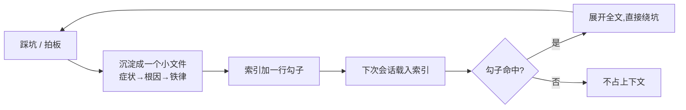

# 记忆方法论:让 AI 越用越懂你的系统

> 这页讲我们如何把「踩过的坑、拍过的板」沉淀成 AI 可跨会话读取的记忆库,让 AI(和新人)不再重复交学费。想让 AI 助手长期陪跑一个系统的团队都该读。

**读完你会知道:**

- AI 每次会话「失忆」到底损失了什么,为什么光靠 CLAUDE.md 不够
- 一条记忆该长什么样:一坑一文件 + 一行索引的组织方式
- 什么值得写进记忆、什么坚决不写(包括记忆自身的保密红线)
- 怎么维护记忆库,让它不腐烂——核心是「记真源指针,不抄真源内容」
- 记忆的复利:为什么它同时是 AI 的经验库和团队的活文档

## 问题:AI 是金鱼,坑是回头客

AI 编程助手有个天生缺陷:**每次会话都是全新的**。上一次会话里,它花了两小时定位到「定时任务时区配置要按北京时间写、不能再减 8 小时」这种反直觉结论;下一次会话,它对此一无所知,大概率在同一个地方再摔一跤——而且摔得理直气壮,因为按「常识」那样写看起来完全正确。

人类团队靠什么避免这种事?靠「有人记得」。老员工会说「别动那个配置,三年前改过一次,炸了」。但这种口口相传有两个问题:一是 AI 听不到,二是人也会走、也会忘。

我们的解法很朴素:**把所有「不写下来就要靠有人记得」的东西,写成 AI 每次会话都能读到的记忆文件**。AI 失忆没关系,只要它开工前先读一遍「战史摘要」,效果等价于一个从不忘事的老员工。

## 形态:一坑一文件,一行一索引

记忆库的物理形态刻意做得非常简单——就是一个目录下的一堆 Markdown 文件,外加一份索引:

- **一条记忆 = 一个独立小文件**。一个文件只装一件事:一个事实、一个坑、或一个决策。不写长文,不搞综述。文件名本身就是主题,比如 `celery-beat-timezone.md`、`price-snapshot-never-realtime.md`。
- **一份索引文件**。一行对应一条记忆,格式是「链接 + 勾子短语」。勾子短语是这条记忆最核心的一句结论,浓缩到扫一眼就能判断「这条跟我现在的活儿有没有关系」。
- **会话开始只载入索引,按需展开**。索引很短,占不了多少上下文;AI 扫到相关的勾子,再打开对应小文件看全文。这是典型的「目录换正文」——用极小的常驻成本,换来整个经验库的可达性。

索引里的一行大概长这样(示例,非真实内容):

```markdown
- [定时任务时区](scheduler-timezone.md) — 调度器的小时字段按本地时间写,不要再做时区换算
- [单据价格快照](price-snapshot.md) — 统计一律读下单时的快照价,绝不读实时价
- [库存对账待办](todo-inventory-recon.md) — 自动对账任务已上线,人工核对流程待下线,勿新增依赖
```

为什么坚持「小文件」而不是一个大文件?因为记忆的生命周期各不相同:有的坑修了根因就该删,有的决策十年不变,有的待办下周就完成。混在一个大文件里,过期内容和有效内容纠缠不清,没人敢删;拆成小文件,删一条就是删一个文件,干净利落。



## 写什么:四类值得付「记忆税」的东西

每写一条记忆都有成本——写的时间、索引的一行、以后维护它的义务。所以只写四类东西:

**1. 坑:症状 → 根因 → 铁律。** 这是记忆库的主力。格式固定三段:当时看到了什么怪现象(症状),挖到底是什么原因(根因),以后必须遵守什么(铁律)。铁律是给未来的 AI 和人的行动指令,必须写成可执行的祈使句,比如「改这类任务后必须重启 worker,热重启不够」,而不是「这里要小心」。

**2. 口径与决策,以及为什么。** 「统计用快照价还是实时价」「在职状态字段哪个表以哪个值为准」这类问题,答案本身只有一句话,但背后的 why 值得多写两句——因为没有 why 的决策,半年后一定会被某个「看起来更合理」的改法推翻,然后所有历史数据口径错乱。记忆要把 why 钉死。

**3. 真源指针。** 有些状态一直在变:某个模块做到哪一步了、某份设计的权威版本在哪。这类东西**不要把内容抄进记忆**,只记一句「X 的权威文档在 Y 路径,以它为准」。记忆记的是地图,不是领土——这是让记忆库抗腐烂的最重要技巧,下面维护一节再展开。

**4. 待办与悬而未决。** 「这个功能开关默认关着,等拍板」「那张废弃表确认无调用后要删」。这类记忆自带过期属性,做完就删,但在做完之前,它们是防止 AI「好心办坏事」(比如顺手把还没拍板的开关打开)的护栏。

一句话判断标准:**凡是「不写下来就要靠有人记得」的,写;其他的,不写。**

## 不写什么:三类坚决不进记忆的东西

- **代码里已有的结构。** 模型有哪些字段、接口路由长什么样、函数签名是什么——AI 自己会读代码,而且代码永远比记忆新。把结构抄进记忆,等于主动制造一份注定过期的副本。
- **一次性细节。** 某次排障中间的临时数据、只对当次会话有意义的上下文。这些东西写进去只会稀释索引的信噪比。判断方法:三个月后再遇到类似问题,这条信息还有用吗?没用就别写。
- **敏感数值。** 记忆库也要守发布红线:真实营收、成本、密钥、服务器地址、配方参数,一概不进记忆。记忆是给 AI 每次会话都读的东西,等于长期驻留在提示词里,泄露面比任何单次对话都大。需要引用敏感事实时,同样用真源指针:「成本口径见某某文档(权限受控)」,让权限体系去管内容本身。

## 维护:记忆库不打理会变成谣言库

记忆库最大的风险不是写得少,而是**过期的记忆比没有记忆更危险**——AI 会拿着三个月前的「铁律」理直气壮地拦住一个已经正确的改法。我们的维护动作有三个:

- **定期合并重复。** 同一个主题踩了两次坑,往往会留下两条相近的记忆。定期(比如每月一次,或每当索引明显变长时)过一遍索引,把同主题的合并成一条,矛盾的以新为准。
- **删除过时。** 待办完成了、坑的根因被彻底修掉了、决策被新决策取代了——对应的记忆文件直接删,索引行同步删。删除是维护动作,不是损失;舍不得删的团队,最后会得到一个没人敢信的记忆库。
- **靠真源指针把过期风险降到最小。** 这是结构性的防腐手段:记忆里凡是「会变的内容」都只记指向(权威文档在哪、真相源是哪张表),不抄内容。这样内容更新时只需要改真源一处,记忆天然保持有效。回头看我们踩过的记忆腐烂问题,几乎全部出在「当时图方便把内容抄进了记忆」。

## 复利:AI 省时间,人得到一部活战史

记忆库的第一层收益是显性的:**同类问题第二次出现时,AI 直接命中铁律**。第一次踩坑可能花两小时定位;沉淀之后,第二次 AI 在动手前就从索引里看到勾子短语,直接绕开。坑越独特、越反直觉,这条记忆的回报率越高——恰好这类坑也是人最容易忘的。

第二层收益是我们当初没预料到的:**记忆库成了团队最好的文档**。因为它天然满足好文档的所有特征——每条都源自真实事故或真实决策,没有一句空话;每条都带 why;过时的会被删掉。新人(或者新接手某模块的同事)把索引通读一遍,再挑相关的条目展开,相当于把这个系统全部的战史听了一遍。传统的「新人入职文档」总是写时热闹、半年即腐;记忆库因为 AI 每天都在用、坏了立刻会被发现,反而是全库里最鲜活的文字。

维护成本也远比想象低:每条记忆平均十几行,一次踩坑后花五分钟写,一个月花半小时清理(示例数字,非真实数据)。相比它省下的重复排障时间,这大概是我们整个 AI 工程实践里投入产出比最高的一件事。

## 与 CLAUDE.md 的分工:手册管稳定,记忆管流动

我们同时维护 CLAUDE.md(见 [CLAUDE.md:给 AI 的入职手册](claude-md-practice.md))和记忆库,两者边界很清楚:

| | CLAUDE.md(手册) | 记忆库 |
|---|---|---|
| 装什么 | 稳定的项目知识:目录结构、编码约定、模块地图、命令 | 流动的经验教训:坑、决策、真源指针、进行中状态 |
| 变化频率 | 低,架构级变更才动 | 高,每次踩坑/拍板都可能新增或删除 |
| 组织方式 | 一份精心编排的文档,追求体系感 | 碎片小文件 + 索引,追求可增可删 |
| 类比 | 员工手册 | 老员工的经验口袋本 |

判断一条信息该进哪边,问一个问题:**这条信息一年后大概率还原样成立吗?** 成立,进手册;不一定,进记忆。两边都别放的,就是上面说的「不写什么」。

实践里最常见的流向是:一条记忆在库里躺了一年、被反复验证、再也没变过,就把它「毕业」进 CLAUDE.md,记忆文件删除。记忆库是手册的孵化器。

## 踩坑与红线

**记忆抄了真源内容,过期后误导 AI**
- 症状:AI 按记忆里记的接口字段/状态开工,做完发现真实系统早已不是那样。
- 根因:写记忆时图方便,把当时的内容快照抄了进去,真源更新后记忆没人同步。
- 铁律:会变的内容只记指针(「权威文档在 X,以它为准」),绝不抄正文;发现抄了的,改成指针。

**索引膨胀,信噪比崩塌**
- 症状:索引长到 AI 载入后抓不住重点,真正关键的铁律被淹没在琐碎条目里。
- 根因:什么都往记忆里塞,一次性细节、代码结构、排障流水账混了进来;只增不删。
- 铁律:入库前过「三个月后还有用吗」这一关;定期合并重复、删除已完成待办和已修根因的坑。

**敏感数值随记忆长期驻留**
- 症状:一条含真实经营数据/密钥的记忆,被每次会话默默载入,泄露面持续扩大。
- 根因:把记忆当私密笔记,忘了它本质是长期驻留的提示词内容。
- 铁律:记忆库与对外发布执行同一套红线;敏感事实只留指针,内容交给权限受控的真源。

**铁律写成了「要小心」**
- 症状:记忆命中了,AI 也读了,坑还是照踩——因为记忆只说「这里有坑」,没说怎么绕。
- 根因:写记忆时只记录了情绪(这里坑过我),没提炼出可执行的行动指令。
- 铁律:每条坑必须写满三段——症状、根因、祈使句铁律;写完自问「一个毫无背景的 AI 读了能照做吗」。

## 延伸阅读

- [CLAUDE.md:给 AI 的入职手册](claude-md-practice.md) — 记忆库的孪生兄弟:稳定知识那一半怎么写
- [AI 产出的质量纪律](ai-review-discipline.md) — 记忆解决「别重复踩坑」,复查纪律解决「新坑别漏网」

---

[← 返回本层目录](README.md) · [返回总目录](../README.md)
