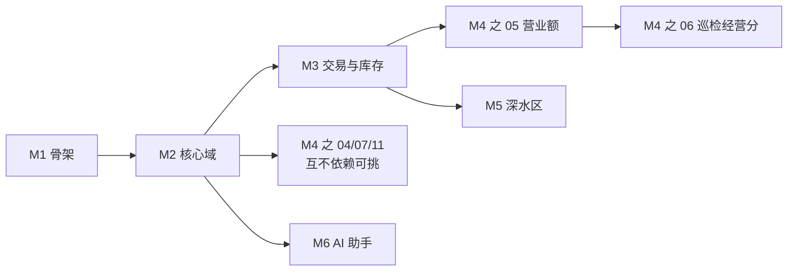

# AI 复刻路线图与里程碑

> 这一层是整本书的「施工指令包」:12 份可以整块复制给 AI 编程代理的 prompt 文件,加上这份路线图。想动手把系统建出来的老板、IT 负责人、工程师从这页开始读。

**读完你会知道:**

- 这一层的分工:人负责按顺序投喂和验收,AI 负责施工
- 6 个里程碑的顺序、每个里程碑对应哪些 prompt 文件、依赖关系是什么
- 为什么 prompt 按 Django 写,你却可以换任何技术栈
- 「AI 说做完了」为什么不算数,验收清单该怎么用

## 这一层是什么:给 AI 的施工指令包

前面四层讲的是「我们建了什么、怎么建的、踩了什么坑、AI 怎么参与」。这一层把它们浓缩成可以直接执行的东西:每份 prompt 文件对应一个业务模块,里面写清楚建模要求、接口约定、红线和验收标准。

分工很明确:**你(人)负责按顺序把 prompt 喂给 AI、跑验收清单、拍板业务差异;AI 负责写代码。** 你不需要会写 Django,但你需要会判断「这一步到底成了没有」——验收清单就是为此设计的。

## 怎么用

1. **开一个空项目**,用能读写文件、能跑命令的 AI 编程代理(比如 Claude Code)。只能聊天不能动手的 AI 不行,施工需要它真的建文件、跑迁移、起服务。
2. **按里程碑顺序,把 prompt 文件整块喂给 AI。** 每份 prompt 的「喂给 AI 的指令」部分放在一个代码块里,整块复制;粘贴前先把里面的方括号占位符(如 `[你的 IM 通知渠道]`、`[N=14,示例数字]`)换成你的实际参数——含占位符的 prompt 都会在代码块上方提醒你,别原样丢给 AI 一堆残缺指令。
3. **每步做完,跑该文件末尾的验收清单,全过了才进下一步。** 顺序是硬约束:后面的模块假设前面的地基已经存在。
4. **建议先读对应的 02 层模块蓝图页再喂 prompt。** prompt 是施工令,蓝图页是设计说明;把蓝图页也丢给 AI 当上下文,它对「为什么这么设计」理解更足,施工时的自由发挥会更靠谱。

## 里程碑总览

| 里程碑 | prompt | 内容 | 依赖 |
|---|---|---|---|
| **M1 骨架** | [00-bootstrap](prompts/00-bootstrap.md) | 框架 / 响应约定 / 鉴权 / 定时任务 | 无 |
| **M2 核心域** | [01-core-domain](prompts/01-core-domain.md) | 门店 / 员工 / 角色权限 | M1 |
| **M3 交易与库存** | [02-ordering-mall](prompts/02-ordering-mall.md) · [03-inventory](prompts/03-inventory.md) | 订货商城(价格快照) / 库存四量 | M2 |
| **M4 运营模块** | [04-points-daily-ops](prompts/04-points-daily-ops.md) · [05-turnover-dashboards](prompts/05-turnover-dashboards.md) · [06-inspection-score](prompts/06-inspection-score.md) · [07-delivery-platforms](prompts/07-delivery-platforms.md) · [11-site-crm](prompts/11-site-crm.md) | 积分+开收档+日报 / 营业额+看板 / 巡检+经营分 / 外卖平台集成 / 选址+CRM | 04/07/11 只依赖 M2;05 依赖 M3(订货锁框架);06 依赖 M3 + 05(营业额取数) |
| **M5 深水区** | [08-production-costing](prompts/08-production-costing.md) · [09-finance-ledger](prompts/09-finance-ledger.md) | 生产+成本 / 自建内账引擎 | M3 |
| **M6 AI 助手** | [10-ai-assistant](prompts/10-ai-assistant.md) · [12-wechat-chatops](prompts/12-wechat-chatops.md) | 岗位 AI 助手 / 群聊客服机器人(聊天即操作) | 10 依赖 M1,已建成的模块越多助手能答的越多;12 依赖 10 与 M4 的 04(积分)、05(营业额) |

三点提醒:

- **文件序号 ≠ 施工顺序,一律以上表的里程碑为准。** 序号只是我们写这些文件的先后——最典型的是 [11-site-crm](prompts/11-site-crm.md),序号排在最后,里程碑却是 M4;照文件夹自然排序施工的人会把它拖到 M6 之后才做,那就错了。
- **M4 里的 04(积分)、07(外卖)、11(选址 CRM)三篇互不依赖**,挑你业务最疼的先做。但 **05(营业额)和 06(巡检)是例外**:05 的达标锁必须接进 M3 订货商城建好的锁框架,06 的经营分又要从 05 的营业额取数——想做这两篇,先把 M3 和 05 排在前面,别指望跳过去。
- **M5 依赖 M3**:生产成本要吃库存数据,内账引擎要吃订货和采购的业务事件。没有 M3 的单据流,M5 是无源之水。

## 技术栈:栈可以换,模式不能丢

prompt 全部按 **Django + MySQL + Redis + Celery** 写——这是我们真实跑在生产上的栈,写具体栈能让 AI 的产出直接可跑,不用二次翻译。

但真正值得复刻的不是栈,是**模式**:

- **唯一出口**:积分增减、库存变更这类敏感操作只留一个函数入口,别处一律禁止直改
- **快照**:单据金额下单时冻结,绝不回读实时价
- **口径文档**:每个统计数字的算法用自然语言写成文档,人和 AI 共用一份
- **锁与豁免**:达标锁、超期锁都配统一的豁免入口,别让运营找工程师开后门

这些模式在任何栈上都成立。**换栈时只需要在喂 prompt 前告诉 AI 一句:「用 Spring Boot / Rails / NestJS 实现,但保持 prompt 里的模式不变。」** 验收清单里凡是跟具体命令绑定的项,让 AI 顺手给出等价命令即可。

## 全程习惯:每一步都让 AI 写文档

每份 prompt 里都有同一条要求:**做完这个模块,同步更新项目的 CLAUDE.md 和口径文档。** 这不是仪式感——CLAUDE.md 是 AI 的入职手册,口径文档是数字的宪法,它们只有从第一天开始积累才有用。等系统建完再补,补出来的是考古报告,不是活文档。

这正是 04 层方法论的落地:你在复刻系统的同时,也在复刻「让 AI 越用越懂你的系统」的工作方式。后者比前者值钱。

## 验收哲学:AI 说「做完了」不算数

AI 报告「已完成」的可信度,大约相当于装修工人说「都弄好了」——可能真好了,也可能水管还没接。所以每份 prompt 末尾的验收清单,每一项都设计成**可操作验证**:跑一条命令、发一个请求、看一条数据。比如(示例,具体以各 prompt 文件为准):

- 发一个未登录请求,确认返回统一的未授权响应,而不是 500
- 改一次商品价格,再查历史订单,确认订单金额纹丝不动
- 手工把库存改错,跑一遍对账任务,确认差异被找出来

清单没过,就把失败现象原样贴回给 AI 让它修,修完重跑清单。**过了清单才进下一个里程碑**——这条纪律是整个复刻流程里人最重要的贡献。

## 走完之后你得到什么

全部 6 个里程碑走完,你得到的是一个**可运营的最小系统骨架**:门店和员工建了档、订货流水能跑、库存对得上账、日常运营有抓手、AI 助手能答疑。

它不会恰好等于你的业务——品类不同、组织不同、流程不同。但这些差异是在骨架上**小改**:加几个字段、调几条规则、换几个口径。骨架里最难的部分(单据一致性、库存对账、权限体系、文档习惯)已经就位,而这些恰恰是自己从零摸索最容易翻车的地方。

## 延伸阅读

- [业务模块全景与阅读顺序](../02-modules/README.md) —— 每份 prompt 对应的设计蓝图都在这一层
- [CLAUDE.md:给 AI 的入职手册](../04-ai-engineering/claude-md-practice.md) —— 「每步更新 CLAUDE.md」背后的方法论
- [AI 产出的质量纪律](../04-ai-engineering/ai-review-discipline.md) —— 验收哲学的完整版
- [技术选型与取舍:为什么单体 Django 够用](../01-architecture/tech-stack.md) —— 想理解 prompt 为什么选这个栈

---

[← 返回总目录](../README.md)
