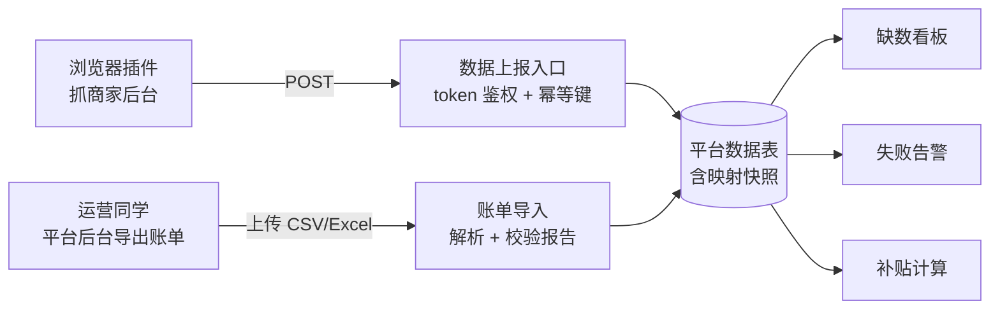

# M4 外卖平台集成

> 这一页是喂给 AI 编程助手的复刻指令:搭一套「平台数据半自动接入」的底座——映射表、上报入口、账单导入、缺数看板、告警、补贴计算。适合已经完成核心域(M2)的团队。

**读完你会知道:**

- 为什么平台门店 id 必须放在独立映射表里,而不是给门店主表加字段
- 「半自动」的正确姿势:插件/人工导入 + 幂等上报接口,而不是硬啃官方 API
- 幂等键怎么设计,才能让同店同月重复上报永远不产生脏数据
- 改绑映射后,历史数据归属为什么必须纹丝不动
- 一份可勾选的验收清单,复刻完照着逐条打勾

## 目标

把美团、饿了么、京东这类外卖平台的经营数据,以**半自动**方式接进你在 M2 建好的底座:数据可以来自浏览器插件抓取、也可以来自运营同学手工导出的账单文件,后端提供统一的上报入口和导入通道,配套缺数看板、失败告警和补贴计算。

先讲清楚「半自动」这个定位,免得 AI 一上来就去接官方 API:

- 外卖平台的官方开放接口普遍门槛高、字段不全、政策多变;而商家后台里人肉能看到的数据是最全的。
- 所以我们的模式是:**浏览器插件在商家后台页面上抓取数据 → 调后端上报接口写入**;插件抓不到或没装插件的,运营同学从平台后台导出 CSV/Excel,走**账单导入**通道。
- 后端不负责「去平台拿数据」,只负责「收数据、校验数据、发现缺数据」。这是整个模块能长期稳定运行的关键——平台页面改版只影响插件一端,后端接口和数据模型不动。

这一页只搭后端底座。插件本身怎么写不在本页范围(每个平台后台页面结构不同,没有通用答案),但底座建好后,插件就只剩「抓到数据 → POST 到上报接口」一件事。

## 前置依赖

- **[M2 核心域](01-core-domain.md)**:必须先有门店主表(Shop)、员工与权限体系,平台映射表要挂在内部门店 id 上。
- 建议先读 [外卖平台集成:插件半自动抓取模式](../../02-modules/delivery-platforms.md) 理解设计动机,以及 [数据口径:最贵的一类坑](../../03-pitfalls/data-caliber.md) 里关于「快照归属」的教训。
- 若你也在做 [M4 营业额 + 看板](05-turnover-dashboards.md),两者会共享「按门店按月」的账期口径,先后顺序不限,但口径定义要一致。

整体数据流一张图看清(后端只做右半边):



## 喂给 AI 的指令

下面整块复制给你的 AI 编程助手。假设它已经在 M1/M2 建好的 Django 项目里工作。

````markdown
你在既有的 Django 单体项目上实现「外卖平台集成」模块。项目已有门店主表(Shop)、
用户与权限体系、统一响应约定(code 字符串 '0' 表示成功)。严格按以下要求实现。

## 一、平台门店映射表(唯一真相源)

建模型 PlatformShopMapping,字段至少包含:

- platform:平台标识,枚举字符串(如 'meituan' / 'eleme' / 'jd'),留扩展余地
- platform_shop_id:平台侧门店 id,字符串(平台 id 可能超长、可能带字母,禁用整型)
- shop_id:内部门店 id,逻辑外键指向 Shop
- status:绑定状态(生效 / 停用),停用不删除
- 建绑时间、改绑时间、操作人

约束与红线:

1. 【红线】门店主表 Shop 上**禁止**新增任何平台相关字段(如 meituan_poi_id 这类)。
   我们踩过这个坑:主表加平台字段后,一店多平台、平台换绑、历史追溯全都变成灾难,
   最后只能废弃字段、另建映射表。你从第一天就用映射表,主表保持干净。
2. 同一 (platform, platform_shop_id) 在「生效」状态下只允许绑定一个内部门店,
   加唯一性校验(可用条件唯一约束或应用层校验,写清你的选择)。
3. 所有「平台 id → 内部门店」的解析,必须走映射表这一个入口,封装成一个
   service 函数(如 resolve_shop(platform, platform_shop_id)),禁止各处自己 join。

## 二、数据上报入口接口(给插件或人工脚本用)

提供一个 POST 接口,如 /api/platform/report,行为如下:

- 鉴权:请求头带上报 token(独立于用户 session 的机器凭证,存配置,不入库不入 git)。
  token 校验失败返回明确错误码。这个接口是给插件调的,不能依赖登录态。
- 请求体:platform + platform_shop_id + 账期(建议月粒度,如 '2026-06')+ 数据载荷
  (营收、订单量等指标字段,按你项目实际需要定义,写进接口文档)。
- 【核心】幂等键 = 平台 + 门店 + 账期。同一幂等键重复上报,**覆盖**旧数据,
  不新增记录。实现上对这三个字段建联合唯一约束,写入用 update_or_create 语义。
  插件重试、运营同学重复导入,都不允许产生第二条记录。
- 【红线】写入时把「当时解析到的内部门店 id」固化存进数据行(映射快照)。
  之后映射表改绑,这行历史数据的归属**不变**。归属永远看写入当时的快照,
  不做任何「按最新映射重算历史」的逻辑。
- 上报成功返回本次是「新增」还是「覆盖」,方便插件端打日志。

## 三、账单导入(CSV/Excel 上传)

提供管理端上传接口,如 /api/platform/bill_import:

- 默认只收 CSV;Excel 作为可选项,开启前必须确认生产环境装好了对应解析库
  (我们在导出侧吃过「生产容器缺 openpyxl 直接 500」的亏,解析 Excel 是同一类
  重依赖,同理适用;确认不了就只收 CSV,让运营把账单另存为 CSV 再传)。
- 解析后逐行校验:平台门店 id 能否在映射表解析、账期格式、
  金额字段是否合法数值。
- 【关键】校验采用「能过的行入库,不能过的行报告」策略,返回一份**校验报告**:
  总行数、成功行数、失败行数,以及每一条失败行的行号 + 具体原因
  (如「第 12 行:平台门店 id 未在映射表登记」「第 30 行:金额非数字」)。
  禁止只返回一句「导入失败」——运营同学要能照着报告修文件。
- 入库复用第二节的幂等写入逻辑(同一幂等键覆盖),导入和插件上报最终落同一张表、
  同一套约束,不允许两套写入路径。

## 四、抓取状态看板

提供查询接口,如 /api/platform/coverage:

- 输入账期范围,输出一张「平台 × 门店 × 月」的覆盖矩阵:哪家店哪个月哪个平台
  有数据、哪些是空洞。
- 空洞判定基准 = 映射表中该账期内处于生效状态的绑定关系;没绑定的组合不算缺数。
- 这个看板是运营的日常工具:每月初对上月数据查漏,缺哪家催哪家。

## 五、失败告警

- 加一个定时任务(用项目既有的定时体系,注意确认挂在哪一套调度上):
  账期结束后超过 N 天(N 参数化,放配置)仍有空洞的,推送提醒
  (复用项目既有的消息通道,如 IM 机器人;没有就先写日志 + 预留发送函数)。
- 告警内容直接列出缺数的「平台 + 门店 + 账期」清单,让人一眼知道催谁。

## 六、补贴计算(规则参数化)

我们有按商品维度给门店发运营补贴的场景(如引流品补贴)。实现要点:

- 匹配键 = **商品名快照**:平台侧数据里只有商品名,没有你内部的商品 id,
  所以匹配只能按名字。上报/导入时把商品名原样存下来作为快照,计算时用快照匹配,
  禁止事后拿内部商品表的「当前名字」反向对——商品改名会让历史匹配全错。
- 补贴规则(哪些商品、单价补多少、按什么量计)全部参数化存库,禁止硬编码。
  规则要能按平台区分(不同平台可用不同计量口径,例如有的平台按订单量计)。
- 输出按「门店 × 账期」的补贴汇总,明细可下钻到商品行。
- 【红线】计算结果只做展示与导出,不直接触发打款;打款是另一个模块的事。

## 七、文档同步(必做)

- 在项目 CLAUDE.md 增补:平台门店 id 的唯一真相源是映射表、主表禁加平台字段、
  上报幂等键三要素、历史归属按映射快照不随改绑变化。
- 新建或更新平台集成接口文档:上报接口的鉴权方式、幂等语义、导入文件格式、
  校验报告结构、补贴规则配置方式,全部写清。
- 在数据口径文档里登记:账期粒度定义、空洞判定基准、商品名快照匹配口径。
````

## 踩坑与红线

这三条都是真金白银换来的,AI 实现完后要人工核对:

- **主表加平台字段**
  症状:一开始图省事在门店主表加了平台 id 字段,后来一店多平台、门店换绑,字段语义混乱,查数据的人不知道该信哪个。
  根因:平台绑定是「关系」不是「属性」,关系随时间变化,塞进主表就丢了历史。
  铁律:平台映射独立成表,主表零平台字段;解析统一走一个 service 入口。

- **改绑重算历史**
  症状:门店换了平台账号,改绑映射后,历史月份的数据突然「搬家」到别的店,月报对不上。
  根因:查询时实时 join 映射表,而不是用写入时的快照。
  铁律:数据行写入时固化门店归属快照;历史归属永不随映射变化。

- **导入失败无报告**
  症状:运营同学上传账单,系统只回「导入失败」,来回猜了一下午是哪行的问题。
  根因:解析器遇错即抛,没有逐行校验与错误收集。
  铁律:逐行校验、能过的过、失败行带行号和原因返回;导入报告是功能的一部分,不是锦上添花。

## 验收清单

复刻完成后逐条验证,全部打勾才算过:

- [ ] 平台门店映射表可建绑、停用、改绑,门店主表没有新增任何平台字段
- [ ] 同一 (platform, platform_shop_id) 生效绑定唯一,重复建绑被拒绝并有明确报错
- [ ] 上报接口用机器 token 鉴权,不依赖登录态;token 错误有明确错误码
- [ ] 同店同月同平台重复上报 3 次,库里始终只有 1 条记录,内容为最后一次的值
- [ ] 上报响应能区分本次是「新增」还是「覆盖」
- [ ] 账单导入 CSV 走通;若开启了 Excel,已确认生产环境装好对应解析库。构造一个含 2 行坏数据的文件(示例数字,非真实数据),校验报告准确指出行号与原因,其余行正常入库
- [ ] 导入与插件上报走同一套幂等写入,交叉重复(先导入后上报同一账期)也不产生重复数据
- [ ] 缺数看板:抽 3 家店 × 2 个月人工核对,空洞列表与实际库内数据一致;未绑定的平台组合不误报缺数
- [ ] 把某家店的映射改绑到另一内部门店后,改绑前的历史数据归属保持不变
- [ ] 缺数超时告警定时任务能触发,内容包含完整的「平台 + 门店 + 账期」清单;N 天阈值改配置即生效
- [ ] 补贴计算:配一条虚构规则(如某单品每单补 1 元,示例数字,非真实数据),按商品名快照匹配出正确汇总;把内部商品改名后重算,历史匹配结果不变
- [ ] CLAUDE.md、接口文档、数据口径文档三处均已同步更新

## 延伸阅读

- [外卖平台集成:插件半自动抓取模式](../../02-modules/delivery-platforms.md) — 本模块的设计动机与结构详解
- [营业额:录入、抓取与达标锁](../../02-modules/turnover.md) — 平台数据的下游消费方之一
- [数据口径:最贵的一类坑](../../03-pitfalls/data-caliber.md) — 快照归属与口径定义的通用教训
- [M4 营业额 + 看板](05-turnover-dashboards.md) — 共享账期口径的姊妹里程碑
- [M2 核心域:门店 / 员工 / 权限](01-core-domain.md) — 本页的前置依赖

---

[← 返回本层目录](../README.md) · [返回总目录](../../README.md)
