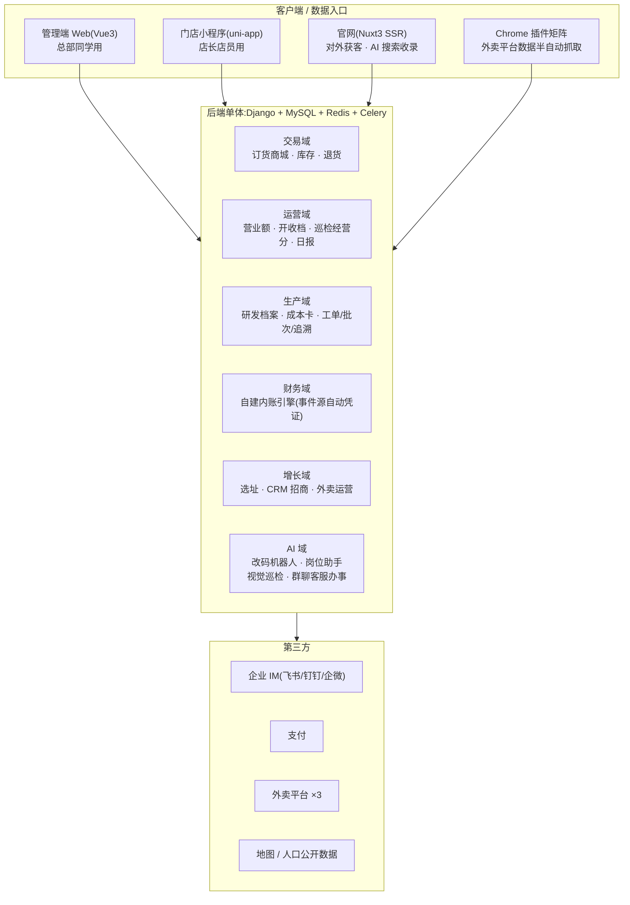

# 🍢 餐饮连锁数字化 + AI 全景蓝图

> 我们是 **原串**(一家真实运营中的平价烤串连锁品牌,官网 [ycbbq.cn](https://www.ycbbq.cn)),用「**1 个人** + AI」建成了覆盖订货、库存、生产、财务、门店运营、拓店招商的全链路数字化系统。
> 这个仓库不放代码,放的是比代码更值钱的东西:**架构决策、业务口径、踩坑实录,以及能让 AI 直接替你施工的复刻指令**。

**适合谁**:想做数字化的餐饮连锁创始人、IT 负责人、被老板拉来搭系统的工程师——以及你们手里的 AI 编程助手。

---

## 这个仓库是什么(与不是什么)

**是:**

- 一套经过真实门店验证的连锁数字化**整体方案**,全部用自然语言写成
- 每个业务模块的流程、领域模型设计、口径红线
- 我们踩过、你可以直接跳过的坑(症状 → 根因 → 铁律)
- 一组可以按顺序直接喂给 AI 编程助手的**施工指令**(见 [05 层](05-replication/README.md))

**不是 / 不包含:**

- ❌ 源代码——方案与技术栈解耦;AI 时代照蓝图重建,比读别人的老代码更快
- ❌ 任何配方、原料用量、工艺参数(只讲研发/生产模块的**结构**)
- ❌ 任何财务税务、公司主体安排(只讲记账引擎的**模式**)
- ❌ 任何真实经营数据——**全书出现的数字均为虚构示例**

---

## 全景图



后端加三个前端,共四个独立仓库、各自独立的发布节奏;Chrome 插件矩阵挂在后端仓里,不算独立的端。后端是唯一的数据与接口中枢。为什么这样拆,见 [四端拆分](01-architecture/four-repos.md)。

---

## 贯穿全书的六个原则

这六条是整套系统反复验证过的骨架思想,后面每一层都会反复出现:

| # | 原则 | 一句话 | 详见 |
|---|------|--------|------|
| 1 | **唯一出口** | 凡是"改数值"的系统(库存、积分、凭证),只留一个入口函数 + 完整流水,其余一律禁写 | [库存](02-modules/inventory.md) · [积分](02-modules/points.md) · [内账](02-modules/finance-ledger.md) |
| 2 | **价格快照** | 单据在成交瞬间冻结价格与商品信息,此后统计、退款、对账只读快照,绝不读实时价 | [订货商城](02-modules/ordering-mall.md) |
| 3 | **口径文档先行** | 每个指标先写清口径再写代码,人和 AI 读同一份文档 | [数据口径](03-pitfalls/data-caliber.md) |
| 4 | **单体 + AI** | 小团队别碰微服务;单体仓库对 AI 的上下文最友好 | [技术选型](01-architecture/tech-stack.md) |
| 5 | **锁与豁免** | 用业务锁(如锁订货)换数据质量,但豁免必须收敛到统一入口 | [订货商城](02-modules/ordering-mall.md)(正篇) · [营业额](02-modules/turnover.md) · [巡检经营分](02-modules/inspection.md) |
| 6 | **人机半自动** | 拿不到官方 API 就承认现实:插件抓取 + SOP + 失败告警,人做最后一环 | [外卖平台集成](02-modules/delivery-platforms.md) |

---

## 地图(分层目录)

### [01 · 架构与决策](01-architecture/README.md) — 技术底座怎么选、怎么部署

| 页面 | 讲什么 |
|------|--------|
| [技术选型与取舍](01-architecture/tech-stack.md) | 为什么单体 Django 够用;统一响应/鉴权/会话的约定与教训 |
| [四端拆分](01-architecture/four-repos.md) | 后端 / 管理端 / 门店小程序 / 官网,为什么四个仓库 |
| [部署链路与部署坑](01-architecture/deployment.md) | 热重启、CDN 缓存、小程序审核节奏,以及那些"发了却没生效"的坑 |
| [定时任务](01-architecture/scheduled-jobs.md) | 双系统并存的教训:第一天就只选一套 |

### [02 · 业务模块蓝图](02-modules/README.md) — 每个模块讲透:流程、模型、口径

| 页面 | 讲什么 |
|------|--------|
| [核心域](02-modules/core-domain.md) | 门店 / 员工 / 角色权限;那个"在职口径相反"的史诗级坑 |
| [订货商城](02-modules/ordering-mall.md) | 价格快照铁律、购物车原子操作、退货状态机、订货锁体系 |
| [库存](02-modules/inventory.md) | 四量模型、唯一出口、自动对账、"门店要不要做库存"的边界决策 |
| [积分体系](02-modules/points.md) | 唯一出口原则的最小样板 |
| [营业额](02-modules/turnover.md) | 录入 + 抓取双来源;用"锁订货"换录入率 |
| [门店日常运营](02-modules/daily-ops.md) | 开收档打卡与工作日报:把店长该做的事变成可统计的动作 |
| [巡检与经营分](02-modules/inspection.md) | 巡检 → 整改 → 经营分的闭环,把门店管理变成一个分数 |
| [外卖平台集成](02-modules/delivery-platforms.md) | 插件半自动抓取模式;平台门店 ID 映射的血泪教训 |
| [选址工具](02-modules/site-selection.md) | 评估 SOP、地图打点、公开数据算商圈性价比 |
| [CRM 招商](02-modules/crm.md) | 线索管道、公海认领、与官网打通 |
| [生产与成本(结构篇)](02-modules/production-costing.md) | 研发档案 / 成本卡 / 工单批次追溯;量纲铁律 |
| [自建内账引擎(模式篇)](02-modules/finance-ledger.md) | 事件源自动凭证;内外账分工 |
| [供应链协同](02-modules/supply-chain.md) | 供应商档案、第三方代仓对接、区域代理虚拟仓 |
| [外围模块速览](02-modules/misc-modules.md) | 培训考试 / 达人探店 / 合同年费 / 投诉 / 门店 AI 摄像头 |

### [03 · 踩坑实录](03-pitfalls/README.md) — 症状 → 根因 → 铁律

| 页面 | 讲什么 |
|------|--------|
| [后端坑](03-pitfalls/backend.md) | 时区、迁移编号、连接、序列化、同名遮蔽 |
| [管理端前端坑](03-pitfalls/frontend.md) | 旧缓存跑旧 JS、路由重挂、组件陷阱 |
| [小程序坑](03-pitfalls/miniapp.md) | 构建损坏、发布流程、暗色模式、真机纪律 |
| [数据口径](03-pitfalls/data-caliber.md) | 最贵的一类坑:口径不一致的所有案例与方法论 |

### [04 · AI 工程实践](04-ai-engineering/README.md) — 1 个人干出一个团队产能的方法

| 页面 | 讲什么 |
|------|--------|
| [机器人体系](04-ai-engineering/bots-architecture.md) | 改码机器人(需求→AI改码→人审批→部署)+ 岗位 AI 助手 |
| [CLAUDE.md](04-ai-engineering/claude-md-practice.md) | 给 AI 的入职手册怎么写;业务名词→代码落点对照表 |
| [记忆方法论](04-ai-engineering/memory-methodology.md) | 让 AI 跨会话沉淀教训,越用越懂你的系统 |
| [业务型 AI](04-ai-engineering/business-ai.md) | AI 直接上岗:视觉巡检(问候/开档/穿戴)+ 群聊客服聊天即操作(录营业额/兑积分/领券) |
| [AI 产出的质量纪律](04-ai-engineering/ai-review-discipline.md) | 对抗复查、同款病全库 grep、鉴权双向验证、多 agent 共处 |

### [05 · AI 复刻指南](05-replication/README.md) — 按序喂给 AI 的施工指令

| 里程碑 | 指令 | 内容 |
|--------|------|------|
| M1 骨架 | [00-bootstrap](05-replication/prompts/00-bootstrap.md) | 框架 / 响应约定 / 鉴权 / 定时任务底座 |
| M2 核心域 | [01-core-domain](05-replication/prompts/01-core-domain.md) | 门店 / 员工 / 权限 |
| M3 交易 | [02-ordering-mall](05-replication/prompts/02-ordering-mall.md) · [03-inventory](05-replication/prompts/03-inventory.md) | 订货商城 + 库存 |
| M4 运营 | [04-points-daily-ops](05-replication/prompts/04-points-daily-ops.md) · [05-turnover-dashboards](05-replication/prompts/05-turnover-dashboards.md) · [06-inspection-score](05-replication/prompts/06-inspection-score.md) · [07-delivery-platforms](05-replication/prompts/07-delivery-platforms.md) · [11-site-crm](05-replication/prompts/11-site-crm.md) | 积分开收档 / 营业额看板 / 巡检经营分 / 外卖集成 / 选址 CRM |
| M5 深水区 | [08-production-costing](05-replication/prompts/08-production-costing.md) · [09-finance-ledger](05-replication/prompts/09-finance-ledger.md) | 生产成本 + 内账引擎 |
| M6 AI | [10-ai-assistant](05-replication/prompts/10-ai-assistant.md) · [12-wechat-chatops](05-replication/prompts/12-wechat-chatops.md) | 岗位 AI 助手接入 IM + 群聊客服机器人(聊天即操作) |

---

## 三种打开方式

- **👔 老板 / 业务负责人(15 分钟)**:读 [02 层模块全景](02-modules/README.md) 看每个模块解决什么问题,再读 [数据口径坑](03-pitfalls/data-caliber.md) 和 [04 层导读](04-ai-engineering/README.md)——知道该向团队要什么。
- **🛠 技术负责人(2 小时)**:01 层全部 → 02 层按推荐顺序 → 03 层全部 → 04 层。读完你就知道每一步的深浅。
- **🤖 直接让 AI 干活(约一至数周)**:见下方快速开始。

## 快速开始:让 AI 复刻一套

1. git clone 本仓库(或直接把仓库内容给你的 AI);
2. 用能读写文件、能跑命令的 AI 编程助手(如 Claude Code)打开一个空项目;
3. 把下面这段话**整段发给你的 AI**:

```text
请先读蓝图仓库的 README.md 和 05-replication/README.md,
然后按 05-replication/prompts/00-bootstrap.md 开始施工,
每完成一个里程碑跑一遍该文件末尾的验收清单,通过后再进入下一个。
技术栈默认 Django + MySQL + Redis + Celery;
如需更换技术栈,保持文中的模式与口径不变,实现方式由你决定。
```

每个 prompt 文件都自带**验收清单**——AI 说"做完了"不算数,清单过了才算。

## 本仓库如何写成

本仓库由原串技术团队维护——就是上面说的那 1 个人。初稿由我们自己的 AI 工程体系起草(方法论就在 [04 层](04-ai-engineering/README.md)),人工逐页复核机密红线后发布。欢迎提 issue 交流;涉及配方、财务与真实经营数据的问题恕不回答。

## 常见问答

**Q1:为什么不开放源码?**

不是藏私。我们的判断是:编程语言本来就只是把人的语言解释/编译成机器码的中间层,往后传统编程语言和手写 coding 会越来越不重要。所以这个仓库开放的是比源码更上游的东西——架构决策、业务口径、踩坑实录和能让 AI 直接施工的复刻指令([05 层](05-replication/README.md))。把这些喂给 AI,它给你生成的代码只会比我们的历史代码更新、更干净。

**Q2:开放这个项目的目的是什么?**

记录自己的实践过程,和同行学习交流。不接受打赏,不提供咨询,也不做付费搭建——有问题提 issue,我们定期回答。

另外说句实在话:这个行业能用的软件大多做得不怎么样。希望更多人能动手,做出更好的产品。

**Q3:日常协作基于哪些平台?**

公司和工厂团队基于**飞书**:飞书网页应用 + 飞书机器人;门店基于**个人微信门店群** + 群机器人 + **门店小程序**。团队在哪里干活,系统就长在哪里,不另开新入口。

**Q4:维持这套系统有哪些成本?**

一台服务器,加一个 Claude 账号订阅。就这两项。

## 声明

- 全书示例数字均为虚构,不构成任何经营或投资建议。
- 方案以烤串/烧烤连锁为背景写成,其他餐饮业态请自行映射。
- License:[MIT](LICENSE)。随便用、随便改、随便转载,保留版权声明即可;我们不对使用后果承担任何责任。
